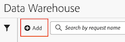
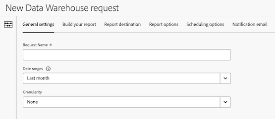

# Data Warehouse request general settings

1. In Adobe Analytics, select **[!UICONTROL Tools]** > **[!UICONTROL Data Warehouse]**.

1. On the [!UICONTROL **Data Warehouse**] page, select [!UICONTROL **Add**].

   

   The New Data Warehouse request page is displayed.

   

1. On the [!UICONTROL **General settings**] tab, complete the following fields:

   |Option | Function | 
   |---------|----------|
   | Request name | Identifies the request. | 
   | Date ranges | Select the date range to be included in the report. 
You can choose custom dates, or a preset date range. Preset ranges are relative to the date the report is sent.

The following preset options are available:
<ul><li>Today</li><li>Yesterday</li><li>Last 7 days</li><li>Last 30 days</li><li>This week</li><li>Last week</li><li>Last 2 weeks</li><li>Last 3 weeks</li><li>Last 4 weeks</li><li>This month</li><li>Last month</li><li>Last hour</li><li>Today</li><li>Today</li></ul> | 
   | Granularity | <!--what does this setting do? It's not the schedule/frequency... -->The frequency in which the report is sent.
The following options are available:
<ul><li>None
Choose this option if you want to 
</li><li>Yesterday</li><li>Last 7 days</li><li>Last 30 days</li><li>This week</li><li>Last week</li><li>Last 2 weeks</li><li>Last 3 weeks</li><li>Last 4 weeks</li><li>This month</li><li>Last month</li><li>Last hour</li><li>Today</li><li>Today</li></ul> | 

1. Continue with [Build a report for a Data Warehouse request](/help/export/data-warehouse/create-request/dw-request-build-report.md).