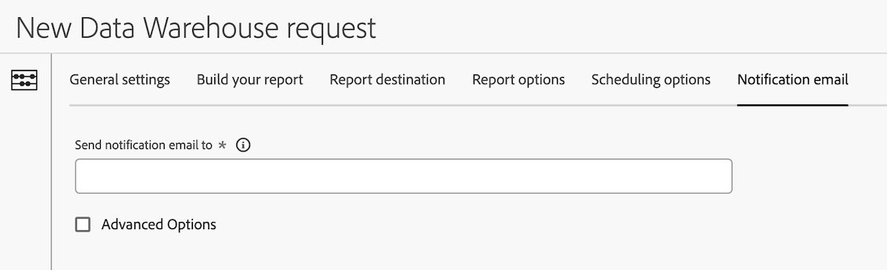

# Configure a notification email for a Data Warehouse request

{{release-limited-testing}}

There are various configuration options available when creating a Data Warehouse request. The following information describes how to configure a notification email for the request.

For information about how to begin creating a request, as well as links to other important configuration options, see [Create a Data Warehouse request](/help/export/data-warehouse/create-request/t-dw-create-request.md). 

To configure configure a notification email for a Data Warehouse request:

1. Begin creating a request in Adobe Analytics by selecting **[!UICONTROL Tools]** > **[!UICONTROL Data Warehouse]** > [!UICONTROL **Add**].

   For additional details, see [Create a Data Warehouse request](/help/export/data-warehouse/create-request/t-dw-create-request.md).

1. On the New Data Warehouse request page, select the [!UICONTROL **Notification email**] tab.

    <!--update screenshot -->

1. Complete the following fields:

   |Option | Function | 
   |---------|----------|
   | Send notification email to | Specify the email addresses of people who should receive email notifications when the report is sent. 
You can specify a single email address or a comma-separated list of email addresses.
 | 
   | Advanced options | Select this option to include a subject and notes for the email when the notification is sent. |

   {style="table-layout:auto"}

1. Select [!UICONTROL **Save request**] to save the Data Warehouse report request.
