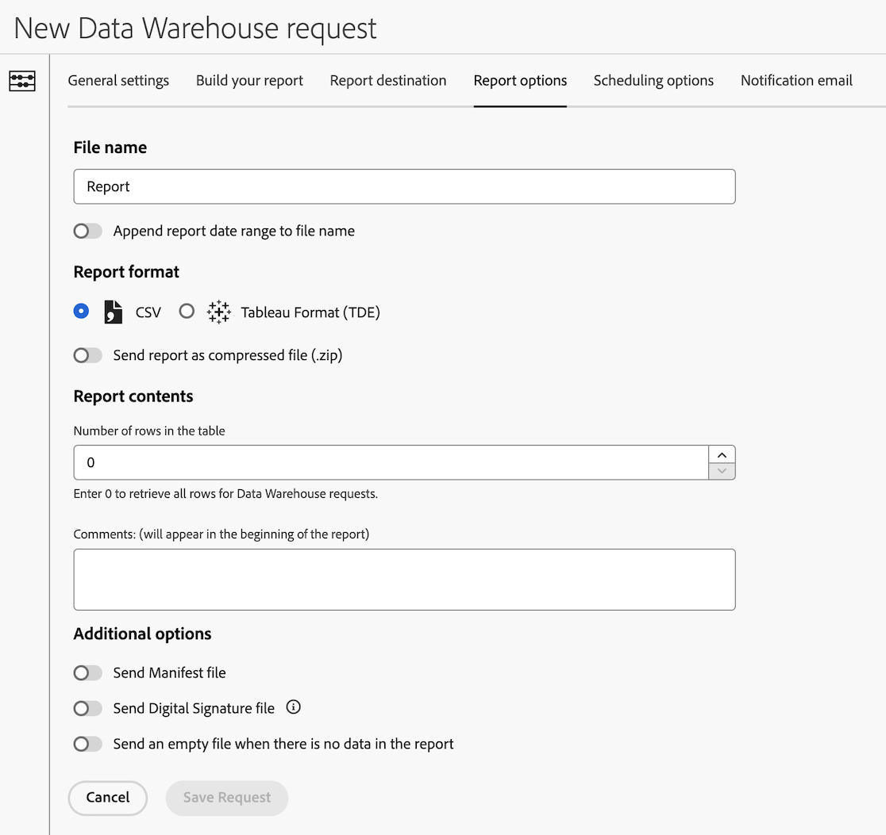

# Configure report options for a Data Warehouse request

>[!AVAILABILITY]
>
>Some of the Data Warehouse features described in this article (and other Data Warehouse articles in this section) are available only in the Limited Testing phase of release and might not be available yet in your environment. 
>
>For information about which features are not yet available for all customers, as well as for information about the release timeline of these features, see the [release notes](/help/release-notes/latest.md).
>
>This note will be removed when the functionality is generally available. For information about the Analytics release process, see [Adobe Analytics feature releases](/help/release-notes/releases.md).

There are various configuration options available when creating a Data Warehouse request. The following information describes how to configure report options for the request.

For information about how to begin creating a request, as well as links to other important configuration options, see [Create a Data Warehouse request](/help/export/data-warehouse/create-request/t-dw-create-request.md). 

To configure report options for a Data Warehouse request:

1. Begin creating a request in Adobe Analytics by selecting **[!UICONTROL Tools]** > **[!UICONTROL Data Warehouse]** > [!UICONTROL **Add**].

   For additional details, see [Create a Data Warehouse request](/help/export/data-warehouse/create-request/t-dw-create-request.md).

1. On the New Data Warehouse request page, select the [!UICONTROL **Report options**] tab.

    <!-- update screenshot to include Sort by metrics -->

1. Complete the following fields:

   |Option | Function | 
   |---------|----------|
   | File name | Identifies the report. | 
   | Append report date range to file name | Adds the date range to the report file name. 
For example, if you request data from May 1, 2024 through May 7, 2024, the filename includes the date range of 20240501 - 20240507.
 |
   | CSV | Delivers reports in a CSV file format for viewing data in a spreadsheet. | 
   | Tableau (TDE) | Delivers reports in a Tableau Data Extract (TDE) file format, which can be used to visualize data and layer in additional data within Tableau. |
   | Send report as compressed file (ZIP) | Delivers reports in a compressed (ZIP) file format. We recommend enabling this option when using email as the [report destination](/help/export/data-warehouse/create-request/dw-request-report-destinations.md). | 
   | Number of rows in the table | The number of rows that can be included in the report. Use 0 to include all rows (this is the default selection). <!-- when would you want to limit the rows? To improve performance? Do we have recommendations? --> | 
   | Comments | Add any comments that you want to be included with the report. Comments appear at the beginning of the report. | 
   | Sort by metrics | Provides ranked breakdown reports in Data Warehouse, sorted by descending metric value. Sorting by metric makes Data Warehouse reports easier for you to interpret, and makes these reports easier to compare with other Analytics breakdown reporting views.
For more information, see [Sort by metric](/help/export/data-warehouse/sorting-by-metric.md).
 | 
   | Send manifest file | Includes metadata about the files included in the report.<!-- What kind of metadata is included in the manifest file? --> | 
   | Send digital signature file | Allows report recipients to verify that the file came from Adobe and that it has not been altered. | 
   | Send an empty file when there is not data in the report | Sends a report even when the report contains no data. | 

   {style="table-layout:auto"}

1. Continue configuring your Data Warehouse request on the [!UICONTROL **Scheduling options**] tab. For more information, see [Configure scheduling options for a Data Warehouse request](/help/export/data-warehouse/create-request/dw-request-scheduling.md).