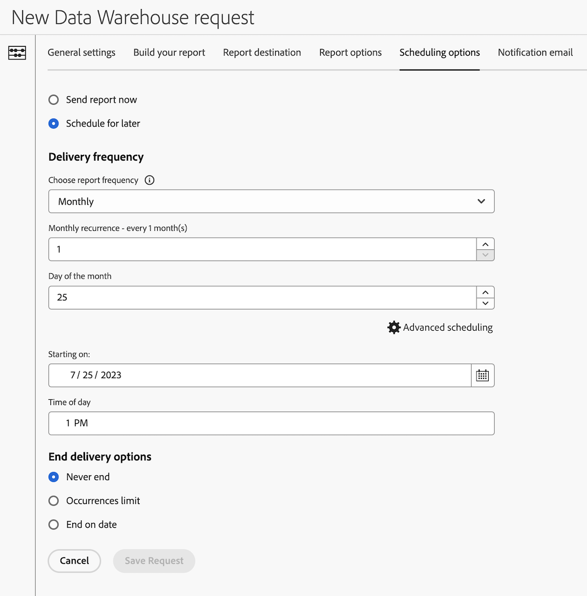

# Configure scheduling options for a Data Warehouse request

>[!AVAILABILITY]
>
>Some of the Data Warehouse features described in this article (and other Data Warehouse articles in this section) are available only in the Limited Testing phase of release and might not be available yet in your environment. 
>
>For information about which features are not yet available for all customers, as well as for information about the release timeline of these features, see the [release notes](/help/release-notes/latest.md).
>
>This note will be removed when the functionality is generally available. For information about the Analytics release process, see [Adobe Analytics feature releases](/help/release-notes/releases.md).

There are various configuration options available when creating a Data Warehouse request. The following information describes how to configure scheduling options for the request.

For information about how to begin creating a request, as well as links to other important configuration options, see [Create a Data Warehouse request](/help/export/data-warehouse/create-request/t-dw-create-request.md). 

To configure scheduling options for a Data Warehouse request:

1. Begin creating a request in Adobe Analytics by selecting **[!UICONTROL Tools]** > **[!UICONTROL Data Warehouse]** > [!UICONTROL **Add**].

   For additional details, see [Create a Data Warehouse request](/help/export/data-warehouse/create-request/t-dw-create-request.md).

1. On the New Data Warehouse request page, select the [!UICONTROL **Scheduling options**] tab.

    <!-- update screenshot -->

1. Complete the following fields:

   |Option | Function | 
   |---------|----------|
   | [!UICONTROL **Send report now**] | Sends the report as a one-time report. When this option is selected, all scheduling options are hidden. | 
   | [!UICONTROL **Schedule for later**] | Provides options for scheduling report delivery. All options are described below. |
   | [!UICONTROL **Report frequency**] | The frequency with which reports are delivered. 
The following options are available:
<ul><li>Hourly</li>
[!UICONTROL **Hourly**] is available only when the [!UICONTROL **Date ranges**] option on the [!UICONTROL **General settings**] tab is set to [!UICONTROL **Last hour**].
<li>Daily</li><li>Weekly</li><li>Monthly</li><li>Yearly</li></ul>
Additional options are displayed depending on the frequency you select.
 | 
   | [!UICONTROL **Starting on**] | The date when the new schedule should start. | 
   | [!UICONTROL **Time of day**] | The time of day that the report should be sent. | 
   | [!UICONTROL **End delivery options**] | Choose when to end the scheduled deliveries. You can choose to never end, to end after a specific number of occurrences, or to end on a specific date. | 

   {style="table-layout:auto"}

1. Continue configuring your Data Warehouse request on the [!UICONTROL **Notification email**] tab. For more information, see [Configure a notification email for a Data Warehouse request](/help/export/data-warehouse/create-request/dw-request-email.md).
  