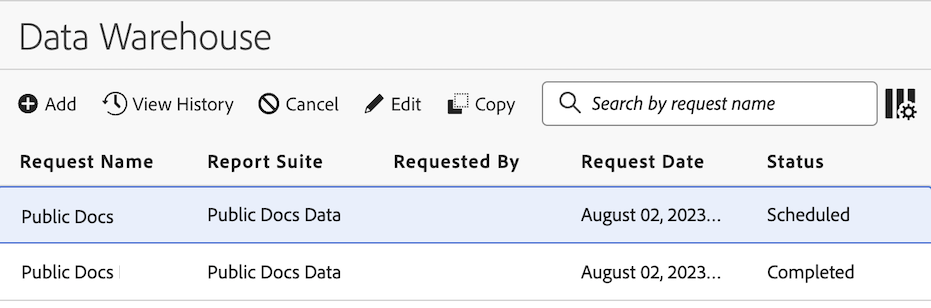

# Manage Data Warehouse requests

{{release-limited-testing}}

>[!NOTE]
>
>If your organization does not yet have the new Data Warehouse experience, which will be available soon for all customers, use the information in [Manage Data Warehouse requests (old experience)](#manage-data-warehouse-requests-old-experience)

You can manage Data Warehouse requests you have made. The following sections describe activities you can perform when managing requests. <!-- just those you have made? I think you can see other people's requests (you can filter by them). What can you do with other people's requests? Just view them?-->

## View requests

1. In Adobe Analytics, select [!UICONTROL **Tools**] > [!UICONTROL **Data Warehouse**].

   The Data Warehouse page displays all requests you have made. <!-- just those you have made? -->Data is shown in each column. You can [configure which columns](#configure-columns) are visible.

   <!-- add screenshot of main page -->

<!-- describe columns? -->

1. (Optional) To see when a request started processing, click on a scheduled request ID.

    A dialog appears with the processing information. <!-- still true? -->

## Edit requests

Consider the following when editing requests:

* Only requests that are configured to run on a schedule can be edited.

* Not all fields associated with the request can be edited. Fields that can't be edited are dimmed.

To edit a scheduled request: 

1. In Adobe Analytics, select [!UICONTROL **Tools**] > [!UICONTROL **Data Warehouse**].

1. On the Data Warehouse page, select the request that you want to edit.

   

1. Select [!UICONTROL **Edit**]. 

1. Edit the request as desired. Dimmed configuration options cannot be edited.

   For information about each configuration option, see [Create a Data Warehouse request](/help/export/data-warehouse/create-request/t-dw-create-request.md).

1. Select [!UICONTROL **Save changes**].

## View the history of a request

You can view the history of any reports that have run. 

1. In Adobe Analytics, select [!UICONTROL **Tools**] > [!UICONTROL **Data Warehouse**].

1. On the Data Warehouse page, select the request whose history you want to view.

   

1. Select [!UICONTROL **View history**].

## Copy requests

When you copy a request, all configuration options are copied from the original request. 

1. In Adobe Analytics, select [!UICONTROL **Tools**] > [!UICONTROL **Data Warehouse**].

1. On the Data Warehouse page, select the request that you want to copy.

   

1. Select [!UICONTROL **Copy**].

   The Copy Data Warehouse request page displays. All configuration options are copied from the original request.

1. Update any configuration options associated with the request.

   For information about each configuration option, see [Create a Data Warehouse request](/help/export/data-warehouse/create-request/t-dw-create-request.md).

1. Select [!UICONTROL **Save changes**].   

## Cancel requests

Only requests that are configured to run on a schedule can be canceled.

To cancel a scheduled request:

1. In Adobe Analytics, select [!UICONTROL **Tools**] > [!UICONTROL **Data Warehouse**].

1. On the Data Warehouse page, select the request that you want to edit.

   

1. Select [!UICONTROL **Cancel**].

   The request will no longer run at the scheduled time.

## Configure columns

You can configure what information is displayed for each request by adding or removing columns.

1. Select the **Configure columns** icon in the upper-right of the Data Warehouse page.

   

   The following columns are available:

   |Available column | Description |
   |---------|----------|
   | Request name | The name of the person who created the request. | 
   | Report suite | The report suite associated with the request. | 
   | Requested by | The user who created the request. | 
   | Request date | The date the request was made. |
   | Status | The following statuses are available:<ul><li>
**Completed**: The request ran successfully.
</li><li>
**Canceled**: The request was canceled by the user.
</li><li>
**Scheduled**: The request is configured to run on a schedule.
</li><!-- Are there other statuses? Failed? --> |

   {style="table-layout:auto"}

1. Ensure that any columns you want to display are selected. Selected columns appear on the Data Warehouse page and display the relevant information.

## Filter and sort requests

1. Select the **Filter** icon in the left rail of the Data Warehouse page.

   

1. Expand the [!UICONTROL **Report Suites**], [!UICONTROL **Owner**], or [!UICONTROL **Status**] sections, then select how you want to filter the requests.

## Search for requests

1. In the search field at the top of the Data Warehouse page, specify the request name that you want to view. 

   Requests are filtered as you type.

## Manage Data Warehouse requests (old experience)

>[!NOTE]
>
>The following information applies only if your organization does not yet have the new Data Warehouse experience, which will be available soon for all Analytics customers.

The Request Manager lets you view, duplicate, and re-prioritize requests.

In Data Warehouse, select the **[!UICONTROL Request Manager]** tab.

Working in this tab lets you

* View recent report requests by report name, segment applied, requestor, request date and status.
* Duplicate requests. Click **[!UICONTROL Duplicate]** next to the request.

  >[!NOTE]
  >
  >This action duplicates only the request, not the schedule or the delivery details.

* Search for reports by report name or by the login name of the requestor.
* Re-prioritize reports by dragging and dropping them to a new location within the queue.
* To see when a request started processing, click on a scheduled request ID and examine the pop-up that opens.

Click on a job to see individual requests for that job.

* Rate Limited: Your organization has too many Data Warehouse requests running. The request is paused until other data requests complete.

<!--

To manage existing requests in Data Warehouse:
  
     * Select a job to see individual requests for that job. <!-- still true? -->

     * Rate Limited: Your organization has too many Data Warehouse requests running. The request is paused until other data requests complete. <!-- What is this?? -->

-->