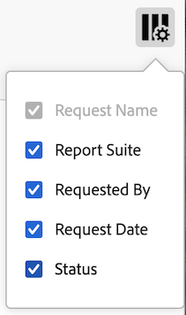
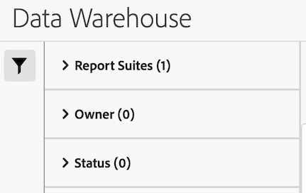

# Manage Data Warehouse requests

You can manage Data Warehouse requests you have made. The following sections describe activities you can perform when managing requests. <!-- just those you have made? I think you can see other people's requests (you can filter by them). What can you do with other people's requests? Just view them?-->

## View requests

1. In Adobe Analytics, select [!UICONTROL **Tools**] > [!UICONTROL **Data Warehouse**].

   The Data Warehouse page displays all requests you have made. <!-- just those you have made? -->Data is shown in each column. You can [configure which columns](#configure-columns) are visible.

   <!-- add screenshot of main page -->

<!-- describe columns? -->

1. (Optional) To see when a request started processing, click on a scheduled request ID.

    A dialog appears with the processing information. <!-- still true? -->

## Configure columns

You can configure what information is displayed for each request by adding or removing columns.

1. Select the **Configure columns** icon in the upper-right of the Data Warehouse page.

   

   The following columns are available:

   * [!UICONTROL **Request name**]: The name of the person who created the request.

   * [!UICONTROL **Report suite**]: The report suite associated with the request.

   * [!UICONTROL **Request date**]: The date the request was made.

   * [!UICONTROL **Status**]: The status of the request

1. Ensure that any columns you want to display are selected. Selected columns appear on the Data Warehouse page and display the relevant information.

## Filter and sort requests

1. Select the **Filter** icon in the left rail of the Data Warehouse page.

   

1. Expand the [!UICONTROL **Report Suites**], [!UICONTROL **Owner**], or [!UICONTROL **Status**] sections, then select how you want to filter the requests.

## Search for requests

1. In the search field at the top of the Data Warehouse page, specify the request name that you want to view. <!-- "or by the login name of the requestor" (still true?) It also used to say "by report name" instead of "request name" What's the difference? Can you search by any other data/column attribute? -->.

## Duplicate requests

1. On the Data Warehouse page, select **[!UICONTROL Duplicate]** next to the request that you want to duplicate.

     >[!NOTE]
     >
     >This action duplicates only the request, not the schedule or the delivery details of the request.

## Prioritize requests

You can prioritize the order in which requests are processed. 

1. On the Data Warehouse page, drag a request to a new location within the queue. 

   Requests are processed in the order that they appear, with requests at the top of the page being processed before requests at the bottom of the page. <!-- still true? -->

<!--

To manage existing requests in Data Warehouse:
  
     * Select a job to see individual requests for that job. <!-- still true? -->

     * Rate Limited: Your organization has too many Data Warehouse requests running. The request is paused until other data requests complete. <!-- What is this?? -->

-->