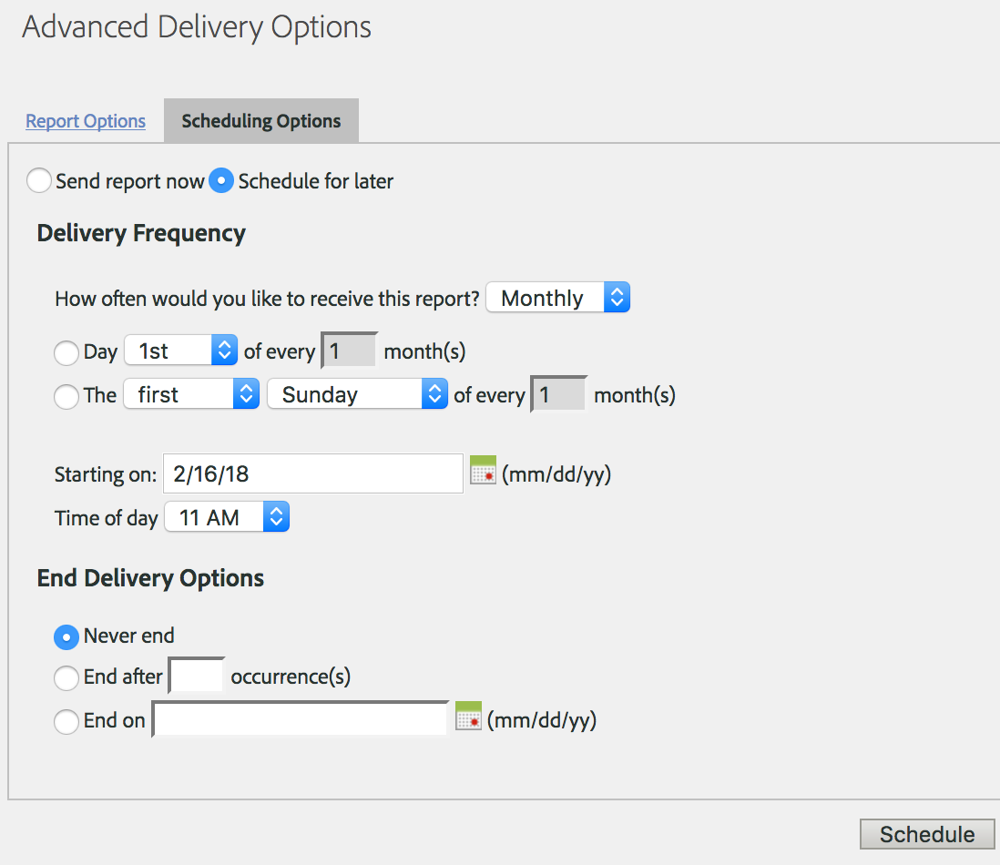

# Schedule a recurring request

## Schedule a recurring request {#topic_8C3CE0CE8A584F80946D24B377CB51BE}

To schedule Data Warehouse requests for Daily/Monthly/Yearly, make sure &#42;Preset &#42;is correctly selected

1. Under [!UICONTROL Reporting Date], select **[!UICONTROL Preset]**. 

1. Under [!UICONTROL Schedule Delivery], click **[!UICONTROL Advanced Delivery Options]**. 

1. Go to the Scheduling Options tab and select **[!UICONTROL Schedule for later]**. 
1. Select your desired settings for [!UICONTROL Delivery Frequency] and [!UICONTROL End Delivery Options].

   

1. Click **[!UICONTROL Schedule]**.

