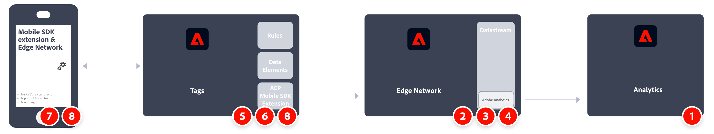
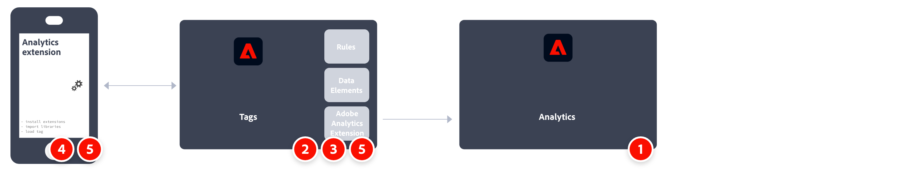

# Implement Adobe Analytics using the Adobe Experience Platform Mobile SDK

The Adobe Experience Platform Mobile SDK helps power Adobe's Experience Cloud solutions and services in your mobile apps. It is available for Android&trade;, iOS, and various cross-platform development frameworks. Configuration is handled through Adobe Experience Platform Data Collection.
>[!IMPORTANT]
>
>An Adobe Analytics extension is also available in Adobe Experience Platform Data Collection. If you install this extension, you do not take advantage of XDM or the Edge Network.

## Adobe Experience Platform SDK

A high-level overview of the implementation tasks:

| | Task | More Information | 
|-| ------|------------------|
| 1 | Ensure you have **defined a report suite**. | [Report Suite Manager](../../../admin/admin/c-manage-report-suites/report-suites-admin.md) |
| 2 | **Set up schemas and datasets**. To standardize data collection for use across applications that leverage Adobe Experience Platform, Adobe has created the open and publicly documented standard, Experience Data Model (XDM). | [Set up schemas and datasets](https://developer.adobe.com/client-sdks/documentation/getting-started/set-up-schemas-and-datasets/) |
| 3 | **Configure a datastream**. A datastream represents the server-side configuration when implementing the Adobe Experience Platform Web SDK. | [Configure a datastream](https://experienceleague.adobe.com/docs/experience-platform/edge/datastreams/configure.html?lang=en) |
| 4 | **Add an Adobe Analytics service** to your datastream. That service controls whether and how data is sent to Adobe Analytics. | [Add Adobe Analytics service to a datastream](https://experienceleague.adobe.com/docs/experience-platform/edge/datastreams/configure.html?lang=en#analytics) |
| 5 | **Create a mobile property**. A property is a container that you fill with extensions, rules, data elements, and libraries. | [Set up a mobile property](https://developer.adobe.com/client-sdks/documentation/getting-started/create-a-mobile-property/) |
| 6 | **Install the Adobe Experience Platform Edge Network extension** in the mobile tag property and configure the datastream in the extension. | [Adobe Experience Platform Edge Network](https://developer.adobe.com/client-sdks/documentation/edge-network/) |
| 7 | **Use code in your app** to register the necessary extensions and load your tag configuration. | [Set up the configuration](https://developer.adobe.com/client-sdks/documentation/user-guides/getting-started-with-platform/overview/#set-up-the-configuration) |
| 8 | **Implement and test functionality** using combination of tag's data elements, rules, additional extensions, and SDK API calls in your app. Inspect, validate, and debug data collection and experiences for your mobile application. | [Use the sample application](https://developer.adobe.com/client-sdks/documentation/user-guides/getting-started-with-platform/overview/#use-the-sample-application) |
| 9 | **Extend and validate your mobile app implementation** before pushing it out to production. | | 

## Adobe Analytics extension.

A high-level overview of the implementation tasks:

| | Task | More Information | 
|-| ------|------------------|
| 1 | Ensure you have **defined a report suite**. | [Report Suite Manager](../../../admin/admin/c-manage-report-suites/report-suites-admin.md) |
| 2 | **Create a mobile property**. A property is a container that you fill with extensions, rules, data elements, and libraries. | [Set up a mobile property](https://developer.adobe.com/client-sdks/documentation/getting-started/create-a-mobile-property/) |
| 3 | **Install the Adobe Analytics extension** in the mobile tag property and configure the extension to point to your report suite. | [Adobe Analytics extension for mobile property](https://developer.adobe.com/client-sdks/documentation/adobe-analytics/) |
| 4 | **Use code in your app** to register the necessary extensions and load your tag configuration. | [Set up the configuration](https://developer.adobe.com/client-sdks/documentation/user-guides/getting-started-with-platform/overview/#set-up-the-configuration) |
| 5 | **Implement and test functionality** using combination of tag's data elements, rules, additional extensions, and SDK API calls in your app. Inspect, validate, and debug data collection and experiences for your mobile application. | [Use the sample application](https://developer.adobe.com/client-sdks/documentation/user-guides/getting-started-with-platform/overview/#use-the-sample-application) |
| 6 | **Extend and validate your mobile app implementation** before pushing it out to production. | | 

## Additional resources

-   [Tags documentation](https://experienceleague.adobe.com/docs/experience-platform/tags/home.html#)

-   [Mobile SDK documentation](https://developer.adobe.com/client-sdks/documentation/)

