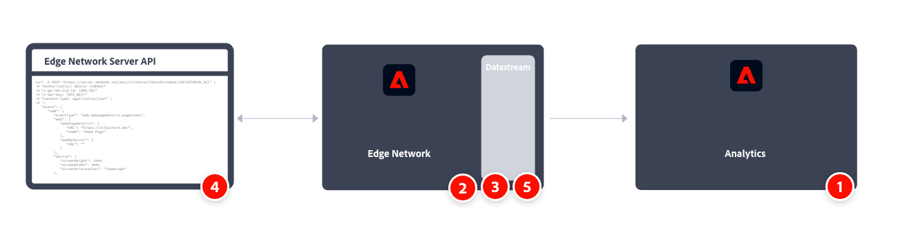

# Implement Adobe Analytics using the Adobe Experience Platform Edge Network Server API

You typically use the Experience Platform Edge Network Server API to collect data from devices like IoT devices, set-top boxes, desktop applications. Then send that data to the Edge network and then to services like Adobe Analytics.

Also consider the Edge Network Server API when you require sensitive data to be collected securely and authenticated across the network. See [Authentication](https://experienceleague.adobe.com/docs/experience-platform/edge-network-server-api/authentication.html?lang=en) for more information.

A high-level overview of the implementation tasks:

<table style="width:100%">

<tr>
<th style="width:5%"></th><th style="width:60%"><b>Task</b></th><th style="width:35%"><b>More Information</b></th>
</tr>

<tr>
<td>1</td>
<td>Ensure you have <b>defined a report suite</b>.</td>
<td><a href="../../../admin/admin/c-manage-report-suites/report-suites-admin.md">Report Suite Manager</a></td>
</tr>

<tr>
<td>2</td>
<td><b>Setup schemas and datasets</b>. To standardize data collection for use across applications that leverage Adobe Experience Platform, Adobe has created the open and publicly documented standard, Experience Data Model (XDM).</td>
<td><a href="https://experienceleague.adobe.com/docs/experience-platform/xdm/ui/overview.html?lang=en">Schemas UI overview</a> and <a href="https://experienceleague.adobe.com/docs/experience-platform/catalog/datasets/user-guide.html?lang=en">Datasets UI overview</a></td>
</tr>

<tr>
<td>3</td>
<td><b>Configure a datastream</b>. A datastream represents the server-side configuration when using the API's from the Adobe Experience Platform Edge Network API.</td>
<td><a href="https://experienceleague.adobe.com/docs/experience-platform/datastreams/configure.html?lang=en">Configure a datastream<a></td> 
</tr>

<tr>
<td>4</td>
<td><b>Implement and test data collection</b> using the Single event data and Batch event data collection APIs.</td>
<td><a href="https://experienceleague.adobe.com/docs/experience-platform/edge-network-server-api/data-collection/interactive-data-collection.html?lang=en">Single-event data collection</a> <a href="https://experienceleague.adobe.com/docs/experience-platform/edge-network-server-api/data-collection/non-interactive-data-collection.html?lang=en">Batch event data collection</a>
</tr>

<td>5</td>
<td><b>Add an Adobe Analytics service</b> to your datastream. That service controls whether and how data is sent to Adobe Analytics.</td>
<td><a href="https://experienceleague.adobe.com/docs/experience-platform/edge-network-server-api/interacting-other-adobe-solutions/interacting-adobe-analytics.html?lang=ens">Interacting with Adobe Analytics</a></td>
</tr>

</table>

See [Edge Network Server API documentation](https://experienceleague.adobe.com/docs/experience-platform/edge-network-server-api/overview.html), and an example [integration with Adobe Analytics](https://experienceleague.adobe.com/docs/experience-platform/edge-network-server-api/interacting-other-adobe-solutions/interacting-adobe-analytics.html) for more information.

