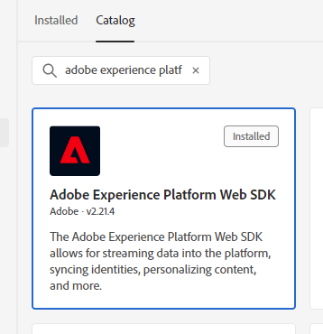
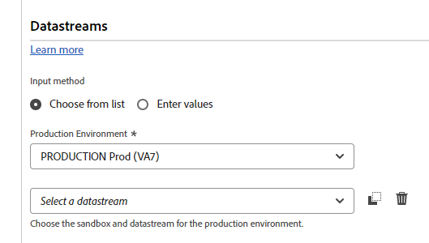
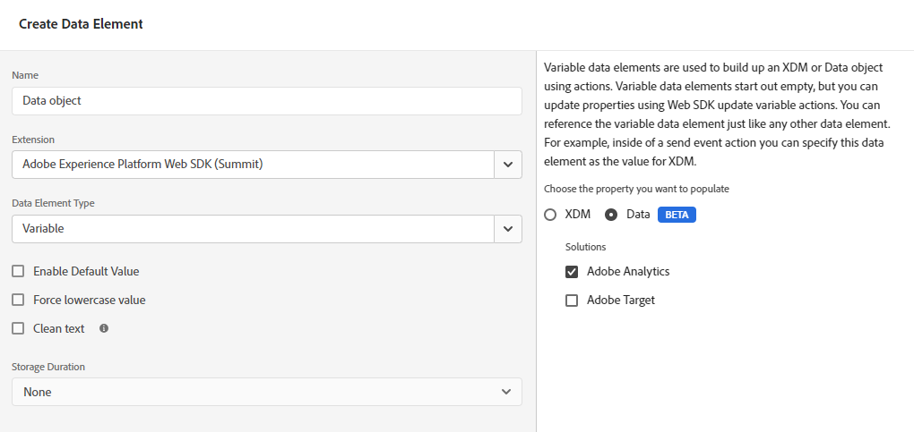
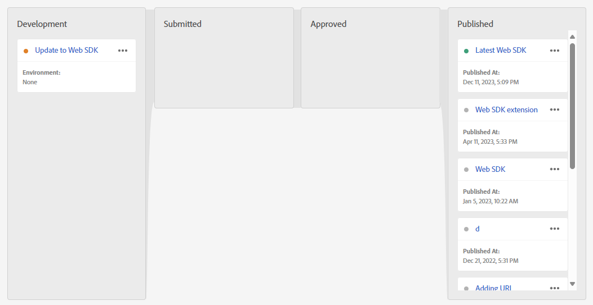

# Migrate from the Adobe Analytics tag extension to the Web SDK tag extension

This implementation path involves a methodical migration approach to move from the Adobe Analytics tag extension to the Web SDK tag extension. Other implementation paths are covered on separate pages:

* [AppMeasurement to Web SDK JavaScript library](appmeasurement-to-web-sdk.md): A smooth and methodical approach to migrate to the Web SDK, except it does not use tags. Instead, you manually remove the Adobe Analytics data collection library (`AppMeasurement.js`) and replace it with the Web SDK JavaScript library (`alloy.js`).
* [Web SDK tag extension](web-sdk-tag-extension.md): A fresh Web SDK installation where you manage the implementation using tags in Adobe Experience Platform Data Collection. Requires the Adobe Analytics ExperienceEvent field group, which includes typical Analytics variables to be included in your XDM schema.
* [Web SDK JavaScript library](web-sdk-javascript-library.md): A fresh Web SDK installation using the Web SDK JavaScript library (`alloy.js`). Manage the implementation yourself instead of using the tags UI. Requires the Adobe Analytics ExperienceEvent field group, which includes typical Analytics variables to be included in your XDM schema.

## Advantages and disadvantages of this implementation path

Using this migration approach has both advantages and disadvantages. Carefully weigh each option to decide which approach is best for your organization.

| Advantages | Disadvantages |
| --- | --- |
| <ul><li>**No code changes on your site**: Since your implementation already has tags installed, all migration updates can be made in the tags interface.</li><li>**Uses your existing implementation**: This approach does not require a net-new implementation. While it does require new rule actions, you can reuse your existing data elements and rule conditions with minimal changes.</li><li>**Does not require a schema**: While a schema is required to ultimately send data to Customer Journey Analytics, a schema is not required for this stage of migration to the Web SDK. Instead, you can populate the `data` object, which sends data straight to Adobe Analytics. Once migration to the Web SDK is complete, then you can create a schema for your organization and use datastream mapping to populate applicable XDM fields.</li></ul> | <ul><li>**Implementation technical debt**: Since this approach uses a modified form of your existing implementation, it can be harder to track implementation logic and perform changes when needed. Custom code can be particularly difficult to debug.</li><li>**Requires mapping to send data to Platform**: When your organization is ready to use Customer Journey Analytics, you must send data to a data set in Adobe Experience Platform. This action requires that every field in the `data` object be an entry in the datastream mapping tool that assigns it to an XDM schema field. While this mapping workflow only needs to be done once and doesn't require implementation changes, it is a required action that is not needed when sending data directly to XDM.</li></ul> |

Adobe recommends following this implementation path in the following scenarios:

* You have an existing implementing using the Adobe Analytics tag extension. If you have an implementation using AppMeasurement, follow [Migrate from AppMeasurement to the Web SDK](appmeasurement-to-web-sdk.md) instead.
* You intend to use Customer Journey Analytics in the future, but do not want to completely replace your Analytics implementation with a Web SDK implementation from scratch. Replacing your implementation from scratch on the Web SDK requires the most effort, but also offers the most viable long-term implementation architecture. If your organization is willing to go through the effort of a clean Web SDK implementation, see [Ingest data via the Adobe Experience Platform Web SDK](https://experienceleague.adobe.com/en/docs/analytics-platform/using/cja-data-ingestion/ingest-use-guides/edge-network/aepwebsdk) in the Customer Journey Analytics user guide.

## Steps required to migrate to the Web SDK

The following steps contain concrete goals to work towards. Click each step for detailed instructions around how to accomplish it.

+++**1. Create and configure a datastream

Create a datastream in Adobe Experience Platform Data Collection. When you send data to this datastream, it forwards data to Adobe Analytics. In the future, this same datastream forwards data to Customer Journey Analytics.

1. Navigate to [experience.adobe.com](https://experience.adobe.com) and log in using your credentials.
1. Use the home page or product selector in the top right to navigate to **[!UICONTROL Data Collection]**.
1. In the left navigation, select **[!UICONTROL Datastreams]**.
1. Select **[!UICONTROL New Datastream]**.
1. Enter the desired name, then select **[!UICONTROL Save]**.
1. Once the datastream is created, select **[!UICONTROL Add Service]**.
1. In the service drop-down menu, select **[!UICONTROL Adobe Analytics]**.
1. Enter the same report suite ID as the site you currently send analytics data to. Click **[!UICONTROL Save]**.

 {style="border:1px solid gray"}

Your datastream is now ready to receive and pass along data to Adobe Analytics.

+++

+++**1. Add the Web SDK extension to your tag property**

This section prepares your tag for the bulk of migration effort taking place in the next step.

1. Click the hamburger icon in the top left of the Adobe Experience Platform interface, then select **[!UICONTROL Tags]**.
1. Select the desired tag property.
1. In the left navigation of the tag property, select **[!UICONTROL Extensions]**.
1. Select **[!UICONTROL Catalog]** near the top to see a list of all available extensions.
1. Search for and select the **[!UICONTROL Adobe Experience Platform Web SDK]** extension, then click **[!UICONTROL Install]** on the right.

    

1. The extension configuration settings appear. Locate the Datastreams section, and select the datastream that you created in the previous step.

    

1. Select **[!UICONTROL Save]**.

Your tag property now has the Web SDK installed.

+++

+++**2. Create a data object data element**

The data object data element provides an intuitive framework to configure a payload that the Web SDK uses to send to a datastream. Most rules that you update in the following step interact with this data element.

1. In the left navigation of the tags interface, select **[!UICONTROL Data Elements]**.
1. Select **[!UICONTROL Add Data Element]**
1. Give the data element the following settings:
    * [!UICONTROL Name]: Anything you'd like, such as "Data layer" or "Data object"
    * [!UICONTROL Extension]: [!UICONTROL Adobe Experience Platform Web SDK]
    * [!UICONTROL Variable]: [!UICONTROL Variable]
    * Check boxes can remain as-is
1. On the right, select the following settings:
    * Property radio button: [!UICONTROL Data]
    * Solution: [!UICONTROL Adobe Analytics]
1. Select **[!UICONTROL Save]**.

Your tag property now has everything needed to update rules.

+++

+++**3. Update rules to use the Web SDK extension instead of the Analytics extension**

This step is the most involved of a Web SDK migration, and requires knowledge around how your implementation works. This step provides an example of how to edit a typical tag rule. You must update all tag rules in your implementation to replace all reference to the Adobe Analytics extension with the Web SDK extension.

1. In the left navigation of the tags interface, select **[!UICONTROL Rules]**.
1. Select a rule to edit.
1. Select the action **[!UICONTROL Adobe Analytics - Set Variables]**
1. Note all Analytics variables set within this rule. Note both variables set in the drop-down menus and variables set within custom code.
1. Change the [!UICONTROL Action Configuration] to the following settings:
    * [!UICONTROL Extension]: [!UICONTROL Adobe Experience Platform Web SDK]
    * [!UICONTROL Action type]: Update variable
1. Ensure that your data object is selected in the drop-down on the right.
1. Set the Analytics variables to their same respective values as they were configured in the Analytics extension.
    * Variables set within the tags interface can directly translate to the same values.
    * String variables set within custom code require minimal adjustments. Instead of using the `s` object, use `data.__adobe.analytics` instead. For example, `s.eVar1` would translate to `data.__adobe.analytics.eVar1`.
    * Analytics configuration variables and method calls in custom code can require modified implementation logic. See each respective [variable](/help/implement/vars/overview.md) to determine how to best achieve its equivalent using the Web SDK.
1. Once all rule logic is replicated using the Web SDK extension, select **[!UICONTROL Keep Changes]**.
1. Repeat these steps for every action configuration that uses the Adobe Analytics extension to set values. This step includes both variables set using the tags interface and variables set using custom code. Custom code blocks cannot reference the `s` object anywhere.

The above steps apply only to rules that set values. The following steps replace all actions that use the [!UICONTROL Action Configuration] [!UICONTROL Send Beacon].

1. Select a rule that sends a beacon.
1. Select the action **[!UICONTROL Adobe Analytics - Send Beacon]**.
1. Note the current value of the [!UICONTROL Tracking] radio button on the right ([`s.t()`](../../vars/functions/t-method.md) or [`s.tl()`](../../vars/functions/tl-method.md)).
1. Change the [!UICONTROL Action Configuration] to the following settings:
    * [!UICONTROL Extension]: [!UICONTROL Adobe Experience Platform Web SDK]
    * [!UICONTROL Action type]: [!UICONTROL Send event]
1. On the right, change the action settings to the following:
    * [!UICONTROL Type]: For `s.t()` use **[!UICONTROL Web Webpagedetails Page Views]**. For `s.tl()` use **[!UICONTROL Web Webinteraction Link Clicks]**. If you use [`s.tl()`](../../vars/functions/tl-method.md), you must also include the following fields in your data object. These fields are listed under [!UICONTROL Additional properties] when performing the [!UICONTROL Update variable] action configuration:
      * [Link name](../../vars/functions/tl-method.md)
      * [Link type](../../vars/functions/tl-method.md)
      * [Link URL](../../vars/config-vars/linkurl.md)
1. Select **[!UICONTROL Keep Changes]**.
1. Repeat these steps for every action configuration that uses Adobe Analytics to send a beacon.

+++

+++**4. Publish updated rules**

Publishing updated rules follows the same workflow as any other change to your tags configuration.

1. In the left navigation of the tags interface, select **[!UICONTROL Publishing Flow]**.
1. Select **[!UICONTROL Add Library]**.
1. Give this tag commit a name, such as "Upgrade to Web SDK".
1. Select **[!UICONTROL Add All Changed Resources]**.
1. Select **[!UICONTROL Save]**.
1. The publishing workflow displays an orange dot, indicating that it is building. Once the dot turns green, your changes are available in your development environment.
1. Test your changes in your development environment to ensure that all rules are firing properly, and that the data object is getting populated with expected values.
1. When ready, submit the library for approval, build to staging, then ultimately approve and publish to production.

+++

+++**5. Disable Analytics extension**

Once your tag implementation is fully on the Web SDK, you can disable the Adobe Analytics extension.

1. In the left navigation of the tags interface, select **[!UICONTROL Extensions]**.
1. Locate and select the [!UICONTROL Adobe Analytics] extension. On the right, select **[!UICONTROL Disable]**.
1. Follow the same publishing workflow above to publish the removal of the [!UICONTROL Adobe Analytics] extension.
1. Once the extension is disabled on production, you can uninstall it entirely. Select the extension, select the three-dot menu on the right, then select **[!UICONTROL Uninstall]**.
1. Follow the same publishing workflow above the publish those changes to production.

+++

At this point, your Analytics implementation is fully on the Web SDK and is adequately prepared to move to Customer Journey Analytics in the future.
