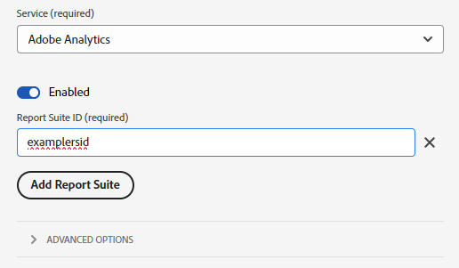

# Migrate from AppMeasurement to the Web SDK

This implementation path involves a methodical migration approach to move from an AppMeasurement implementation to a Web SDK JavaScript library implementation. Other implementation paths are covered on separate pages:

* [Analytics extension to Web SDK extension](analytics-extension-to-web-sdk.md): Take a smooth and methodical approach to move from the Adobe Analytics tag extension to the Web SDK tag extension. This approach suppresses the need to use XDM until your organization is ready to use Adobe Experience Platform services, such as Customer Journey Analytics. Use the `data` object instead of the `xdm` object to send data to Adobe.
* [Web SDK JavaScript library](web-sdk-javascript-library.md): A fresh Web SDK installation using the Web SDK JavaScript library (`alloy.js`). Manage the implementation yourself instead of using the tags UI. It requires the Adobe Analytics ExperienceEvent field group, which includes typical Analytics variables to be included in your XDM schema.
* [Web SDK tag extension](web-sdk-tag-extension.md): A fresh Web SDK installation where you manage the implementation using tags in Adobe Experience Platform Data Collection. It requires the Adobe Analytics ExperienceEvent field group, which includes typical Analytics variables to be included in your XDM schema.

## Advantages and disadvantages of this implementation path

Using this migration approach has both advantages and disadvantages. Carefully weigh each option to decide which approach is best for your organization.

| Advantages | Disadvantages |
| --- | --- |
| <ul><li>**Uses your existing implementation**: While this approach requires some implementation changes, it does not require a completely new implementation from scratch. You can use your existing data layer and code with minimal changes to implementation logic.</li><li>**Does not require a schema**: For this stage of migrating to the Web SDK, you don't need an XDM schema. Instead, you can populate the `data` object, which sends data straight to Adobe Analytics. Once migration to the Web SDK is complete, then you can create a schema for your organization and use datastream mapping to populate applicable XDM fields. If a schema were required at this stage of the migration process, your organization would be forced to use an Adobe Analytics XDM schema. Use of this schema makes it more difficult for your organization to use your own schema in the future.</li></ul> | <ul><li>**Implementation changes require developer intervention**: If you want to make changes to your Web SDK implementation, you must work with your development team to edit the code on your site. The approach that [migrates to the Web SDK tag extension](analytics-extension-to-web-sdk.md) avoids this disadvantage.</li><li>**Implementation technical debt**: Since this approach uses a modified form of your existing implementation, it can be harder to track implementation logic and perform changes in the future when needed.</li><li>**Requires mapping to send data to Platform**: When your organization is ready to use Customer Journey Analytics, you must send data to a data set in Adobe Experience Platform. This action requires that every field in the `data` object be an entry in the datastream mapping tool that assigns it to an XDM schema field. Mapping only needs to be done once for this workflow, and it doesn't involve making implementation changes. However, it is an extra step that is not required when sending data in an XDM object.</li></ul> |

Adobe recommends following this implementation path in the following scenarios:

* You have an existing implementation using the Adobe Analytics AppMeasurement JavaScript library. If you have an implementation using the Adobe Analytics tag extension, follow [Migrate from the Adobe Analytics tag extension to the Web SDK tag extension](analytics-extension-to-web-sdk.md) instead.
* You intend to use Customer Journey Analytics in the future, but do not want to replace your Analytics implementation with a Web SDK implementation from scratch. Replacing your implementation from scratch on the Web SDK requires the most effort, but also offers the most viable long-term implementation architecture. If your organization is willing to go through the effort of a clean Web SDK implementation, see [Ingest data via the Adobe Experience Platform Web SDK](https://experienceleague.adobe.com/en/docs/analytics-platform/using/cja-data-ingestion/ingest-use-guides/edge-network/aepwebsdk) in the Customer Journey Analytics user guide.

## Steps required to migrate to the Web SDK

The following steps contain concrete goals to work towards. Click each step for detailed instructions on how to accomplish it.

+++**1. Create and configure a datastream**

Create a datastream in Adobe Experience Platform Data Collection. When you send data to this datastream, it forwards data to Adobe Analytics. In the future, this same datastream forwards data to Customer Journey Analytics.

1. Navigate to [experience.adobe.com](https://experience.adobe.com) and log in using your credentials.
1. Use the home page or product selector in the top right to navigate to **[!UICONTROL Data Collection]**.
1. In the left navigation, select **[!UICONTROL Datastreams]**.
1. Select **[!UICONTROL New Datastream]**.
1. Enter the desired name, then select **[!UICONTROL Save]**.
1. Once the datastream is created, select **[!UICONTROL Add Service]**.
1. In the service drop-down menu, select **[!UICONTROL Adobe Analytics]**.
1. Enter the same report suite ID as the site you currently send analytics data to. Click **[!UICONTROL Save]**.

 {style="border:1px solid gray"}

Your datastream is now ready to receive and pass along data to Adobe Analytics. Note the datastream ID, as this ID is required when configuring the Web SDK in code.

+++

+++**2. Install the Web SDK JavaScript library**

Reference the latest version of `alloy.js` so its method calls can be used. See [Install the Web SDK using the JavaScript library](https://experienceleague.adobe.com/en/docs/experience-platform/web-sdk/install/library) for details and code blocks to use.

+++

+++**3. Configure the Web SDK**

Set up your implementation to point to the datastream created in the previous step by using the Web SDK [`configure`](https://experienceleague.adobe.com/en/docs/experience-platform/web-sdk/commands/configure/overview) command. The `configure` command must be set on every page, so you can include it alongside the library installation code.

Use the [`edgeConfigId`](https://experienceleague.adobe.com/en/docs/experience-platform/web-sdk/commands/configure/edgeconfigid) and [`orgId`](https://experienceleague.adobe.com/en/docs/experience-platform/web-sdk/commands/configure/orgid) properties within the Web SDK `configure` command:

* Set the `edgeConfigId` to the datastream ID retrieved from the previous step.
* Set the `orgId` to your organization's IMS org.

```js
alloy("configure", {
    "edgeConfigId": "ebebf826-a01f-4458-8cec-ef61de241c93",
    "orgId": "ADB3LETTERSANDNUMBERS@AdobeOrg"
});
```

You can optionally set other properties in the [`configure`](https://experienceleague.adobe.com/en/docs/experience-platform/web-sdk/commands/configure/overview) command depending on your organization's implementation requirements.

+++

+++**4. Update code logic to use a JSON payload**

Change your Analytics implementation so that it does not rely on `AppMeasurement.js` or the `s` object. Instead, set variables into a correctly formatted JavaScript object, which is converted to a JSON object when sent to Adobe. Having a [Data layer](../../prepare/data-layer.md) on your site helps tremendously when setting values, as you can continue referencing those same values.

To send data to Adobe Analytics, the Web SDK payload must use `data.__adobe.analytics` with all analytics variables set within this object. Variables within this object share identical names and formats as their AppMeasurement variable counterparts. For example, if you set the `products` variable, do not split it into individual objects like you would with XDM. Instead, include it as a string exactly is if you set the `s.products` variable:

```json
{
  "data": {
    "__adobe": {
      "analytics": {
        "products": "Shoes,Men's sneakers,1,49.99"
      }
    }
  }
}
```

Ultimately, this payload contains all desired values, and all references to the `s` object in your implementation are removed. You can use any of the resources that JavaScript provides to set this payload object, including dot notation to set individual values.

```js
// Define the payload and set objects within it
var dataObj = {data: {__adobe: {analytics: {}}}};
dataObj.data.__adobe.analytics.pageName = window.document.title;
dataObj.data.__adobe.analytics.eVar1 = "Example value";

// Alternatively, set values in an object and use a spread operator to achieve identical results
var a = new Object;
a.pageName = window.document.title;
a.eVar1 = "Example value";
var dataObj = {data:{__adobe:{analytics:{...a}}}};
```

+++

+++**5. Update method calls to use the Web SDK**

Update all instances where you call [`s.t()`](../../vars/functions/t-method.md) and [`s.tl()`](../../vars/functions/tl-method.md), replacing them with the [`sendEvent`](https://experienceleague.adobe.com/en/docs/experience-platform/web-sdk/commands/sendevent/overview) command. There are three scenarios to consider:

* **Page view tracking**: Replace the page view tracking call with the Web SDK `sendEvent` command:

  ```js
  // If your current implementation has this line of code:
  s.t();

  // Replace it with this line of code. The dataObj object contains the variables to send.
  alloy("sendEvent", dataObj);
  ```

* **Automatic link tracking**: The [`clickCollectionEnabled`](https://experienceleague.adobe.com/en/docs/experience-platform/web-sdk/commands/configure/clickcollectionenabled) configuration property is enabled by default. It automatically sets the correct link tracking variables to send data to Adobe Analytics. If you want to disable automatic link tracking, set this property to `false` within the [`configure`](https://experienceleague.adobe.com/en/docs/experience-platform/web-sdk/commands/configure/overview) command.

* **Manual link tracking**: The Web SDK does not have separate commands between pageview and non-pageview calls. Provide that distinction within the payload object.

  ```js
  // If your current implementation has this line of code:
  s.tl(true,"o","Example custom link");

  // Replace it with these lines of code. Add the required fields to the dataObj object.
  dataObj.data.__adobe.analytics.linkName = "Example custom link";
  dataObj.data.__adobe.analytics.linkType = "o";
  dataObj.data.__adobe.analytics.linkURL = "https://example.com";
  alloy("sendEvent", dataObj);
  ```

+++

+++**6. Validate and publish changes**

Once you have removed all references to AppMeasurement and the `s` object, publish your changes to your development environment to validate that the new implementation works. Once you have validated that everything works correctly, you can publish your updates to production.

If migrated correctly, `AppMeasurement.js` is no longer required on your site, and all references to this script can be removed.

+++

At this point, your Analytics implementation is fully on the Web SDK and is adequately prepared to move to Customer Journey Analytics in the future.
