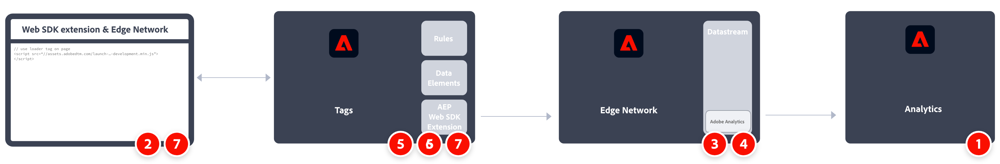

# Implement Adobe Analytics using the Adobe Experience Platform Web SDK

You can use the [Adobe Experience Platform Web SDK](https://experienceleague.adobe.com/docs/experience-platform/tags/extensions/client/sdk/overview.html) to send data to Adobe Analytics. This implementation method works by translating the [Experience Data Model (XDM)](https://experienceleague.adobe.com/docs/experience-platform/xdm/home.html) into a format used by Analytics.

You can send data to Experience Edge directly using the Web SDK, or through the Web SDK extension in Tags.

## Web SDK

A high-level overview of the implementation tasks:

<table style="width:100%">

<tr>
<th style="width:5%"></th><th style="width:60%"><b>Task</b></th><th style="width:35%"><b>More Information</b></th>
</tr>

<tr>
<td>1</td>
<td>Ensure you have <b>defined a report suite</b>.</td>
<td><a href="../../../admin/admin/c-manage-report-suites/report-suites-admin.md">Report Suite Manager</a></td>
</tr>

<tr>
<td>2</td>
<td><b>Setup schemas and datasets</b>. To standardize data collection for use across applications that leverage Adobe Experience Platform, Adobe has created the open and publicly documented standard, Experience Data Model (XDM).</td>
<td><a href="https://experienceleague.adobe.com/docs/experience-platform/xdm/ui/overview.html?lang=en">Schemas UI overview</a> and <a href="https://experienceleague.adobe.com/docs/experience-platform/catalog/datasets/user-guide.html?lang=en">Datasets UI overview</a></td>
</tr>

<tr>
<td>3</td>
<td><b>Create a data layer</b> to manage the tracking of the data on your website.</td>
<td><a href="../../prepare/data-layer.md">Create a data layer</a></td>
</tr>

<tr>
<td> 4</td>
<td><b>Install the prebuilt standalone version</b>. You can reference the library (<code>alloy.js</code>) on the CDN directly on your page or download and host it on your own infrastructure. Alternatively, you can use the NPM package.</td>
<td><a href="https://experienceleague.adobe.com/docs/experience-platform/edge/fundamentals/installing-the-sdk.html?lang=en#option-2%3A-installing-the-prebuilt-standalone-version">Installing the prebuilt standalone version</a> and <a href="https://experienceleague.adobe.com/docs/experience-platform/edge/fundamentals/installing-the-sdk.html?lang=en#option-3%3A-using-the-npm-package">Using the NPM package</a></td>
</tr>

<tr>
<td>5</td>
<td><b>Configure a datastream</b>. A datastream represents the server-side configuration when implementing the Adobe Experience Platform Web SDK.</td>
<td><a href="https://experienceleague.adobe.com/docs/experience-platform/edge/datastreams/configure.html?lang=en">Configure a datastream<a></td> 
</tr>

<td>6</td>
<td><b>Add an Adobe Analytics service</b> to your datastream. That service controls whether and how data is sent to Adobe Analytics.</td>
<td><a href="https://experienceleague.adobe.com/docs/experience-platform/edge/datastreams/configure.html?lang=en#analytics">Add Adobe Analytics service to a datastream</a></td>
</tr>

<tr>
<td>7</td>
<td><b>Configure the Web SDK</b>. Ensure the library that you installed in step 4 is properly configured with the datastream ID (formerly known as edge configuration id (<code>edgeConfigId</code>)), organization id (<code>orgId</code>), and other available options.</td>
<td><a href="https://experienceleague.adobe.com/docs/experience-platform/edge/fundamentals/configuring-the-sdk.html?lang=en">Configure the Web SDK</a></td>
</tr>

<tr>
<td>8</td>
<td><b>Execute commands</b> and/or <b>track events</b>. After the base code has been implemented on your webpage, you can begin executing commands and tracking events with the SDK.
</td>
<td><a href="https://experienceleague.adobe.com/docs/experience-platform/edge/fundamentals/executing-commands.html?lang=en">Execute commands</a> and <a href="https://experienceleague.adobe.com/docs/experience-platform/edge/fundamentals/tracking-events.html?lang=en">Track events</a></td>
</tr>

<tr>
<td>9</td><td><b>Extend and validate your implementation</b> before pushing it out to production.</td><td></td> 
</tr>
</table>

## Web SDK extension

A high-level overview of the implementation tasks:

<table style="width:100%">

<tr>
<th style="width:5%"></th><th style="width:60%"><b>Task</b></th><th style="width:35%"><b>More Information</b></th>
</tr>

<tr>
<td>1</td>
<td>Ensure you have <b>defined a report suite</b>.</td>
<td><a href="../../../admin/admin/c-manage-report-suites/report-suites-admin.md">Report Suite Manager</a></td>
</tr>

<tr>
<td>2</td>
<td><b>Setup schemas and datasets</b>. To standardize data collection for use across applications that leverage Adobe Experience Platform, Adobe has created the open and publicly documented standard, Experience Data Model (XDM).</td>
<td><a href="https://experienceleague.adobe.com/docs/experience-platform/xdm/ui/overview.html?lang=en">Schemas UI overview</a> and <a href="https://experienceleague.adobe.com/docs/experience-platform/catalog/datasets/user-guide.html?lang=en">Datasets UI overview</a></td>
</tr>

<tr>
<td>3</td>
<td><b>Create a data layer</b> to manage the tracking of the data on your website.</td>
<td><a href="../../prepare/data-layer.md">Create a data layer</a></td>
</tr>

<tr>
<td>4</td>
<td><b>Configure a datastream</b>. A datastream represents the server-side configuration when implementing the Adobe Experience Platform Web SDK.</td>
<td><a href="https://experienceleague.adobe.com/docs/experience-platform/edge/datastreams/configure.html?lang=en">Configure a datastream<a></td> 
</tr>

<tr>
<td>5</td> 
<td><b>Add an Adobe Analytics service</b> to your datastream. That service controls whether and how data is sent to Adobe Analytics.</td>
<td><a href="https://experienceleague.adobe.com/docs/experience-platform/edge/datastreams/configure.html?lang=en#analytics">Add Adobe Analytics service to a datastream</a></td>
</tr>

<tr>
<td>6</td>
<td><b>Create a tag property</b>. Properties are overarching containers used to reference tag management data.</td>
<td><a href="https://experienceleague.adobe.com/docs/experience-platform/tags/admin/companies-and-properties.html?lang=en#for-web">Create or configure a tag property for web</a></td>
</tr>

<tr>
<td>7</td> 
<td><b>Install and configure the Web SDK extension</b> in your tag property. Configure the Web SDK extension to send data to the datastream configured in step 4.</td>
<td><a href="https://experienceleague.adobe.com/docs/experience-platform/tags/extensions/client/sdk/overview.html?lang=en">Adobe Experience Platform Web SDK extension overview</a></td>
</tr>

<tr>
<td>8</td>
<td><b>Iterate, validate, and publish</b> to production. Add the tag property to your web site. Then use data elements, rules, and so on, to customize your implementation.</td>
<td><a href="https://experienceleague.adobe.com/docs/experience-platform/tags/publish/overview.html?lang=en">Publishing overview</a></td>
</tr>

</table>

## Additional resources

Tags can be highly customized. Learn more about how you can get the most out of Adobe Analytics by including the right data in your implementation.

-   [Tags documentation](https://experienceleague.adobe.com/docs/experience-platform/tags/home.html#): Learn how the interface works and what extensions are available.

-   [Adobe Experience Platform Web SDK documentation](https://experienceleague.adobe.com/docs/web-sdk.html?lang=en)
