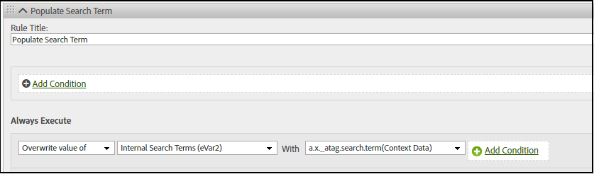

# Map XDM data to Analytics manually

The Adobe Experience Platform (AEP) Web SDK includes aids for helping you to manually map data between the Platform and Analytics.

For XDM data that is not automatically mapped to Analytics, you can add [context data](https://experienceleague.adobe.com/docs/analytics/implementation/vars/page-vars/contextdata.html) to match your [schema](https://experienceleague.adobe.com/docs/experience-platform/xdm/schema/composition.html). Then it can be  used by Analytics [processing rules](https://experienceleague.adobe.com/docs/analytics/admin/admin-tools/processing-rules/processing-rules-configuration/t-processing-rules.html) to populate Analytics variables. 
 
Also, you can use a default set of actions and product lists to send or retrieve data with the [AEP Web SDK](https://experienceleague.adobe.com/docs/experience-platform/edge/home.html?lang=en).

## Context data

 To be used by Analytics, XDM data is flattened using dot notation and made available as `contextData`. The following list of value pairs shows an example of `context data`:

```javascript
{
          "bh": "900",
          "bw": "1680",
          "c": "24",
          "c.a.d.key.[0]": "value1",
          "c.a.d.key.[1]": "value2",
          "c.a.d.object.key1": "value1",
          "c.a.d.object.key2.[0]": "value2",
          "c.a.x.environment.browserdetails.javascriptenabled": "true",
          "c.a.x.environment.type": "browser",
          "cust_hit_time_gmt": "1579781427",
          "g": "https://example.com/home",
          "gn": "home",
          "j": "1.8.5",
          "k": "Y",
          "s": "1680x1050",
          "tnta": "218287:1:0|0,218287:1:0|2,218287:1:0|1,218287:1:0|32767,218287:1:0|1,218287:1:0|0,218287:1:0|1,218287:1:0|0,218287:1:0|1",
          "user_agent": "Mozilla/5.0 AppleWebKit/537.36 Safari/537.36",
          "v": "Y"
        }
```

## Processing rules

All data collected by the edge network can be accessed via [processing rules](https://experienceleague.adobe.com/docs/analytics/admin/admin-tools/processing-rules/processing-rules-configuration/t-processing-rules.html). In Analytics, you can use processing rules to incorporate context data into Analytics variables. 

For example, in the following rule, Analytics is set to populate **Internal Search terms (eVar2)** with the data associated with **a.x_atag.search.term(Context Data)**.

  


## XDM Schema

Experience Platform uses schemas to describe the structure of data in a consistent and reusable way. By defining data consistently across systems, it becomes easier to retain meaning and therefore gain value from data. Analytics context data works with the structure defined by schema. 

The following example shows how the [`event` command](https://experienceleague.adobe.com/docs/experience-platform/edge/fundamentals/tracking-events.html) can be used with the `xdm` option to send and retrieve data with the AEP Web SDK. In this example, the `event` command matches the [ExperienceEvent Commerce Details Schema](https://github.com/adobe/xdm/blob/1c22180490558e3c13352fe3e0540cb7e93c69ca/docs/reference/context/experienceevent-commerce.schema.md) so that the productListItems `name` and `SKU` values are tracked:


```
alloy("event",{
  "xdm":{
    "commerce":{
      "productViews":{
        "value":1
      }
    },
    "productListItems":[
      {
        "SKU":"HT105",
        "name":"Large Field Hat",
      },
      {
        "SKU":"HT104",
        "name":"Small Field Hat",
      }
    ]
  }
});
```

For more information on tracking events with the AEP Web SDK, see [Tracking events](https://experienceleague.adobe.com/docs/experience-platform/edge/fundamentals/tracking-events.html).
