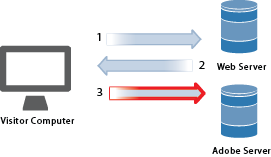
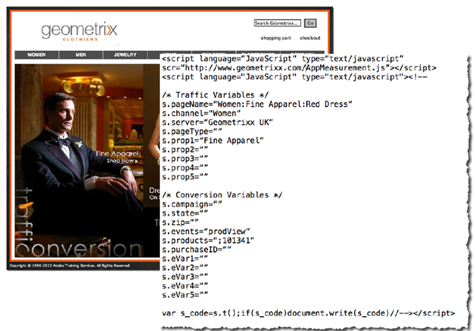
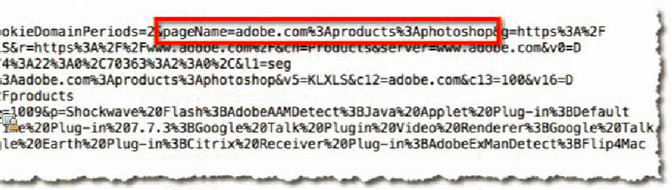
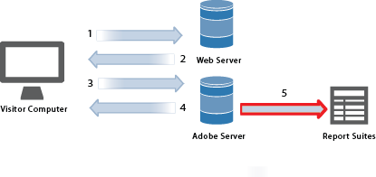
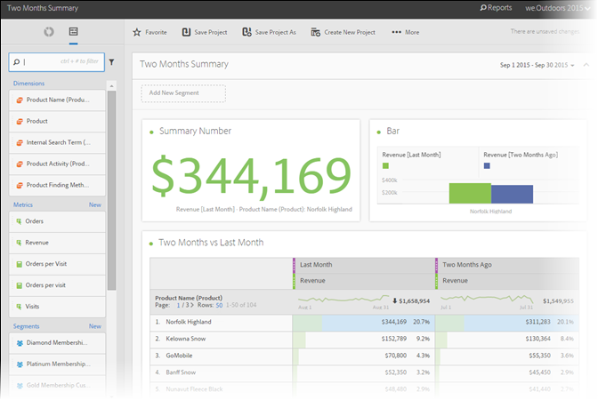

# Data Collection

Learn how visits to your web site become a report in Adobe Analytics.

Analytics data collection is accomplished by making a special image request to Adobe data collection servers. In most implementations, JavaScript code is placed on the web pages being tracked. When a tagged web page loads in a visitor's browser, the browser executes our JavaScript code, performing logic to capture visitor information and populate tags correctly. The last step of JavaScript processing is an image request to an Analytics data collection server which collects the data being submitted and returns a small transparent image to the visitor's browser.

As the typical bottleneck in browser processing is the time it takes to download page elements (images, et cetera) from web servers, the time required for the browser to execute the JavaScript code is negligible. However, the last step where the visitor's browser requests an image from the Adobe data collection server does add to the total page download time. The overall affect on page download time depends on the website visitor's proximity (typically in Internet hops, not geographic distance) to Adobe data collection servers.

Adobe has created multiple ways to send data into Analytics. These methods include tracking information in real-time from:

* Applications that can access the Internet 
* Campaigns 
* Client-server applications 
* Emails 
* Mobile devices 
* Web-based kiosks 
* Web sites

<!-- 

Need to reconcile with Data Collection topics in the user guide, in this guide, and in reference. 

 -->

1. When a visitor comes to your site, a request is made to your web server.

   

1. Your site's web server sends the page code information, and the page displays in the browser.

   

1. The page loads, and the Analytics JavaScript code runs.

   

   The JavaScript code sends an image request to the Adobe server, passing the variables, metrics, and page data that you defined in your implementation.

   **Example JavaScript Code:** The JavaScript code is placed within the body tags of a web page:

   

   **Example Image Request:** A snippet of an image request with the page name outlined:

   

   >[!NOTE]
   >
   >Each image request contains a random number string to prevent browser caching and ensure that subsequent image requests are made by the browser.

1. Adobe returns a transparent pixel image.

   

   The code automatically collects additional details (such as operating system, browser type, browser height and width, IP address, and browser language).

1. Adobe servers store web analysis data in *`report suites`* (your data repository).

   

   A [report suite](https://marketing.adobe.com/resources/help/en_US/reference/report_suites_admin.html) defines the complete, independent reporting on a chosen website, set of websites, or subset of web pages.

1. Report suite data populates the reports that you can access in a web browser.

   

   **Example report:**

   

   The JavaScript code execution occurs quickly and does not noticeably affect page load times. This approach allows you to count pages that were displayed when a visitor clicked **[!UICONTROL Reload]** or **[!UICONTROL Back]** to reach a page, because the JavaScript runs even when the page is retrieved from cache.

For more details, see:

* [Data Collection](/help/implement/js-implementation/data-collection/query-parameters.md)
* [Create a Data Element](/help/implement/c-implement-with-dtm/t-data-element.md)
* [Data Warehouse](https://marketing.adobe.com/resources/help/en_US/reference/data_warehouse.html)
* [Ad Hoc Analysis](https://marketing.adobe.com/resources/help/en_US/dsc/c_getting_started.html)
* [Data Sources](https://marketing.adobe.com/resources/help/en_US/whitepapers/ftp/ftp_datasources.html)
* [Data Connectors](https://marketing.adobe.com/resources/help/en_US/whitepapers/ftp/ftp_genesis.html) 
* [Analytics Data Feed](/help/export/analytics-data-feed/data-feed-overview.md)
  
>[!MORELIKETHIS]
>       
>* [Experience Cloud Debugger](/help/implement/impl-testing/debugger.md)  
