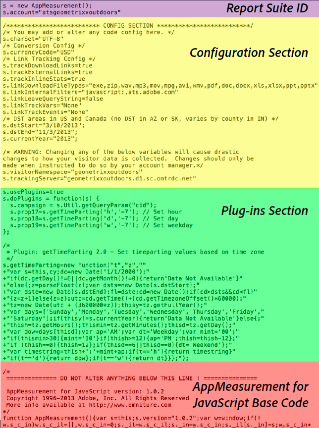

# Analytics code

Data is sent to a report suite to display in reporting. The easiest and most common way to send data to Analytics is by using the DTM implementation. You can also enter the code with the JavaScript implementation.

For information about using Dynamic Tag Management to create the header and footer code for you, see [Add Header and Footer Code](../../implement/c-implement-with-dtm/c-headers-footers/t-header-footer-code.md#task_43C8DD699A514638B0620775C06423E5).

Here is an example of AppMeasurement JavaScript file, showing the code parts:

