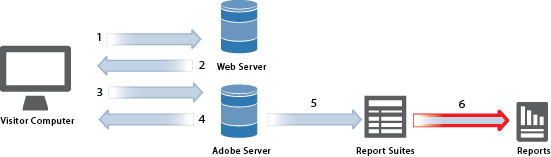

# Reports and Report Suites

A report suite defines the complete, independent reporting on a chosen website, set of websites, or subset of web pages. Usually, a report suite is one website, but it can be a global segment where you have combined several sites' numbers to get totals. When you log in to the marketing reports, ad hoc analysis, and report builder, you select one report suite to use (except when you use roll-ups that combine report suites).

 

Reports provide information about the data collected by Analytics, based on specific parameters.

You can run an *Analytics report* after implementing Adobe Analytics. Reporting provides insights into your traditional web-based channels as well as evolving channels like mobile, video, and social networking. Some examples of marketing reports include:

* How many people visit your site 
* How many of those visitors are unique visitors (counted only once) 
* How they came to the site (such as whether they followed a link or came there directly) 
* What keywords visitors used to search site content 
* How long visitors stayed on a given page or on the entire site 
* What links visitors clicked, and when they left the site 
* Which marketing channels are most effective at generating revenue or conversion events 
* How much time they spent watching a video 
* Which browsers and devices they used to visit your site

High-level report types include:

* ** [Traffic](https://marketing.adobe.com/resources/help/en_US/reference/reports_traffic.html):** Gives you in-depth insight into how visitors interact with your website, and your customized traffic statistics. 
* ** [Conversion](https://marketing.adobe.com/resources/help/en_US/reference/reports_conversion.html):** Displays information about success indicators that you define. 
* ** [Paths](https://marketing.adobe.com/resources/help/en_US/reference/reports_paths.html):** Enable you to track and record entire browsing paths of visitors.

You can use [Analysis Workspace](https://marketing.adobe.com/resources/help/en_US/analytics/analysis-workspace/) to remove the typical limitations of a single Analytics report. It provides a robust, flexible canvas for building custom analysis projects. Drag-and-drop any number of data tables, visualizations, and components (dimensions, metrics, segments, and time granularities) to a project. Instantly create breakdowns and segments, create cohorts for analysis, create alerts, create segments, and curate reports for sharing with anyone in your business. 

 <b>See Also</b> 

* [Analysis Workspace Help](https://marketing.adobe.com/resources/help/en_US/analytics/analysis-workspace/) 
* [Reports and Analytics](https://marketing.adobe.com/resources/help/en_US/sc/user/) help 
* [Real-Time Reports](https://marketing.adobe.com/resources/help/en_US/reference/realtime.html) 
* [Adobe Report Builder](https://marketing.adobe.com/resources/help/en_US/arb/) help 
* [Data Extracts](https://marketing.adobe.com/resources/help/en_US/sc/user/data_extract.html) 
* [Activity Map](https://marketing.adobe.com/resources/help/en_US/analytics/activitymap/) 
* [Report Suite Manager](https://marketing.adobe.com/resources/help/en_US/reference/report_suites_admin.html) 
* [Analytics Product Comparison and Requirements](https://marketing.adobe.com/resources/help/en_US/reference/analytics-product-comparison.html) 
* [Report Descriptions](https://marketing.adobe.com/resources/help/en_US/reference/reports_descriptions.html) 
* [Dashboards and Reportlets](https://marketing.adobe.com/resources/help/en_US/sc/user/dashboard.html) 
* [Bookmarks](https://marketing.adobe.com/resources/help/en_US/insight/client/c_bookmark_about.html) 
* [Virtual Report Suites](https://marketing.adobe.com/resources/help/en_US/reference/virtual-report-suites.html) 
* [Anomaly Detection](https://marketing.adobe.com/resources/help/en_US/arb/anomaly_detection.html) 
* [Contribution Analysis](https://marketing.adobe.com/resources/help/en_US/analytics/contribution/ca_main.html)

