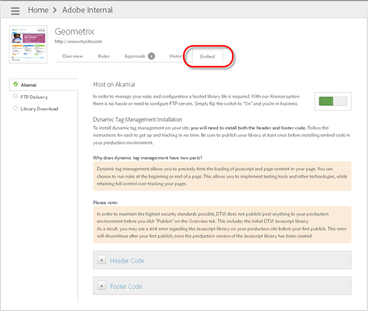

# Add header and footer code

Use Dynamic Tag Management to add header and footer code that determines the loading of JavaScript and page content on your site. You must install both the header and footer code on every page of your site, regardless of the hosting option used.

Because Dynamic Tag Management includes a snippet of code in both your header and footer, you can run rules at the beginning or end of a page. This ability allows you to implement testing tools and other technologies while retaining control over tracking your pages.

Dynamic Tag Management creates staging and production embed codes you can use to test your changes in your staging environment before pushing changes to your production environment.

>[!IMPORTANT]
>
>For a successful implementation, it is critical that you follow these instructions as they appear in Adobe Help. Specifically, you must place the header code in the `<head>` section of your document templates. Also, you must place the footer code just before the closing `</body>` tag. Placing either of these embed codes elsewhere in your markup, or using asynchronous methods to append the embed codes, or wrapping the embed codes in any way, are *not* a supported implementations of Dynamic Tag Management. The embed codes must be implemented exactly as provided.
>
>An unsupported implementation will yield unexpected results and prevent Customer Care and Engineering from assisting with your implementation.

1. In the Dynamic Tag Management interface, open the [!UICONTROL Embed] tab and select your hosting option (such as Akamai), then toggle the switch to "On."

   Step Result 1. Copy the production header code provided in the Embed tab of Dynamic Tag Management and place it within the [!DNL HEAD] section of your site HTML.

   

   Place the code as close to the [!DNL <head>] tag as possible. This code snippet should be placed on every page of your live production site.

   >[!NOTE]
   >
   >Production embed code reflects only the published items in that [property](/help/implement/c-implement-with-dtm/t-create-web-property.md). However, embed code for staging reflects all items in the associated property, regardless of the published or unpublished state. To test unpublished items on your production site, locally enable staging in the console by following the instructions in [Test Unpublished Rules for Akamai Hosting](/help/implement/c-implement-with-dtm/c-rules/t-test-rules-akamai.md).

1. Copy the production footer code and place it in the [!DNL BODY] section of your site HTML.

   Place the code as close to the [!DNL </body>] tag as possible.
1. Copy the staging header and footer code, then repeat the steps above on your staging site.

   >[!NOTE]
   >
   >The difference between production and staging code snippets is the addition of [!DNL -staging] to the filename in the staging version. The footer code remains the same in staging and production.

