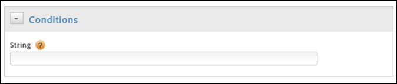

# Create conditions for direct-call rules

Create conditions for direct-call rules.

1. In the **[!UICONTROL Conditions]** dialog, specify the string that will be passed to `_satellite.track()` in your direct call, without quotes.

   

   >[!NOTE]
   >
   >If you specify the string that will be passed to `_satellite.track()` in your direct call using the UI, as described above, do not use quotation marks. If you insert [customized page code](../../c_implement-with-dtm/c_aa_tool/customize-page-code.md#concept_7D6390823DFE4D29AF9505CCE1A79C3B) using the editor, you must use quotation marks.

