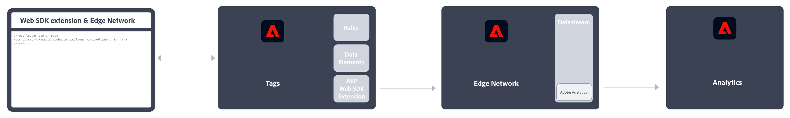
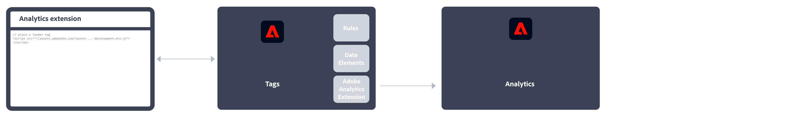
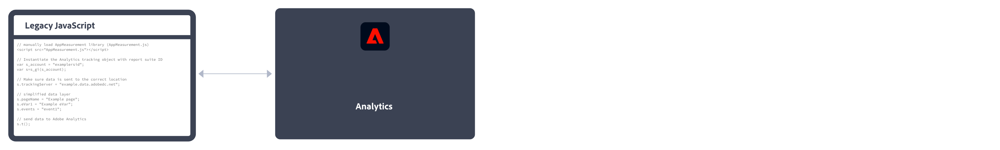
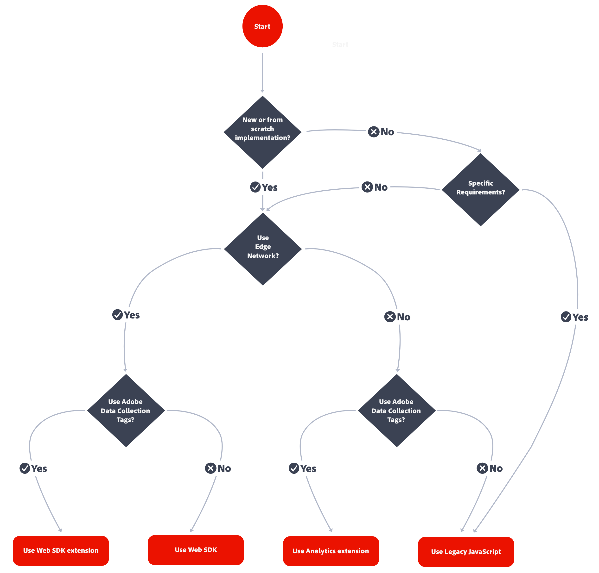
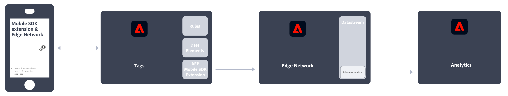
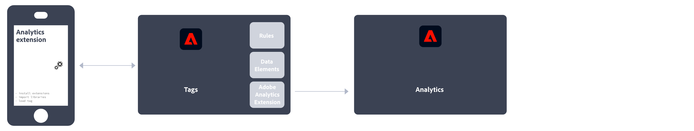

# Implement Adobe Analytics

Adobe requires code on your site or app to send data to Adobe's data collection servers. The following steps indicate how a typical implementation works.

1.  When a visitor comes to your site, a request is made to your web server.
2.  Your site's web server sends the page code information, and the page displays in the browser.
3.  The page loads, and the Analytics JavaScript code runs.
   The JavaScript code sends an image request to Adobe data collection servers. Page data that you defined in your implementation are sent as part of a query string in this image request.

4.  Adobe returns a transparent pixel image.
5.  Adobe servers store collected data in one or more *report suites*.
6.  Report suite data populates the reports that you can access in a web browser.

The JavaScript code execution occurs quickly and does not noticeably affect page load times. This approach allows you to count pages that were displayed when a visitor clicked **[!UICONTROL Reload]** or **[!UICONTROL Back]** to reach a page, because the JavaScript runs even when the page is retrieved from cache.

Adobe Analytics requires code within your website, mobile app, or other application to send data to data collection servers. There are several methods to implement this code, depending on platform and your organization's needs.

## Website implementation methods

For your **website**, the following implementation methods are available:

*   **Web SDK extension**: The standardized and recommended method to implement Adobe Analytics for new customers. Install the **AEP Web SDK extension** in Adobe Experience Platform Data Collection **Tags**, use a loader tag on each page, and send data to Adobe Experience Platform **Edge Network** in a format convenient to your organization. The Edge Network forwards incoming data to Adobe Analytics in the correct format.

See [Implement Adobe Analytics using the Adobe Experience Platform Web SDK extension](./aep-edge/overview.md) for more information.

*   **Web SDK**: You can manually load the Web SDK libraries on your site if you do not want to use Adobe Experience Platform Data Collection. Reference the Web SDK library (`alloy.js`) on each page, and send the desired tracking calls to the Adobe Experience Platform **Edge Network** in a format convenient to your organization. The Edge Network forwards incoming data to Adobe Analytics in the correct format.

See [Implement Adobe Analytics using the Adobe Experience Platform Web SDK](./aep-edge/overview.md) for more information.

*   **Analytics extension**: Install the **Adobe Analytics extension** in Adobe Experience Platform Data Collection **Tags**. Place a loader tag on each page, and use the Adobe Analytics extension to determine how each variable is defined. Use this implementation method if you do want the convenience of Tags, but not want to use the Edge Network infrastructure.

See [Implement Adobe Analytics using the Analytics extension](launch/overview.md) for more information.

*   **Legacy JavaScript**: The historical manual method to implement Adobe Analytics. Reference the AppMeasurement library (`AppMeasurement.js`) on each page and then outline variables and settings used in an implementation. 

This implementation method can be useful for implementations using custom code and is still recommended when you (want to) use:

    *   [activity map data](../analyze/activity-map/activity-map.md), 
    
        >[!INFO]
        >
        >Using the latest Web SDK, Activity Map is supported. See [Enable Activity Map](/help/analyze/activity-map/activitymap-getting-started/activitymap-getting-started-admins/activitymap-enable.md) for more information.

    *   [streaming media measurement](https://experienceleague.adobe.com/docs/media-analytics/using/media-overview.html?lang=en),

    *   [livestream API or livestream triggers](https://github.com/AdobeDocs/analytics-1.4-apis/blob/master/docs/live-stream-api/getting_started.md),

    *   [AMP page tracking](./other/amp.md)

    See [Implement Adobe Analytics with AppMeasurement for JavaScript](js/overview.md) for more information.

The following decision flow might help you select an implementation method:

>[!TIP]
>
>Please contact Adobe for advice and best practices on which implementation to choose based on your current situation.

## Mobile app implementation methods

For your **mobile app**, the following implementation methods are available:

*   **Mobile SDK extension**: The standardized and recommended method to implement Adobe Analytics in your mobile app. Use dedicated libraries to easily send data to Adobe from within your mobile app. Install the **Adobe Experience Platform Mobile SDK extension** in Adobe Experience Platform Data Collection **Tags** and implement the correct code in your app to import libraries, register extensions and load the tag configuration. This sends data to Adobe Experience Platform **Edge Network** in a format convenient to your organization. Experience Edge forwards incoming data to Adobe Analytics in the correct format.

    See [Implement Adobe Analytics using the Adobe Experience Platform Mobile SDK](../implement/aep-edge/mobile-sdk/overview.md) for more information.

*   **Analytics extension**: Install the **Adobe Analytics extension** in Adobe Experience Platform Data Collection **Tags**, and implement the correct code in your application to import libraries, register extensions and load the tag configuration. Use the Analytics extension to determine how each variable is defined. Use this implementation method if you do want the convenience of Adobe Experience Platform Data Collection, but not want to use Adobe's Experience Platform Edge network infrastructure.

    See [Implement Adobe Analytics using the Analytics extension](../implement/aep-edge/mobile-sdk/overview.md) for more information.

>[!CAUTION]
>
>Support for Version 4 Mobile SDKs ended on August 31, 2021. See [Version 4 Mobile SDKs end-of-support FAQ](https://developer.adobe.com/client-sdks/documentation/v4-end-of-life-faq/) for more information.

## Key Analytics Implementation articles

* [Take charge of an existing Adobe Analytics implementation](/help/implement/prepare/existing-implementation.md)
* [Adobe Debugger](validate/debugger.md)
* [Create a tag property in Experience Platform](launch/create-analytics-property.md)
* [AppMeasurement updates](appmeasurement-updates.md)

## More Analytics user guides

[Analytics User Guides](https://experienceleague.adobe.com/docs/analytics.html)

## Key Analytics resources

* [Contact Customer Care](https://experienceleague.adobe.com/?support-solution=Analytics#support)
* [Analytics Forum](https://experienceleaguecommunities.adobe.com/t5/adobe-analytics/ct-p/adobe-analytics-community)
* [Adobe Analytics Resources](https://experienceleaguecommunities.adobe.com/t5/adobe-analytics-discussions/adobe-analytics-resources/m-p/276666)
