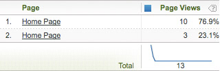

# Using white space in variable values

In HTML there are several characters that create whitespace.

 These include a space, a tab, and a carriage return (or linefeed). Consider the following example: 

```js
<head> 
 <title> 
   Home Page 
 </title> 
</head> 
<body> 
<script language="javascript"> 
 s.pageName=document.title 
</script> 

```

In this case, document.title populates [!UICONTROL s.pageName], which should receive a value of "Home Page." Notice the space before "Home Page." Not all browsers interpret this white space in the same way. The result may be either of two examples below: 

```js
s.pageName="Home Page"
```

```js
s.pageName="        Home Page"
```

The first value displays correctly, but the second displays white space before the text. [!DNL Analytics] treats these as distinct values for the [!UICONTROL s.pageName] variable. The [!DNL Analytics] interface strips the leading white space from the second value. The result is a report that displays as shown below.



This implementation error causes your variable values to be fragmented across multiple line items. [!DNL SAINT] does not allow leading white space in a key value. This means that it cannot be used to group multiple line items as a work-around if this issue is affecting your site. The only way to fix the problem is to pre-process the desired variable value (in this case, the document.title property) to remove any leading (or trailing) white space.

The example above uses the [!UICONTROL s.pageName] variable with the document.title property. Adobe does not recommend using document.title as the page name, nor does this issue only affect the [!UICONTROL s.pageName] variable. Any variable that has leading/trailing white space in its value can be affected. 
