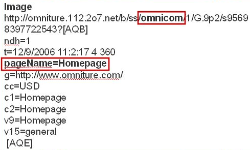

# Identify the s_account variable in the debugger

When you run the Experience Cloud Debugger, you may want to look for the s_account variable.

Validation and testing should always be done on a development report suite.

The following figure shows the location of the *`s_account`* variable.

