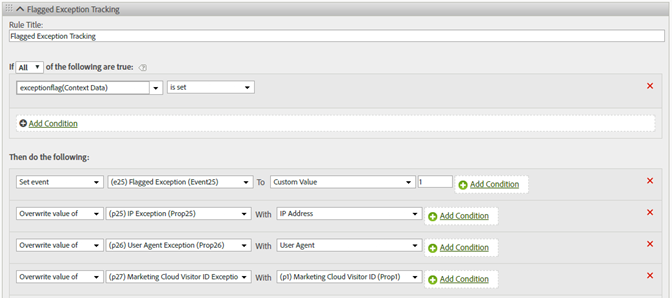

# hitGovernor

The s.hitGovernor plugin tracks the total number of Analytics image requests sent during a predefined rolling time frame, and can perform additional logic as required if that total exceeds a certain threshold.

## hitGovernor {#topic_56B636A42A624B38A0A446C607ACD700}

The s.hitGovernor plugin tracks the total number of Analytics image requests sent during a predefined rolling time frame, and can perform additional logic as required if that total exceeds a certain threshold. 

Although traffic from bots, spiders, specific user agents, or a specific list of IP addresses can be identified as bot traffic or otherwise excluded from reporting, there can be traffic that is captured in your report suites that should not otherwise be counted. For example, a high number of clicks or page views during an unreasonable amount of time (i.e. approximately one request per second) could potentially be duplicitous traffic.

Using this plugin allows for that traffic to automatically be blocked for the remainder of that visitor's lifetime, and that traffic can also be dynamically identified within reports.

## How the Hit Governor Plugin Works {#section_541BC639E31442D09B1C85A2FFCDC02C}

The plugin increments a cookie value each time an image request is sent to your tracking servers, and tracks this over a rolling time frame. The default time frame is one minute, although that time frame can be overridden. (See [Implementation](../../../implement/js-implementation/c-mplementation-plug-ins/hitgovernor.md#task_D4BDB524AA294C139AFCAE2B61FEA3F2), below.) If the total number of hits during that time frame exceeds the default hit threshold (60), a final custom link image request is sent to set the *`exceptionFlag`* context data variable. The default hit threshold can also be overridden.

If desired, from that point forward, traffic can be prevented from being collected for that specific visitor for a default period of sixty days. Blocking the traffic requires an additional line of code in your doPlugins function, as outlined below. The time frame can be adjusted as well. The logic allows time to either include that visitor's IP address, User Agent, or [!DNL Experience Cloud] Visitor ID in the proper permanent exception logic, or to reset the timeout period after the sixty days have elapsed. If this traffic is identified as fraudulent by the plugin after sixty days, the traffic is again flagged as an exception and is not collected for another sixty days.

## Reporting {#section_E742F19B528041808454744DB2C7007C}

No default variables or events need to be set up. However, we strongly recommend that you set up processing rules logic to set variables and events accordingly. Those custom variables and events might include:

* [!DNL Experience Cloud] Visitor ID 
* IP Address 
* User Agent 
* Flagged Exception Event

Creating segments for those variables would then allow you to create segments and virtual report suites to view the overall site impact of those ambiguous hits.

We recommend using the values captured in the reporting to update the bot rules, DB VISTA rules, or company IP exclusions. 

## Implementation {#task_D4BDB524AA294C139AFCAE2B61FEA3F2}

To implement the hitGovernor plugin:

1. Modify the AppMeasurement library.

   To initialize the plugin, include this line of code (in bold) within the `registerPostTrackCallback` function in the AppMeasurement library code.

   >[!NOTE]
   >
   >Although the `registerPostTrackCallback` functionality is included in AppMeasurement libraries 1.8.0+, it is not included in any custom code configuration by default. It is included after and *outside of* the doPlugins function.

   ```
    s.registerPostTrackCallback(function(){ 
       
<b> s.governor();</b> 
   });
   ```

   Below the doPlugins section of your AppMeasurement file, include the plugin code contained in [Plugin Source Code](../../../implement/js-implementation/c-mplementation-plug-ins/hitgovernor.md#reference_76423C81A7A342B2AC4BE41490B27DE0), below.

   The hit limit threshold, hit timing threshold, and traffic exclusion time frames can all be overridden by setting these variables, outside of the plugin itself and preferably with your other configuration variables:

<table id="table_9959A40F5F0B40B39DB86E21D03E25FD"> 
 <thead> 
  <tr> 
   <th colname="col1" class="entry"> Variable </th> 
   <th colname="col2" class="entry"> Syntax </th> 
   <th colname="col3" class="entry"> Description </th> 
  </tr> 
 </thead>
 <tbody> 
  <tr> 
   <td colname="col1"> <p>Hit Limit Threshold </p> </td> 
   <td colname="col2"> <p> <span class="codeph"> s.hl = 60; </span> </p> </td> 
   <td colname="col3"> <p>The total number of hits that should not be exceeded during a given timeframe. </p> </td> 
  </tr> 
  <tr> 
   <td colname="col1"> <p>Hit Time Threshold </p> </td> 
   <td colname="col2"> <p> <span class="codeph"> s.ht = 10; </span> </p> </td> 
   <td colname="col3"> <p>The window, in seconds, for when hits are recorded. This number is divided by six to determine the rolling timing windows. </p> </td> 
  </tr> 
  <tr> 
   <td colname="col1"> <p>Exclusion Threshold </p> </td> 
   <td colname="col2"> <p> <span class="codeph"> s.he = 60; </span> </p> </td> 
   <td colname="col3"> <p>Number of days that the exclusion cookie is set for that visitor. </p> </td> 
  </tr> 
 </tbody> 
</table>

   >[!NOTE]
   >
   >Your implementation might use a different object name than the default analytics "s" object. If so, please update the object name accordingly.

1. Configure processing rules.

   This plugin records flagged exceptions as context data in a link tracking image request. As such, processing rules must be configured to assign track those flagged exceptions into appropriate variables like those below.

   

1. (Optional) Include the traffic-blocking code in doPlugins.

   After traffic has been identified as an exception, any subsequent hits from that visitor can be blocked entirely by including this code within the `doPlugins` function:

   ```
   //Check for hit governor flag 
         if(s.Util.cookieRead('s_hg')==9)s.abort=true;
   ```

   If this code is not included, traffic from that visitor will be flagged but not blocked. 

## Plugin Source Code {#reference_76423C81A7A342B2AC4BE41490B27DE0}

This code should be added below the doPlugins section of your AppMeasurement library.

```
//Hit Governor (Version 0.1 BETA, 11-13-17) 
s.governor=new Function("","" 
+"var s=this;if(typeof s.hl=='undefined'){s.hl=60;}if(typeof s.ht=='u" 
+"ndefined'){s.ht=60;}if(typeof s.he=='undefined'){s.he=60;}if(s.Util" 
+".cookieRead('s_hg')==8){var i=new Date(),y=i.getFullYear(),m=i.getM" 
+"onth(),d=i.getDate(),i=new Date(y,m,d+s.he);s.Util.cookieWrite('s_h" 
+"g',9,i);return;}var f=s.Util.cookieRead('s_hc'),g=Number(s.Util.coo" 
+"kieRead('s_ht')),h=Math.floor((new Date()).getTime()),ha=f!=''?f.sp" 
+"lit('|').map(Number):[0,0,0,0,0],i=ha.reduce(function(ha,b){return " 
+"ha+b;},0),j=g==0?0:Math.floor(((h-g)/(s.ht/6))/1000);if(g==0)s.Util" 
+".cookieWrite('s_ht',h);if(i<s.hl){if(j>=1){if(j>=6){ha=[0,0,0,0,0];" 
+"}else{for(var k=0;k<j;k++){ha.unshift(0);ha.pop();}}s.Util.cookieWr" 
+"ite('s_ht',h);}}else{s.Util.cookieWrite('s_hg',8);s.linkTrackVars+=" 
+"',contextData.exceptionFlag';s.contextData['exceptionFlag']='true';" 
+"s.tl(this,'o','exceptionFlag');}ha[0]++;s.Util.cookieWrite('s_hc',h" 
+"a.join('|'));"); 

```

