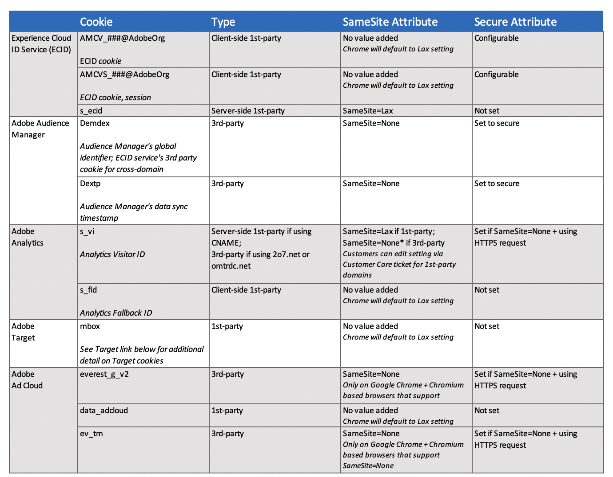

# Browsers and Analytics cookies FAQ

To support persistent user identification across properties and solutions, Adobe Analytics is responsive to changes in how browsers handle cookies. The following FAQ presents information on how persistent visitor identification is preserved with browser cookie changes.

## How are browsers changing the way they handle cookies?

In general, most browsers are becoming more restrictive in how they hold third-party cookies. This can affect tracking if the cookie is deleted or rejected by the browser. The Safari browser is additionally setting some limitations for some first-party cookies. 

The following list shows some recent changes according to browsers:

* Chrome: Starting with Chrome 80, the `SameSite` attribute is handled differently to manage third-party cookies or cross-site requests. Ultimately, Chrome developers are looking for ways to [deprecate third-party cookies](https://blog.chromium.org/2020/01/building-more-private-web-path-towards.html?m=1) altogether.

* Firefox and Edge: Product announcements state that successive versions of their browsers are to follow the same changes as those made in Chrome 80.

* Safari: With [Safari 12.1](https://webkit.org/blog/category/privacy/), first party persistent cookies set through the document.cookie API, often known as “client-side” cookies, have their expiration capped at seven days.

## What is the difference between third-party cookies and first-party cookies?

### First-party cookies

First party cookies are created by customer websites (domain-specific) and stored into client browsers as users visit customer websites. All browsers generally accept first-party cookies. In a first-party cookie Analytics implementation, the visitor id cookie is created at an Adobe node when the hostname is reconciled with the domain by use of a [CNAME](https://docs.adobe.com/content/help/en/id-service/using/reference/analytics-reference/cname.html). The cookie is then accepted by the browser in a first party context. For more information, see [About first-party cookies](https://docs.adobe.com/content/help/en/core-services/interface/ec-cookies/cookies-first-party.html).

### Third-party cookies

Third-party cookies are not created by websites users visit. Although browsers currently treat all third-party cookies the same and store them accordingly, third-party cookies themselves can behave in different, important ways. With a customer’s Analytics third-party cookie implementation, the client makes calls only to Adobe, and not to unknown or suspicious third-party domains. This is the current method for implementing Analytics for secure (HTTPS) and reliable tracking with persistent identifiers. This method is implemented by configuring the AppMeasurement.js file. For more information, see [Cookies and the Experience Platform Identity Service](https://docs.adobe.com/content/help/en/id-service/using/intro/cookies.html).

## How do browsers currently store and manage Analytics cookies?

Depending on the implementation, Analytics cookies are stored as follows:

### Third-party cookie implementations

Browsers currently store the Adobe [demdex.net](https://docs.adobe.com/content/help/en/audience-manager/user-guide/reference/demdex-calls.html) ID as a third-party cookie. This cookie provides persistent identifiers across domains and allows for secure (https) content.

### First-party cookie implementations

By configuring a CNAME, your user can receive Adobe cookies in a first-party cookie context for their browsers. This may be a viable option if a third-party cookie implementation is not optimal for your users. 

## What is the SameSite cookie attribute and how does it affect Analytics?

With the release of the Chrome 80 browser--and successive versions of Firefox, and Edge browsers--the SameSite cookie attribute enforces the specification for three different values for controlling the behavior of cross-site requesting, as follows: 

* `None`: This setting enables cross-site access and enables cookies to be passed in a third-party context. To specify this attribute, you must also specify `Secure` and all browser requests must follow HTTPS. For example, when setting the cookie, you pair the values of the attribute as follows: `Set-Cookie: example_session=test12; SameSite=None; Secure`. If not labelled properly, the cookies are unusable to the newer browsers and will be rejected.

* `Lax`: Allows cross-site requests to be sent with same-site cookies only for top level navigations with *safe* (read-only, such as `GET`) HTTP methods.

* `Strict`: The same-site cookie is not sent for any third-party website requests. The cookie is only sent if the site for the cookie matches the site in the URL bar.

The default behavior in these browser versions is to treat cookies that have no specified `SameSite` attribute the same as `SameSite=Lax`. 

## How is Adobe Analytics responding to these changes?

All Adobe cookie updates are handled via Adobe servers and Adobe has updated their edge servers to set the appropriate cookie attributes. Adobe has released server-side updates to set their third-party cookies with the appropriate attributes. No JavaScript updates are required for your sites. 

This upgrade by Adobe edge servers will happen automatically as users visit any website where the cookie is used. For most Adobe products, cookies will have the appropriate flags as Chrome 80 is released. The exception is Adobe Analytics implementations that use third-party data collection and do not use the Experience Cloud Identity Service (ECID). These customers may experience a small, temporary increase in new visitors that otherwise would have been tagged as returning visitors.

For browsers that Google has identified as mishandling cookies when `SameSite` is set to `None`, `SameSite` will instead be left unset.

The following table summarizes Analytics cookies:

## What is the best way to prepare my site for Chrome, Firefox, and Edge changes?

Analytics customers should confirm that their JavaScript configuration is using HTTPS for their calls to Adobe services. ECID redirects third-party HTTP calls to its HTTPS endpoint, which can increase latency, but means you are not required to change your configuration.

Adobe suggests that you ensure all of your site pages are served with HTTPS.

### One CNAME for multiple domains

If you have a CNAME implementation that is set in the same domain as your website, this will be a first-party cookie context and you do not need to make changes. 

However, if you own multiple domains and use the same CNAME for data collection across all your domains, then it is treated as a third-party cookie on those other domains. With Chrome 80, it will no longer be visible on these other domains. To make the behavior more similar across all browsers, Analytics is explicitly setting the `SameSite` value of this cookie to `Lax`. If you use this cookie in a friendly third-party context, you will need to have the cookie set with the `SameSite=None` value, which also means you must always use HTTPS. Contact Adobe Customer Care to have the SameSite value changed for your secure CNAMEs. Note, this action is NOT required for Analytics customers using ECID.

## What is the impact of Safari changes (ITP 2.1) for Analytics?

Despite changes in Safari 12.1, data sets from Adobe Experience Cloud cookies are still being collected. Although cookies are capped at seven days, visitors returning to your property within that time renew the cookie and keep it from expiring for another seven days. Lookback windows and return visitor counts may be reduced for Safari traffic until an Adobe update is made available.

Due to the shortened expiration window of seven days, customers may see an increase of unique visitors. Visit and page view counts should not be affected. If you have a property that has seasonal traffic, such as tax services or holiday retail, you may see higher impact as this visitor will not be connected between seasons.

If you use a CNAME, the visitor ID service will save the ECID into a server-side first-party cookie. This allows the cookie to persist for it's full duration.

**Note: ITP 2.1 will not apply to embedded browsers in mobile apps.**

### Affected first-party cookies

First party cookies created through `document.cookie` are affected. If you are setting any of these cookies via HTTP response (server-side) or using CNAME certification, you are not affected by the changes in ITP 2.1. The following first party cookies and related Adobe JavaScript libraries are affected:

* AMCV cookies set by the ECID (Experience Cloud ID) service library
* Analytics legacy fallback cookie `s_fid`

Analytics legacy `s_vi` cookie as a third party cookie, including collection targets of 2o7.net or omtrdc.net, continues to be blocked based on earlier versions of ITP.

To sum up:

* If you have a CNAME and use the visitor ID service — your implementation will not be affected.

* If you use a first party CNAME in the first party context and don’t use the visitor ID service — your implementation will not be affected. 

* If you use a first party cookie domain in the third party context, or with the standard third party domain names (e.g 2o7.net, omtrdc.net, etc), Safari will continute to block it as it has.

* If you use a custom visitor ID — This will depend on how your store your visitor ID. If you store your ID in a first party “client-side” cookie then you will be subject to the seven day expiration. If you use other means to store your custom ID then you will need to evaluate if you are affected.

### Least affected data sets

Data sets with active visitors who return frequently are the least affected by the changes. If the content of your site is such that customers return daily or at least a couple times a week, the cookies for these active users will be renewed before they expire. Social network, news and other media sites are most likely to have large communities of users who return frequently.

Customers who are using `s_vi` as their primary visitor ID, and are configured with first party data collection using a CNAME will not be impacted by ITP 2.1. Note that in instances where `s_vi` cannot be set, the fallback cookie, `s_fid` may be used and will have a seven day expiration.

Also, data sets that use the visitor ID service and have a first-party domain are least affected.

## Will Safari changes affect my business?

Adobe recommends customers measure the impact within their own company first before making any changes to data collection. This can be done by methods provided below in this section.

To measure impact to reporting and testing, it's important to know which type of visitor and cookie tracking you have implemented and how much traffic you have from users with Safari. Consider the following for measuring the impact on your individual business:

* Check to see what types of cookies are being set by your Adobe libraries.

* Open your developer console in your latest Safari browser. If you see any of the cookies listed above set in your first party domain, you may be affected by these changes.

* If you see an `s_vi` cookie, but not an `AMCV` cookie set in the context of a CNAME, you are using a CNAME for visitor identification and your Analytics usage is not affected by these changes. If you see both an `s_vi` cookie and an `AMCV` cookie set in the context of a CNAME, you have recently or currently are using Grace Period and some of your Analytics traffic may be impacted.

* Use Analytics to measure the percentage of visitors who do not return within seven days. If your visitors return repeatedly within seven days, your traffic may not be significantly affected. For instructions on using Analtyics to find this out, see [Safari ITP 2.1 Impact on Adobe Experience Cloud and Experience Platform Customers](https://medium.com/adobetech/safari-itp-2-1-impact-on-adobe-experience-cloud-customers-9439cecb55ac).

* Measure your traffic percentage from Safari browsers to determine if making any changes is sufficiently warranted. For instructions on using Analtyics to find out the percentage of Safari traffic to your sites, see [Safari ITP 2.1 Impact on Adobe Experience Cloud and Experience Platform Customers](https://medium.com/adobetech/safari-itp-2-1-impact-on-adobe-experience-cloud-customers-9439cecb55ac).

## Which browsers are my visitors most using?

If you are interested in learning more about the browsers used by your visitors, you can use the Analytics [Browser Dimension](https://docs.adobe.com/content/help/en/analytics/components/variables/dimensions-reports/reports-browsers.html) to determine which browsers are most used for your sites. You can also use Analytics Dimensions to see which browsers are most used according to geographical regions. For more information, see [GeoSegmentation](https://docs.adobe.com/content/help/en/analytics/components/variables/dimensions-reports/reports-geosegmentation.html).

According to [statcounter](https://gs.statcounter.com/browser-market-share/all), at the end of 2019 the worldwide market share for each browser was as follows:

* Chrome: ~64%
* Safari: ~17%
* Firefox: ~4%
* Edge: ~2%

As market share changes, you can refer to such [statistics](https://gs.statcounter.com/browser-market-share/all) to review your implementation strategy.

## How can I best work with ITP 2.1 changes in Safari for the short-term?

Adobe’s CNAME and managed certificate program is being used to deal with ITP changes. The Adobe Managed Certificate program lets you implement a new first-party certificate for first-party cookies at no additional cost. Today, Adobe has several CNAME services by solution and is looking to leverage the Analytics certification program in short-term.

Any current Analytics customer with a CNAME setup that is also using Experience Cloud ID Services for visitor identification will be able to take advantage of a future ECID library update. This change will allow CNAME certified tracking servers to maintain ECID and be used as reference for visitor identification. More information is available in successive releases of the ECID library.

Adobe is aware that not all ECID library customers use CNAMES or Analytics. All ECID customers will be offered a CNAME setup in effort to utilize the same capability.

If you are not currently leveraging a CNAME for your implementation, you can start the process by talking with Customer Care.

## What are Adobe's future plans for persistent visitor identification?

New capabilities and implementations include:

* CNAME certification self-serve options across all Adobe solutions

* Flexible visitor ID collection methods, BYOI (Bring your own Identity) and API-first data collection

* Adobe Experience Platform’s identity graphs

* Unified approach to Adobe data collection

Adobe is committed to more accurate personalization for consumers who want a personalized experience. Adobe strives to offer our customers online identity functionality that helps them align with their consumer’s privacy choices.

## More Information

For information see:

* [Adobe Experience Cloud: Cookie Updates for Google Chrome](https://medium.com/adobetech/adobe-experience-cloud-cookie-updates-for-google-chrome-19ad67cf1598)

* [Safari ITP 2.1 Impact on Adobe Experience Cloud and Experience Platform Customers](https://medium.com/adobetech/safari-itp-2-1-impact-on-adobe-experience-cloud-customers-9439cecb55ac)

