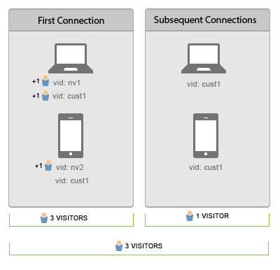

# Connect users across devices

Cross-device visitor identification helps you connect visitors across multiple devices. Cross-device visitor identification uses the visitor ID variable, s.visitorID, to associate a user across devices.

For information about identifying visitors across devices, refer to the [Adobe Experience Cloud Device Co-op Documentation](https://marketing.adobe.com/resources/help/en_US/mcdc/).

When you provide a [!UICONTROL visitor ID] variable with a hit, the system checks for any other visitor profiles that have a matching [!UICONTROL visitor ID]. If one exists, the visitor profile that is already in the system is used from that point forward and the previous visitor profile is no longer used.

The [!UICONTROL visitor ID] is typically set after authentication, or after a visitor performs some other action that enables you to uniquely identify them independently of the device that is used. We recommend creating a hash of the username or an internal ID that does not contain any personally identifiable information.

In the [previous example](../../js-implementation/xdevice-visid/xdevice-visid.md#section_FBB0F18AE4114E7BA987CAB96CA23B2B), after the customer signs on from each device, they are all associated with the same user profile. If the visitor later signs out on a device, stitching continues to work since the [!UICONTROL visitor ID]s that are stored in a cookie on each device are already associated with the same visitor profile. We recommend populating the [!UICONTROL s.visitorID] variable whenever possible in case the [!UICONTROL visitor ID] cookie is deleted.

## Unique Visitor and Visits Counts {#section_70330AB6724C4E419A4BD0BDD54641AC}

Consider the following connection sequence for two devices: 

**On the first data connection**

* Visitor de-duplication is not retroactive.

After authentication on the laptop, hits with either visitor ID ( `nv1` or `cust1`) will be considered the same individual by Adobe Analytics. However, visitor de-duplication is not retroactive, so 2 unique visitors are counted.

On the first data connection on the mobile device the customer is not recognized so a new unique visitor is counted. Once the user is authenticated ( `cust1`) on the mobile device, Adobe Analytics maps `cust1` back to the visitor ID provided on the main site, so no more unique visits are incremented.

Each new device or browser authenticated will add 1 unique visitor.

**On subsequent data connections**

On subsequent data connections to authenticated devices unique visitors are not incremented. 
