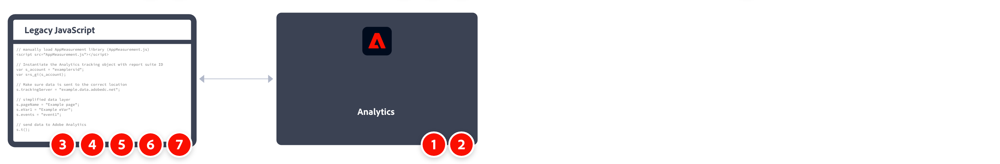

# Implement Adobe Analytics with AppMeasurement for JavaScript

AppMeasurement for JavaScript has historically been a common method to implement Adobe Analytics. However, with increasing popularity of Tag Management Systems, using [tags in Adobe Experience Platform](../launch/overview.md) is recommended.

A high-level overview of the implementation tasks: 



<table>
<tr>
<td></td><td> <b>Task</b></td><td><b>More Information</b></td>
</tr>

<tr>
<td>1</td><td>Ensure you have <b>defined a report suite</b></td><td><a href="../../admin/admin/c-manage-report-suites/report-suites-admin.md">Report Suite Manager</a></td>
</tr>

<tr>
<td>2</td><td><b>Download the required JavaScript code for AppMeasurement</b> from Code Manager. Unzip the file.</td><td><a href="../../admin/admin/code-manager-admin.md">Code Manager</a></td>
</tr>

<tr>
<td>3</td><td><b>Add <code>AppMeasurement.js</code> to your website's template file</b>. The code contains the libraries required to send data to Adobe.

```html
<head>
  <script src="AppMeasurement.js"></script>
  …
</head>
```

</td><td></td>
</tr>

<tr>
<td>4</td><td><b>Define configuration variables within <code>AppMeasurement.js</code></b>. When the Analytics object is instantiated, these variables make sure that data collection settings are correct.

```JavaScript
// Instantiate the Analytics tracking object with report suite ID
var s_account = "examplersid";
var s=s_gi(s_account);
 
// Make sure data is sent to the correct tracking server
s.trackingServer = "example.data.adobedc.net";
```

</td><td><a href="../vars/config-vars/configuration-variables.md">Configuration Variables</a></td>
</tr>

<tr>
<td>5</td><td><b>Define page-level variables within your site's page code</b>. These variables determine specific dimension and metrics sent to Adobe.

```js
s.pageName = "Example page";
s.eVar1 = "Example eVar";
s.events = "event1";
```

</td><td><a href="../vars/page-vars/page-variables.md">Page Variables</a></td>
</tr>

<tr>
<td>6</td><td><b>Send the data to Adobe using the <code>t()</code> method</b>, when all page variables are defined.

```js
s.t();
```

</td><td><a href="../vars/functions/t-method.md">t() method</a></td>
</tr>

<tr>
<td>7</td><td><b>Extend and validate your implementation</b> before pushing it out to production.</b></td><td></td>
</tr>

</table>

## Additional resources

- [Variables, functions, methods, and plug-ins overview](../vars/overview.md)
