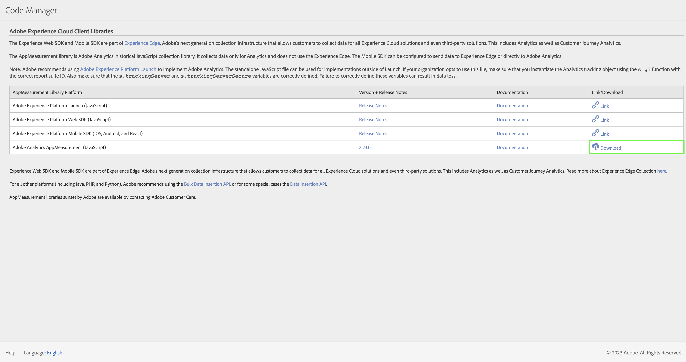

# Implement Adobe Analytics with AppMeasurement for JavaScript

AppMeasurement for JavaScript has historically been a common method to implement Adobe Analytics. However, with increasing popularity of Tag Management Systems, using [tags in Adobe Experience Platform](../launch/overview.md) is recommended.

## Overall workflow sending data to Adobe using JavaScript

1.  Ensure you have defined a report suite. See [Report Suite Manager](help/admin/admin/c-manage-report-suites/report-suites-admin.md) for more information.

2.  Download the required Javascript code for AppMeasurement from Code manager. 
    

    See [Code Manager](help/admin/admin/code-manager-admin.md) for more information.

3.  Unzip the downloaded file and look for `AppNMeasurement.js`.

4.  Add the `AppMeasurement.js` file as part your website's template file to the `<head>` tag. This file contains the libraries required to send data to Adobe.

    ```html
    <head>
        <script src="AppMeasurement.js"></script>
        …
    </head>
    ```

5.  Define configuration variables within `AppMeasurement.js` (or in a dedicated Javascript file, e.g.  `MyVariables.js` that you include as part of your site's page code). When the Analytics object is instantiated, these variables make sure data collection settings are correct. See [Configuration variables](../vars/config-vars/configuration-variables.md) for a full list of variables you can define.

     ```JavaScript
     // Instantiate the Analytics tracking object with report suite ID
     var s_account = "examplersid";
     var s=s_gi(s_account);
   
     // Make sure data is sent to the correct tracking server
     s.trackingServer = "example.data.adobedc.net";
     ```

6.  Define page-level variables within your site's page code. These variables determine specific dimension and metrics sent to Adobe. See [Page variables](../vars/page-vars/page-variables.md) for a full list of variables you can define.

     ```js
     s.pageName = "Example page";
     s.eVar1 = "Example eVar";
     s.events = "event1";
     ```

7.  When all page-level variables are defined, send the data to Adobe using the `t()` method. See [t](../vars/functions/t-method.md) for more information.

    ```js
    s.t();
    ```
