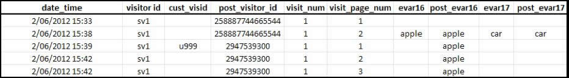
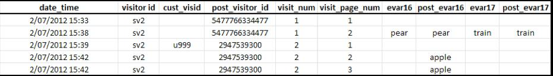

# Attribution and persistence

>[!IMPORTANT]
>
>This method of identifying visitors across devices is no longer recommended. See [Cross-Device Analytics](/help/components/cda/overview.md) in the Components user guide.

When visitor profiles are merged after being associated with the same visitor ID variable, attribution is not changed in the historical data set.

* When the variable `s.visitorID` is set and sent on a hit, Adobe checks for any other visitor profiles that have a matching visitor ID.
* If a profile exists, the visitor profile that is already in the system is used from that point forward and the previous visitor profile is no longer used.
* If no matching visitor ID is found, a new profile is created.

When an un-authenticated customer first arrives at your site, that customer is assigned a visitor profile by Adobe Analytics. When the new profile is created, one visit ends and another visit starts.

## Example 1

The example below represents how data is sent to Adobe Analytics when a customer authenticates for the first time, on the first device:

* `eVar16` has an expiration of 1 day and `evar17` expires on visit.
* The `post_visitor_id` column represents the profile maintained by Adobe Analytics. Post columns are typically seen in data feeds. See [Data feeds](/help/export/analytics-data-feed/data-feed-overview.md) in the Export user guide.
* The `post_evar16` and `post_evar17` columns show shows the persistence of eVars.
* `cust_visid` represents a value set in `s.visitorID`.
* Each row is one 'hit', a single request sent to Adobe Analytics data collection servers.

On the first data connection containing a previously unrecognized `s.visitorID` value (`u999` above), a new profile is created. Persistent values from the previous profile are transferred to the new profile.

* eVars set to expire on the visit are not copied to the authenticated profile. Note the value `car` above is not persisted.
* eVars set to expire by other measures will be copied to the authenticated profile. Note the value `apple` is persisted.
* For the eVars that are persisted, no Instance metric is recorded. This means when using cross-device visitor identification, it is possible to see reports where the Unique Visits metric for an eVar value is larger than the Instance metric.

>[!NOTE]
>
>If a user is new to your site (has never visited before on this device) and authenticates within approximately 3 minutes of arriving, no values persist to the authenticated profile.

## Example 2

The example below represents how data is sent to Adobe Analytics when a customer authenticates on a new device, after having previously authenticated on a different device.

When the customer authenticates, they are matched to the previous 'authenticated' profile - `2947539300`. The profile used at the start of this visit ( `5477766334477`) is no longer used and no data persists from the file.

* Geo-Segmentation data is recorded based on the first hit of the visit and does not change for a single visit regardless of the device used. This means on a subsequent data connection on a new device, geo-Segmentation data is generally not included.
* Technology columns such as browser, operating system, and color depth are recorded on the first hit of a visit. Like Geo-Segmentation values, they are not copied to the stitched profile.
* Marketing channels overwrite other channels on a subsequent data connection containing a first authentication for that device.
