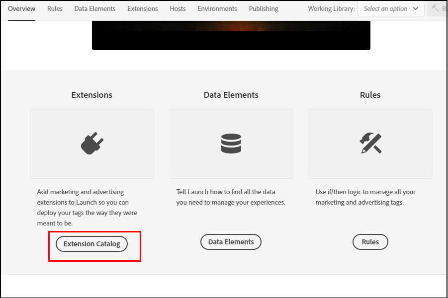
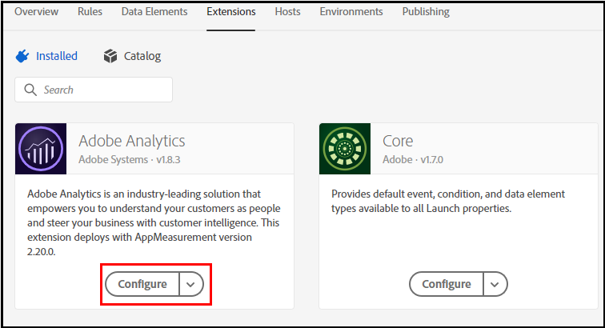
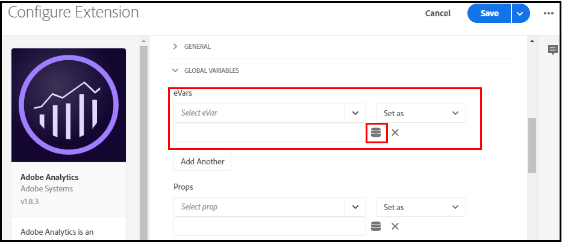

# Map Launch Data Elements to Analytics Variables

After [mapping your data layer objects to Launch data elements](https://docs.adobe.com/content/help/en/analytics/implementation/layer-to-elements.md), you can then map data elements to [Analytics variables](https://docs.adobe.com/content/help/en/analytics/implementation/vars/overview.html).

To map Launch data elements to Analytics variables:

1. If applicable, assign the data element to a global variable. Some data elements, such as *Page Name* apply to every page on a property. In cases like this, you can set the variable globally by doing the following:

2. In Launch, scroll down and click  **Extensions Catalog**.

    

3. Click **Configure** under Analytics.

    

4. Under **eVars** in **Global Variables**,select the [eVar you have set up](https://docs.adobe.com/content/help/en/analytics/admin/admin-tools/conversion-variables/conversion-var-admin.html) to be associated with the variable. Select **Set as**, and click the barrel icon in the right-most field to specify the data element.

    

5. In the **Select Data Element** pop up window, select the data element you want to apply to the variable. 

6. Click **Save.**

Alternatively, if the data element is not associated with a global variable, you can simply [create a rule](https://docs.adobe.com/content/help/en/analytics/admin/admin-tools/processing-rules/processing-rules.html) that assigns the data elements to props or evars.
