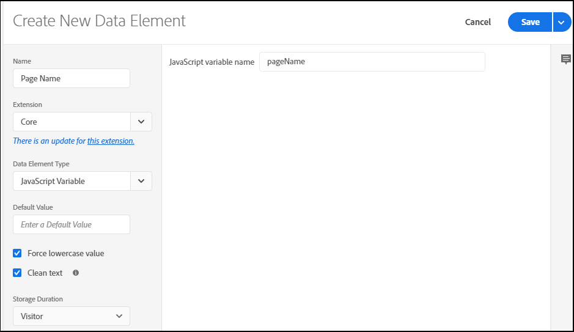

# Map Data Layer Objects to Data Elements

After [creating a data layer](https://docs.adobe.com/content/help/en/analytics/implementation/prepare/data-layer.html) for your implementation, you can map objects in it to [data elements in Launch](https://docs.adobe.com/content/help/en/launch/using/reference/manage-resources/data-elements.html#create-a-data-element). Data elements are building blocks for your data map that can be leveraged in multiple ways. You can use data elements to collect, organize, and deliver data across Adobe Platform solutions, including your Analytics reports.

To map data layer objects to Launch data elements:

1. In Launch, click the name of the property to which you want to add the data element. If you have not set up a property already, see the instructions to [Create a Launch Property](https://docs.adobe.com/content/help/en/core-services-learn/implementing-in-websites-with-launch/configure-launch/launch.html).

2. Click **Data Elements** and then click **Create New Data Element**.

    

3. Enter a name for your data element. This name should be a simple label that corresponds to a JavaScript variable in your data layer that you want to track.

4. For Extension, select **Core.** This extension includes all of the variables you will need.

5. For **Data Element Type**, select **JavaScript Variable**. Enter the **Javascript variable name** in the applicable field. This should match the exact name of the object in your JavaScript data layer.

6. For **Default Value**, enter any value you wish to establish by default, or leave it blank if appropriate.

7. According to your practices, you can select the options to force lowercase values and have enforce clean text (Launch will apply conventional spacing).

8. Specify the duration you would like to have Launch store values for the new data element.

9. Click **Save.**

The following example shows a Page Name data element in Launch created for the JavaScript variable ``pageName`` in the data layer:

With your data layer objects mapped to data elements, you can leverage them to populate Anayltics variables. For more information, see [Map Data Elements to Analytics Variables](https://docs.adobe.com/content/help/en/analytics/implementation/prepare/data-layer.html).
