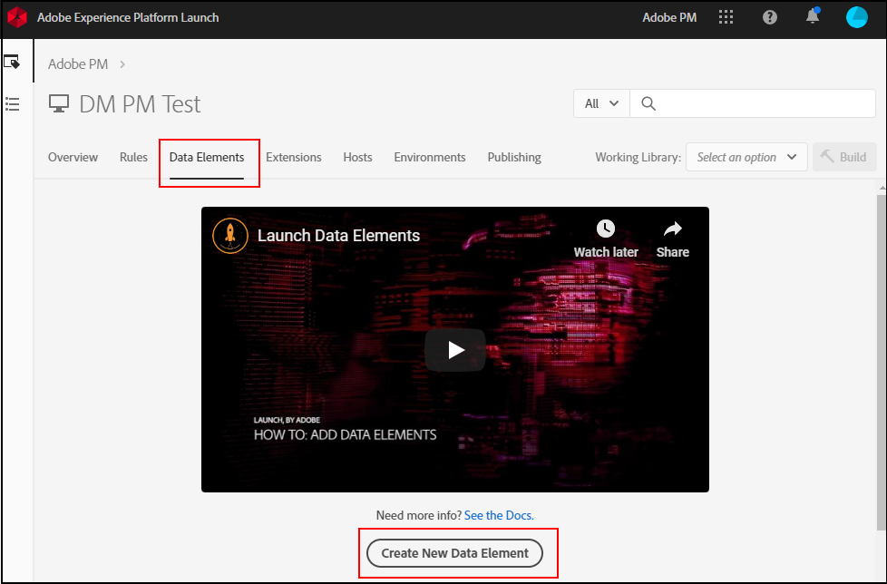

# Map data layer objects to data elements

Once your organization has established and implemented a data layer on your site, you can map data layer objects to data elements within tags.

## Prerequisites

[Create a data layer](../prepare/data-layer.md): Make sure a data layer exists on your site. While you technically can map any JavaScript object or scrape CSS elements directly from the page, Adobe recommends this practice as a last resort. If your site layout changes, the CSS selectors used in tags stop working, causing data loss.

## Use tags to create data elements

[Data elements](https://experienceleague.adobe.com/docs/experience-platform/tags/ui/data-elements.html) are components in Adobe Experience Platform Data Collection that you can use across the tool. You can assign variable values in the Adobe Analytics extension using data elements.

1. Log in to [Adobe Experience Platform Data Collection](https://experience.adobe.com/data-collection) using your AdobeID credentials.
1. Click the desired tag property.
1. Click the **[!UICONTROL Data Elements]** tab, then click **[!UICONTROL Add Data Element]**.

    

1. Enter a name for your data element. It can be a simple label that corresponds to a JavaScript variable in your data layer that you want to track.
1. Under the **[!UICONTROL Extension]** dropdown, select **[!UICONTROL Core]**.
1. Under the **[!UICONTROL Data Element Type]** dropdown, select **[!UICONTROL JavaScript Variable]**. A text field appears to the right that allows you to enter the JavaScript variable to map to this data element.
1. Enter the desired Javascript variable, typically within your data layer. For example, if your organization's data layer closely matches Adobe's recommended practice, a value could be `digitalData.page.pageInfo.pageName`. You can use your browser's console to validate JavaScript variable syntax and values.
1. Click **[!UICONTROL Save]**.

## Next steps

[Map data elements to Analytics variables](elements-to-variable.md): Assign data elements to Analytics variables so you can use them as dimensions in Analysis Workspace.
