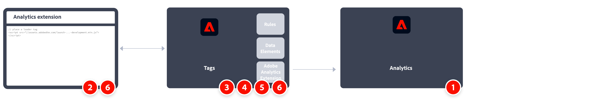

# Implement Adobe Analytics using the Analytics extension

Through the lifetime of Adobe Analytics, Adobe has offered several different methods to implement code on your site for data collection. Adobe's current recommended method is through tags in Adobe Experience Platform.

Tags in Adobe Experience Platform is a tag management solution that lets you deploy Analytics code alongside other tagging requirements. Adobe offers integrations with other solutions and products, and lets you deploy custom code. All of these tasks can be done without relying on any development teams in your organization to update code on your site.

All customers with an active Adobe Experience Cloud contract can use tags. If you are not sure if you have access, contact one of your organization's Experience Cloud system admins.

A high-level overview of the implementation tasks:

| | Task | More Information | 
|-| ------|------------------|
| 1 | Ensure you have **defined a report suite**. | [Report Suite Manager](../../admin/admin/c-manage-report-suites/report-suites-admin.md) |
| 2 | **Create a data layer** to manage the tracking of the data on your website. | [Create a data layer](../prepare/data-layer.md) |
| 3 | **Create a tag property**. Properties are overarching containers used to reference tag management data.| [Create an Adobe Analytics tag property](../launch/create-analytics-property.md) |
| 4 | **Install the Analytics extension** in the tag property. Configure the Analytics extension to send data to Adobe Analytics. | [Adobe Analytics extension overview](https://experienceleague.adobe.com/docs/experience-platform/tags/extensions/client/analytics/overview.html?lang=en) |
| 5 | **Deploy to a development environment**. Have an environment where you can iterate on the development of tags. | [Deploy an Analytics implementation to a development environment](./deploy-dev.md) |
| 6 | **Validate and publish to production**. Add the tag property to your web site. Then use data elements, rules, and so on, to customize your implementation.| [Validate a development implementation and publish to production](./validate-publish-prod.md)

## Additional resources

Tags can be highly customized. Learn more about how you can get the most out of Adobe Analytics by including the right data in your implementation.

-   [Tags documentation](https://experienceleague.adobe.com/docs/experience-platform/tags/home.html#): Learn how the interface works and what extensions are available.

-   [Implementation variables](../vars/overview.md): Determine what variables you want to send to data collection servers.
