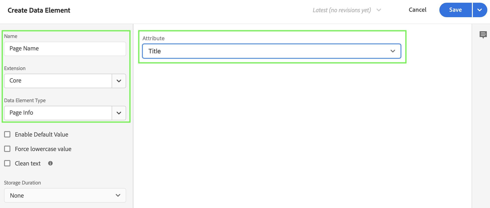
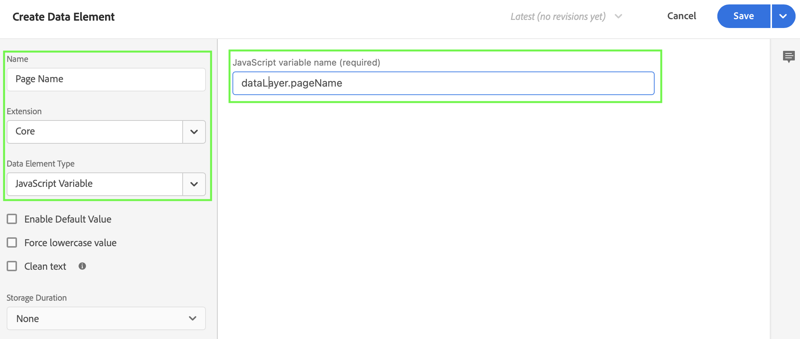
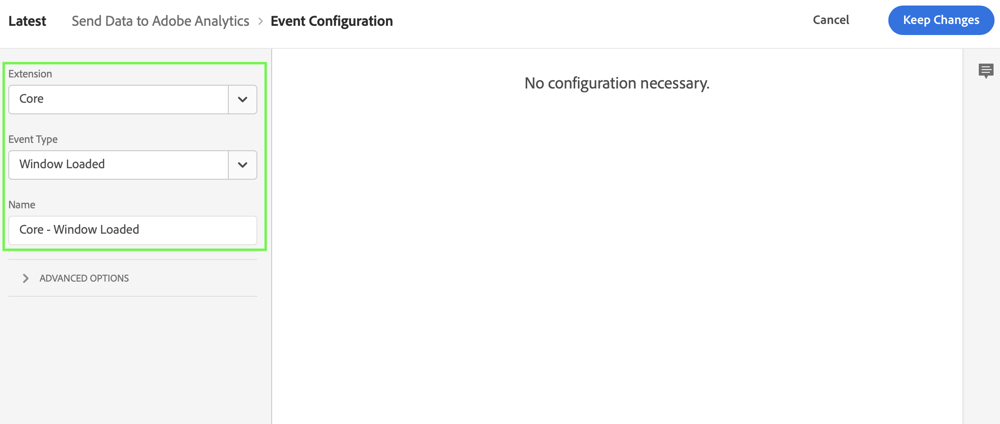
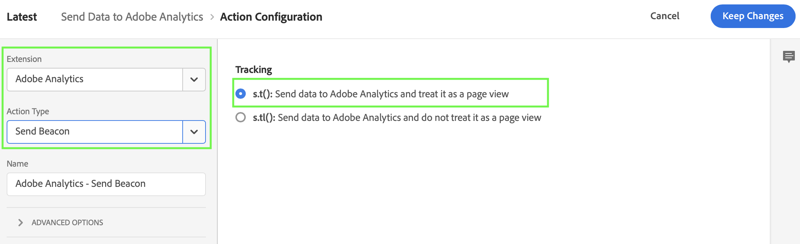
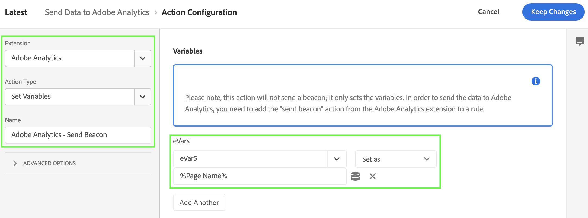
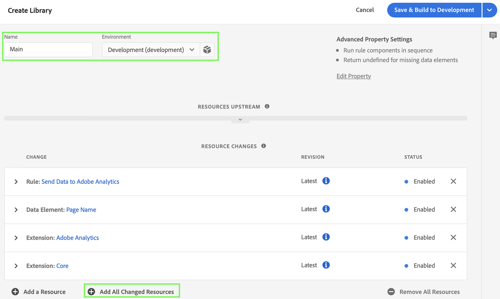
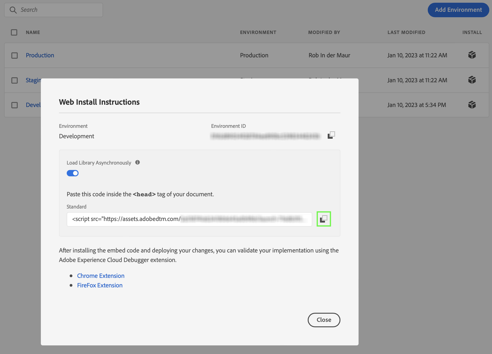

# Implement Adobe Analytics with Adobe Experience Platform Tags

Through the lifetime of Adobe Analytics, Adobe has offered several different methods to implement code on your site for data collection. Adobe's current recommend method is through tags in Adobe Experience Platform.

Tags in Adobe Experience Platform is a tag management solution that lets you deploy Analytics code alongside other tagging requirements. Adobe offers integrations with other solutions and products, and lets you deploy custom code. All of these tasks can be done without relying on any development teams in your organization to update code on your site.

All customers with an active Adobe Experience Cloud contract can use tags. If you are not sure if you have access, contact one of your organization's Experience Cloud system admins.

See below for a quick start guide on how to implement Adobe Analytics with Adobe Experience Platform Tags..

>[!NOTE]
>
>This is a simplified guide on how to set up, implement and deploy Adobe Analytics on your site using tags.  It is higly recommended to study the additional information when referred to.

## Overall workflow

The overall worklow for getting an implementation of Adobe Analytics deployed using tags consists of the following steps:

1.  **Create a data layer** to manage the tracking of the data on your website.

2.  **Use Tags** to easily deploy custom code without having to rely on development teams. You will create one or more tags and configure each tag with extensions, data elements and rules.

3.  **Deploy and validate**: Have an environment where you can iterate on the development of tags and once everything is validated, publish it live on your production environment.
 

## Create a data layer

It is recommended to create a data layer for the web site(s) you want to track. A data layer is a framework of JavaScript objects on your site that contains variable and their values used in your implementation. It allows for greater control and easier maintenance in your implementation. See [Create a data layer](https://experienceleague.adobe.com/docs/analytics/implementation/prepare/data-layer.html) in the Adobe Analytics documentation for more information.

## Use Tags

Use the Tags feature within Adobe Experience Platform to implement code on your site. This tag management solution lets you deploy Analytics code alongside other tagging requirements. Tags offer integrations with other solutions and products, and let you deploy custom code. All of these tasks can be done without relying on any development teams in your organization to update code on your site

### Create your tag

1.  In the Adobe Experience Platform UI, in the left rail, select **[!UICONTROL Tags]** within [!UICONTROL DATA COLLECTON].

2.  Select **[!UICONTROL New Property]**. 

    Name the tag, select **[!UICONTROL Web]** and enter a domain name.

    

    Select **[!UICONTROL Save]** to continue.

### Configure your tag

After creating the tag, you need to configure it with the correct Adobe Analytics extension and configure data elements and rules according to how you want to track your site. 

Select your newly created tag from the list of [!UICONTROL Tag Properties] to open it.

#### **Adobe Analytics Extension**

You need to add the Adobe Analytics extension to your tag to ensure you can send data to Adobe Analytics.

To create and configure the Adobe Analytics extension:

1.  Select **[!UICONTROL Extensions]** in the left rail.

2.  Select **[!UICONTROL Catalog]** in the top bar.

3.  Search for or scroll to the Adobe Analytics extension, and select **[!UICONTROL Install]** to install it.

    

4.  Configure the extension with the correct (optional) settings for:

    -   Library Management (i.e. select the Adobe Analytics report suite(s) you are currently using). 

    -   General settings (i.e. character set, currency code, tracking server).

    -   Global Variables (i.e. eVars and Props).

    -   Link Tracking.

    -   Cookies configuration (i.e. Vsitor ID, Visitor Namespace, Cookie Lifetime).

    -   Configure Tracker using custom code.

    -   Adobe Audience Manager.

    

    Select **[!UICONTROL Save]**.

See [Adobe Analytics extension overview](https://experienceleague.adobe.com/docs/experience-platform/tags/extensions/client/analytics/overview.html) for more information.

#### **Data Elements**

Data elements are the building blocks for your data dictionary (or data map). Use data elements to collect, organize, and deliver data across marketing and ad technology. You will set up data elements in your tag that read from the data layer and can be used to deliver data into your Adobe Analytics report suite.

There are different types of data elements. As an example, you will set up a data element to capture the page name of a page on your site.

To define a page name data element:

1.  Select **[!UICONTROL Data Elements]** in the left rail.

2.  Select **[!UICONTROL Create New Data Element]**.

3.  In the [!UICONTROL Create Data Element] dialog:

    -   Name your data element, e.g. `Page Name`.

    -   Select **[!UICONTROL Core]** from the [!UICONTROL Extension] list.

    -   Select **[!UICONTROL Page Info]** from the [!UICONTROL Data Element Type] list.

    -   Select **[!UICONTROL Title]** from the [!UICONTROL Attribute] list.

        

        Alternatively you could have used the value from a variable of your data layer, e.g. `pageName` and the **[!UICONTROL JavaScript Variable]** [!UICONTROL Data Element Type] to define the data element.

        

    -   Select **[!UICONTROL Save]**.

This is just a simple example of setting up data elements. Use data elements as widely as possible throughout rule creation to consolidate the definition of dynamic data and to improve the efficiency of your tagging process. See [Data Elements](https://experienceleague.adobe.com/docs/experience-platform/tags/ui/data-elements.html) for more information.

#### **Rules**

Tags in Adobe Experience Platform follow a rule-based system. They look for user interaction and associated data. When the criteria outlined in your rules are met, the rule triggers the extension, script, or client-side code you identified. You can use rules to send data (like the page name) into Adobe Analytics using the Adobe Analytics extension.

To define a rule:

1.  Select **[!UICONTROL Rules]** in the left rail.

2.  Select **[!UICONTROL Create New Rule]**.

3.  In the [!UICONTROL Create Rule] dialog:

    -   Name the rule, e.g. `Send Data to Adobe Analytics`.

    -   Select **[!UICONTROL + Add]** underneath [!UICONTROL Events]. 
    
        In the [!UICONTROL Event Configuration] dialog:

        -   Select **[!UICONTROL Core]** from the [!UICONTROL Extension] list.

        -   Select **[!UICONTROL Window Loaded]** from the [!UICONTROL Event Type] list.

            

        -   Select **[!UICONTROL Keep Changes]**.

    -   Select **[!UICONTROL + Add]** underneath [!UICONTROL Actions]. 
    
        In the [!UICONTROL Action Configuration] dialog:

        -   Select **[!UICONTROL Adobe Analytics]** from the [!UICONTROL Extension] list.

        -   Select **[!UICONTROL Send Beacon]** from the [!UICONTROL Action Type] list.

        -   Ensure **[!UICONTROL s.t(): Send data to Adobe Analytics and treat is as a page view]** is selected for [!UICONTROL Tracking].

            

            Additionally, you can define rules that set variables in Adobe Analytics to your earlier defined data elements. As an example, see the [!UICONTROL Action Configuration] for a rule where you map Adobe Analytics `eVar5` to data element `%Page Name%`.

            

        -   Click **[!UICONTROL Keep Changes]**.


    -   Your rule should look like:

        

    -   Select **[!UICONTROL Save]**.

This is just a simple example of defining rules. You can use rules in a variety of ways in your tag to manipulate variables (making use of your data elements). See [Rules](https://experienceleague.adobe.com/docs/experience-platform/tags/ui/rules.html) for more information.

### Build and Publish your tag

After having defined data elements and rules you need to build and publish your tag. When you create a library build, you must assign it to an environment. The build's extensions, rules, and data elements are then compiled and placed into the assigned environment. Each environment provides a unique embed code that allows you to integrate its assigned build into your site.

To build and publish your tag:

1.  Select **[!UICONTROL Publishing Flow]** from the left rail.

2.  Select **[!UICONTROL Select a working library]**, followed by **[!UICONTROL Add Library…]**.

3.  In the [!UICONTROL Create Libray] dialog:

    -   Name the library.

    -   Select **[!UICONTROL Development (development)]** from the [!UICONTROL Environment] list.

    -   Select **[!UICONTROL + Add All Changed Resources]**.

        

    -   Select **[!UICONTROL Save & Build to Development]**.

    This will save and build the tag for your development environment.

4.  A green dot indicates a successful build of your tag on your development environment. 

    You can select **[!UICONTROL ...]** to rebuild the library or submit, approve and publish the library to a staging or production environment.

    

Adobe Experience Platform Tags support simple to complex publishing workflows that should accomodate your deployment of Adobe Analytics. See [Publishing overview](https://experienceleague.adobe.com/docs/experience-platform/tags/publish/overview.html) for more information.


### Retrieve your tag code

Finally, you need to install your tag on the website you want to track. This implies placing code, that refers to your published tag, in the header tag of your website's template.

To get the code that references your tag:

1.  Click **[!UICONTROL Environments]** in the left rail.

2.  From the list of environments, select the correct install (box) button.

    In the [!UICONTROL Web Install Instructions] dialog, select the copy button next to the script code that should read like:

    ```javascript
    <script src="https://assets.adobedtm.com/2a518741ab24/806645a0b9bb/....-development.min.js" async></script>
    ```
    
    

3.  Select **[!UICONTROL Close]**.


## Deploy and validate

You can now deploy the code on the development version of your website inside the `<head>` tag. When deployed, your website will start collecting data into Adobe Analytics.

Validate your implementation, correct it where necessary, and once correct, deploy it to your staging and development environment using the publishing workflow feature. See [Environments](https://experienceleague.adobe.com/docs/experience-platform/tags/publish/environments/environments.html?) for more information.

## Additional resources

Tags can be highly customized. Learn more about how you can get the most out of Adobe Analytics by including the right data in your implementation.

-   [Create an Analytics tag property](create-analytics-property.md): To get started with Tags.

-   [Tags documentation](https://experienceleague.adobe.com/docs/experience-platform/tags/home.html#): Learn how the interface works and what extensions are available.

-   [Adobe Analytics extension](https://experienceleague.adobe.com/docs/experience-platform/tags/extensions/adobe/analytics/overview.html): Use the Analytics extension to send data to Adobe Analytics.

-   [Implementation variables](../vars/overview.md): Determine what variables you want to send to data collection servers.
