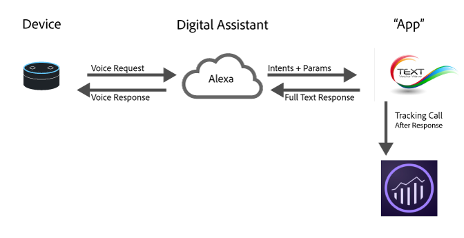

# Implement Analytics for digital assistants

With recent advances in cloud computing, machine learning, and natural language processing, digital assistants are becoming a part of everyday life. Consumers are starting to talk to their devices and expecting them to understand and respond in human-like ways. As these platforms become more established, brands can present their services to consumers in these same realistic and lifelike ways. For example, consumers can ask things like:

* "Alexa, ask my car when it needs an oil change."
* "Cortana, what is the balance of my checking account?"
* "Siri, send John $20 for dinner last night from my banking app."

This page provides an overview of how best to use Adobe Analytics to measure and optimize these types of experiences.

## Digital experience architecture overview



Most digital assistants today follow a similar high-level architecture:

1. **Device**: There is a device (like an Amazon Echo or a phone) with a microphone that allows the user to ask a question.
1. **Digital assistant**: That device interacts with the service that powers the digital assistant. It is where the speech is converted into machine understandable intents and the details of the request are parsed out. Once the user's intent is understood, the digital assistant passes the intent and details of the request to the app that handles the request.
1. **"App"**: The app can either be an app on the phone or a voice app. The app is responsible for responding to the request. It responds to the digital assistant and the digital assistant then responds to the user.

## Where to implement Analytics

One of the best places to implement Analytics is in the app. The app receives the intent and details from the digital assistant, then the app determines how to respond.

There are two times during a request that can be helpful to send data to Adobe Analytics.

1. When the request is sent to your app.
1. After the response is returned from the app.

If you are just interested in recording what happened with the customer for future optimization, send a request to Adobe Analytics after the response has been returned. You'll have the full context of what the request was and how the system responded.

## New installs

For some digital assistants, you get a notification when someone installs the skill, especially when authentication is involved. Adobe recommends sending an Install event by setting the context data variable `a.InstallEvent=1`. This feature is not available on all digital assistants, but is helpful when it is present for looking at retention. The following code sample sends the Install event, Install Date, and AppID values into context data variables.

```text
GET
/b/ss/examplersid/1?vid=[UserID]&c.a.InstallEvent=1&c.a.InstallDate=2017-04-24&c.a.AppID=Spoofify1.0&c.OSType=Alexa&pageName=install
HTTP/1.1
Host:
<xref href="https://example.data.adobedc.net">
  example.data.adobedc.net
 Cache-Control: no-cache
</xref href="https:>
```

## Multiple assistants or multiple apps

It is likely that your organization wants apps for multiple platforms. The best practice is to include an app ID with each request. This variable can be set in the `a.AppID` context data variable. Follow the format of `[AppName] [BundleVersion]`, for example, BigMac for Alexa 1.2:

```text
GET /b/ss/examplersid/1?vid=[UserID]&c.a.AppID=Spoofify1.0&c.a.Launches=1&c.Product=AmazonEcho&c.OSType=Alexa&pageName=install  HTTP/1.1
Host: example.data.adobedc.net
Cache-Control: no-cache
```

```text
GET /b/ss/examplersid/1?vid=[UserID]&c.a.AppID=Spoofify2.0&c.a.Launches=1&c.Product=GoogleHome&c.OSType=Android&pageName=install  HTTP/1.1
Host: example.data.adobedc.net
Cache-Control: no-cache
```

## User/Visitor identification

Adobe Analytics uses the [Adobe Experience Cloud Identity Service](https://experienceleague.adobe.com/docs/ id-service/using/home.html) to tie interactions across time to the same person. Most digital assistants return a `userID` that you can use to keep the activity for different users. In most cases, this value is what you can pass in as a unique identifier. Some platforms return an identifier that is longer than the 100 characters allowed. In these cases, Adobe recommends that you hash the unique identifier to a fixed length value using a standard hashing algorithm, such as MD5 or Sha1.

Using the ID Service provides the most value when you map ECIDs across different devices (for example, web to digital assistant). If your app is a mobile app, use the Experience Platform SDKs as-is and send the user ID using the `setCustomerID` method. However, if your app is a service, use the user ID provided by the service as the ECID, as well as setting it in `setCustomerID`.

```text
GET /b/ss/examplersid/1?vid=[UserID]&pageName=[intent]  HTTP/1.1
Host: example.data.adobedc.net
Cache-Control: no-cache
```

## Sessions

Because digital assistants are conversational, they often have the concept of a session. For example:

**Consumer:** "Ok Google, call a cab for me"

**Google:**: "Sure, what time would you like?"

**Consumer:** "8:30pm"

**Google:** "Sounds good, the driver will be by at 8:30pm"

Sessions are important to keep context, and help collect more details to make the digital assistant more natural. When implementing Analytics on a conversation, there are two things to do when a new session is started:

1. **Reach out to Audience Manager**: Get the relevant segments that a user is a part of so that you can customize the response. (For example, this person currently qualifies for the multi-channel discount.)
2. **Send in a new session or launch event**: When you send the first response to Analytics, include a launch event. Usually, this can be sent by setting context data of `a.LaunchEvent=1`.

```text
GET /b/ss/examplersid/1?vid=[UserID]&c.a.LaunchEvent=1&c.Intent=[intent]&pageName=[intent]  HTTP/1.1
Host: example.data.adobedc.net
Cache-Control: no-cache
```

## Intents

Each of the digital assistants has algorithms that detect intents and then passes the intent down to the "App" so that the app knows what to do. These intents are a succinct representation of the request.

For example, if a user says, "Siri, Send John $20 for dinner last night from my banking app," the intent might be something like *sendMoney*.

By sending in each of these requests as an eVar, you can run pathing reports on each of the intents for conversational apps. Make sure your app can handle requests without an intent as well. Adobe recommends passing in 'No Intent Specified' to the intent context data variable, as opposed to omitting the variable.

```text
GET /b/ss/examplersid/1?vid=[UserID]&c.a.AppID=Penmo1.0&c.a.LaunchEvent=1&c.Intent=SendPayment&pageName=[intent]  HTTP/1.1
Host: example.sc.adobedc.net
Cache-Control: no-cache
```

or

```text
GET /b/ss/examplersid/1?vid=[UserID]&c.a.AppID=Penmo1.0&c.a.LaunchEvent=1&c.Intent=No_Intent_Specified&pageName=[intent]  HTTP/1.1
Host: example.data.adobedc.net
Cache-Control: no-cache
```

## Parameters/Slots/Entities

In addition to the intent, digital assistants often have a set of key/value pairs that give details of the intent. These can be called slots, entities or parameters. For example, "Siri, Send John $20 for dinner last night from my banking app" would have the following parameters:

* Who = John
* Amount = 20
* Why = Dinner

There is typically a finite number of these values with your app. To track these values in Analytics, send them into context data variables and then map each of the parameters to an eVar.

```text
GET /b/ss/examplersid/1?vid=[UserID]&c.a.AppID=Penmo1.0=1&c.a.LaunchEvent=1&c.Intent=SendPayment&c.Amount=20.00&c.Reason=Dinner&c.ReceivingPerson=John&c.Intent=SendPayment&pageName=[intent]  HTTP/1.1
Host: example.data.adobedc.net
Cache-Control: no-cache
```

## Error states

Sometimes the digital assistant provides your app with inputs that it doesn't know how to handle. For example, "Siri, Send John 20 bags of coal for dinner last night from my banking app"

When this situation happens, have your app ask for clarification. Additionally, send data to Adobe that indicates the app has an error state along with an eVar that specifies what type of error occurred. Be sure to include errors where the inputs are not correct and errors where the app had a problem.

```text
GET /b/ss/examplersid/1?vid=[UserID]&c.a.AppID=Penmo1.0&c.Error=1&c.ErrorName=InvalidCurrency&pageName=[intent]  HTTP/1.1
Host: example.data.adobedc.net
Cache-Control: no-cache
```

## Device capabilities

While most platforms don't expose the device that the user spoke to, they do expose the capabilities of the device. For example, Audio, Screen, Video, etc. This information is useful because it defines the types of content that can be used when interacting with your users. When measuring device capabilities, it is best to concatenate them (in alphabetical order).

Example: `":Audio:Camera:Screen:Video:"`

Leading and trailing colons help when creating segments. For example, show all hits with `:Audio:` capabilities.

* [Amazon Capabilities](https://developer.amazon.com/public/solutions/alexa/alexa-skills-kit/docs/alexa-skills-kit-interface-reference) using Amazon Alexa
* [Google Capabilities](https://developers.google.com/actions/assistant/surface-capabilities) using Actions on Google

## Examples

| Person | Device response | Action/Intent | GET request |
|---|---|---|---|
| Install Spoofify | No response | Install | `GET /b/ss/examplersid/1?vid=[UserID]&c.a.InstallEvent=1&c.a.InstallDate=[currentDate]&c.a.AppID=Spoofify1.0&c.OSType=Alexa&c.Intent=Install&pageName=Install  HTTP/1.1`<br>`Host: example.data.adobedc.net`<br>`Cache-Control: no-cache` |
| Play Spoofify | "Okay, playing Spoofify" | Play | `GET /b/ss/examplersid/1?vid=[UserID]&c.a.AppID=Spoofify1.0&c.a.LaunchEvent=1&c.Intent=Play&pageName=PlayApp  HTTP/1.1`<br>`Host: example.data.adobedc.net`<br>`Cache-Control: no-cache` |
| Change song | "Okay, what song do you want?" | ChangeSong | `GET /b/ss/examplersid/1?vid=[UserID]&c.a.AppID=Spoofify1.0&c.Intent=ChangeSong&pageName= Ask%20For%20Song  HTTP/1.1`<br>`Host: example.data.adobedc.net`<br>`Cache-Control: no-cache` |
| Play "Baby Shark" | "Okay, playing 'Baby Shark' by PinkFong" | ChangeSong | `GET /b/ss/examplersid/1?vid=[UserID]&c.a.AppID=Spoofify1.0&c.Intent=ChangeSong&pageName=Action%20Play%20Song&c.SongID=[012345]  HTTP/1.1`<br>`Host: example.data.adobedc.net`<br>`Cache-Control: no-cache` |
| Change playlist | "Okay, what playlist do you want?" | ChangePlaylist | `GET /b/ss/examplersid/1?vid=[UserID]&c.a.AppID=Spoofify1.0&c.Intent=ChangePlaylist&pageName=Ask%20For%20Playlist  HTTP/1.1`<br>`Host: example.data.adobedc.net`<br>`Cache-Control: no-cache` |
| Play my favorite songs playlist | "Okay, playing your favorite songs playlist" | ChangePlaylist | `GET /b/ss/examplersid/1?vid=[UserID]&c.a.AppID=Spoofify1.0&c.Intent=ChangePlaylist&pageName=Action%20Play%20Playlist&c.Playlist=My%20Favorite%20Songs  HTTP/1.1`<br>`Host: example.data.adobedc.net`<br>`Cache-Control: no-cache` |
| Turn music off | No response, music turns off | Off | `GET /b/ss/examplersid/1?vid=[UserID]&c.a.AppID=Spoofify1.0&c.Intent=Off&pageName=Music%20Off  HTTP/1.1`<br>`Host: example.data.adobedc.net`<br>`Cache-Control: no-cache` |
