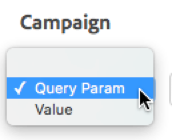

# Referrers and campaigns

Field descriptions in [!UICONTROL Dynamic Tag Management] for referrers and campaign options when deploying [!UICONTROL Dynamic Tag Management] in Adobe [!DNL Analytics].

**[!UICONTROL  *`Property`*]** >  **[!UICONTROL Edit Tool]** > **[!UICONTROL Referrers & Campaigns]**

<table id="table_09AE3BFF0F12442F9C19CD96451F93E4">
 <thead>
  <tr>
   <th colname="col1" class="entry"> Element </th>
   <th colname="col2" class="entry"> Description </th>
  </tr>
 </thead>
 <tbody>
  <tr>
   <td colname="col1"> Referrer Override </td>
   <td colname="col2"> 
Overrides the value set in the  s.referrer variable, which is typically populated by the referrer set in the browser. 
 
See <a href="../../../vars/page-vars/referrer.md">referrer</a>. 
 </td>
  </tr>
  <tr>
   <td colname="col1"> Campaign </td>
   <td colname="col2"> 
A variable that identifies marketing campaigns used to bring visitors to your site. The value of campaign is usually taken from a query string parameter. 
 
See <a href="../../../vars/page-vars/campaign.md">campaign</a>. 
 </td>
  </tr>
 </tbody>
</table>

Use the DTM interface to choose whether you want to use a Query String or Value (which could pull from a data element):

You can either enter your query string directly in the interface, or you can reference a separate data element if you have other means of tracking a campaign.
