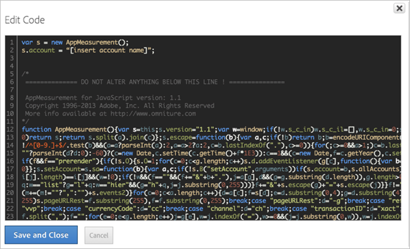

# Insert core AppMeasurement code

Insert AppMeasurement code when manually deploying Dynamic Tag Management in Adobe Analytics.

1. On the [!DNL Adobe Analytics] tool page, expand the **[!UICONTROL General]** section, then click **[!UICONTROL Open Editor]**.
1. Unzip the [!DNL AppMeasurement_JavaScript*.zip] file you downloaded in [deploy Adobe Analytics](/help/implement/c-implement-with-dtm/t-analytics-deploy.md).

   If you opt for custom library, when you open the window it will already have the most recent code version present. There is no need to download the zip from the Admin Console.
1. Open [!DNL AppMeasurement.js] in a text editor.
1. Copy and paste the contents into the **[!UICONTROL Edit Code]** window.

   

1. Adobe recommends adding the following code above the *`Do Not Alter Anything Below This Line`*:

   ```
   var s_account="INSERT-RSID-HERE"
   var s=s_gi(s_account)
   
   ```

   >[!IMPORTANT]
   >
   >If you add this code, it is recommended that you also select the **[!UICONTROL Set report suites using custom code below]** checkbox in the overall library settings.

1. Click **[!UICONTROL Save and Close]**.

   If you are using the Media Module, Integrate Module, or implementation plug-ins, you can copy them into the code section as well. The managed code in Dynamic Tag Management can be configured exactly like the JavaScript file in a typical implementation.

