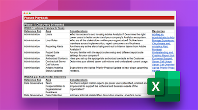

# Take charge of an existing Adobe Analytics implementation

Are you taking over an Adobe Analytics implementation from the previous Technical Owner? Our Inherited Implementation Playbook will help you take charge as the new Technical Owner of an existing implementation. In the downloadable spreadsheet, we'll walk you though the discovery, audit, and documentation activities you should do in your first 10 weeks on the job as you take over an existing implementation.

**Download the [Inherited Implementation Playbook](assets/adobe_analytics_inherited_implementation_playbook.xlsx).**

Check out these tips from your fellow Technical Owner, Sarah Owen. Sarah is an Adobe Analytics Champion and she shares ideas about how to use the Inherited Implementation Playbook to take charge of an existing implementation:

>[!VIDEO](https://video.tv.adobe.com/v/327314/?quality=12&learn=on)

See also:

* ["Focused Review" checklist for reviewing your implementation after each website release](/help/implement/review/focused-review.md)
* [Full Review" checklist for reviewing your implementation every 6 months](/help/implement/review/full-review.md)
* [Define your Top 5 KPIs](/help/implement/review/define-kpis.md)
