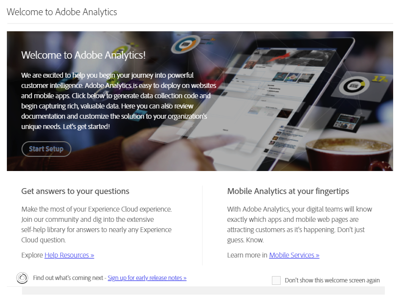
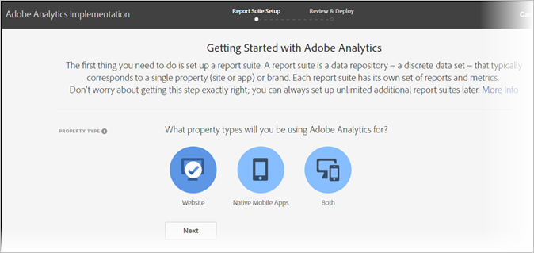

# Implementation modal

Please see [Create a report suite](/help/admin/c-manage-report-suites/c-new-report-suite/t-create-a-report-suite.md).

<!-- https://activation.adobedtm.com/index.php?redirected=1 

The 'Welcome to Adobe Analytics' modal window provides a simplified workflow to create a report suite. Adobe recommends using this workflow whenever more report suites are needed in your organization.

## Prerequisites

Your Adobe ID must have access to both Adobe Analytics and Adobe Experience Platform Launch. If you do not have access to Launch, you can be placed into an authentication loop where it asks to verify your credentials indefinitely. Talk to a system admin in your organization to obtain access to Launch.

## Access the modal

Access the modal to create a report suite using the following steps.

1. Log in to [experiencecloud.adobe.com](https://experiencecloud.adobe.com) using your Adobe ID credentials.
2. Click the 9-grid icon at the top, then click [!UICONTROL Adobe Analytics].
3. If you have not yet created a report suite, the modal automatically appears. If a report suite exists for this login company, click the Help icon in the top right, then click [!UICONTROL Welcome to Adobe Analytics].

>[!NOTE]
>
>The [!UICONTROL Welcome to Adobe Analytics] option only appears if you log in through the Adobe Experience Cloud. If you log in through legacy domains, the modal is not available.

## Create a report suite

Click the [!UICONTROL Start Setup] button to begin the report suite creation workflow.

### Property type

Property type helps Adobe determine some backend settings based on where you intend to implement Analytics.

* **Website**: If you intend to implement Adobe Analytics just for a website.
* **Native Mobile App**: If you intend to implement Adobe Analytics just for a mobile app.
* **Both**: If this report suite contains data for both a website and a mobile app.

### Industries

Specify your primary business model. This setting helps Adobe pre-configure some variable names and settings based on your primary business model.

### Data layer

A [Data layer](data-layer.md) is a JavaScript object that organizes all variables used in your implementation into a single helpful location. See [Data layers](data-layer.md) for more information.

### Data repository

Give your report suite a friendly name. Your report suite ID (RSID) automatically generates based on the friendly name and login company.

### Time zone

Verify that Adobe detected the correct time zone for the report suite.

### Estimated page views per day

Estimate how much traffic your website or app gets per day. This information allows Adobe to allocate the correct amount of processing resources to your report suite.

### Base currency

Determine what currency the report suite stores monetary values in.

>[!IMPORTANT]
>
>Make sure you state the correct currency, especially if you have reporting requirements around revenue. It is difficult to change base currency after data collection begins.

## Implementation resources

After the report suite is created, you have one of two options to proceed with your implementation:

* **Go to Adobe Experience Platform Launch**: Links you to [launch.adobe.com](https://launch.adobe.com) to configure your implementation and download deploy code. See [Implement with Launch](../launch/overview.md). Adobe recommends using Launch in most cases.
* **Download implementation code**: Provides a direct link to download JavaScript files for a manual JavaScript implementation. See [AppMeasurement for JavaScript](../js/overview.md). -->
