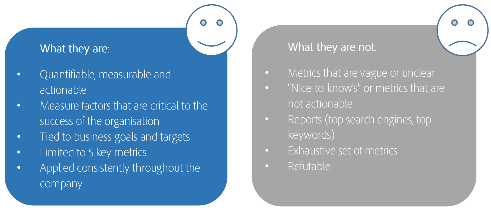

# Define your Top 5 KPIs

You simply can’t measure everything, and your Adobe Analytics implementation will be the most successful if you prioritize measuring what’s most important to the business. Work with your business leaders to define the key performance indicators (KPIs) that are most impactful for your business. Then concentrate your efforts on the metrics and variables that support those KPIs.

## 1. Understand your business goals

Start by understanding the business goals, so you can choose the 5 KPIs that are most important for the business. These KPIs can be metrics such as revenue, calculated metrics such as revenue per visit, and the metrics can have variables as well. Do NOT copy random KPIs from other companies or industry standards – they likely won’t fit YOUR business goals.

## 2. Ask the crucial question

Ask yourself: If my CEO were stuck on an island and you could tell her only 5 things about the business health, what would those things be? If you told her the average time spent on a page was 1:30, that wouldn’t help her at all. However, if you told her your average revenue per visit was $2.00 and you had 2M visits, that will give her a true indication of business success.

## 3. Remember what KPIs are and what they are not

## 4. Define your KPIs

Fill in your own chart, similar to this one:

| Business objective | Metrics and dimensions |
| --- | --- |
| Increase sales through digital channels | Revenue per visit |
| Increase brand awareness | Visitors |
| Drive deeper and enduring customer relationships | Logins, Clicks |
| Site conversion | CTA clicks / Total page views |
| Site engagement | Page views per unique visitor, Average visitor time on site |

## 5. Review your KPIs regularly

Refresh your KPIs at least every 6 months – remember, the needs of the business will frequently change!
