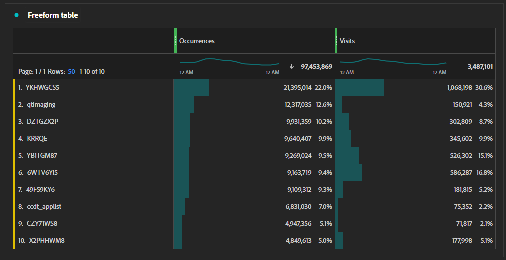

# Campaign tracking workflow

If your organization wants to track the performance and click-through rate of marketing efforts, you can use the following process. Each of these steps have dedicated sections below that contain more detail.

1. [Establish a tracking code generation process](#establish-a-tracking-code-generation-process)
1. [Add the desired tracking code to the email](#add-the-desired-tracking-code-to-the-email)
1. [Set up or adjust your Adobe Analytics implementation to include tracking code data](#include-campaign-variables-in-your-implementation)
1. [View the reports in Analysis Workspace](#view-the-reports-in-analysis-workspace)

[Adobe Campaign](https://business.adobe.com/products/campaign/adobe-campaign.html) can help simplify each of these steps to drive the most value out of your marketing efforts. Contact your Adobe Sales representative for more information. 

## Establish a tracking code generation process

Every organization has different needs for tracking codes. Some organizations might have minimal needs where manually created tracking codes are more than sufficient. Other organizations might want more control over tracking and have multiple systems in place for creating desired tracking codes. If your organization uses Google Analytics in addition to Adobe Analytics, your organization might already have a `utm` tracking code model established.

Regardless of how you choose to create or generate tracking codes, having a consistent system in place allows your organization a much easier time creating classifications for them. Consistently structured tracking codes allow you to create [Classification rules](/help/components/classifications/crb/classification-rule-builder.md) so that they you can get insight on categorical performance. 

## Add the desired tracking code to a URL

Once you have the desired tracking code value, you can add it to any links that you post online, such as advertisements, social media, or email. Adding these tracking codes typically take place in a link's query string. Which query string parameter you use depends on your organization's tracking requirements; a common query string parameter is `cid` (short for campaign ID). Some organizations who also use Google Analytics might already have multiple campaign query string parameters like `utm_source`, `utm_medium`, and others.

Adding query strings to a link in an email would look similar to the following:

```text
https://example.com?cid=EM989027
```

## Include campaign variables in your implementation

Adobe Analytics has a dedicated [Tracking code](/help/components/dimensions/tracking-code.md) dimension that you can use to measure various marketing efforts across your organization. However, different organizations might have different tracking requirements. It is important to reference your organization's [Solution design document](../prepare/solution-design.md) to consistently track the right values in the right variables.

If your organization has not yet set up campaign tracking, you can adjust your implementation to set the [`campaign`](/help/implement/vars/page-vars/campaign.md) variable. See the [`getQueryParam`](/help/implement/vars/plugins/getqueryparam.md) method to learn how you can collect query string parameter values specific to your organization's implementation.

If your organization collects `utm` query strings, you can choose to either:

* Send all `utm` query strings into the Tracking Code dimension as concatenated values. You can then use [Classification rules](/help/components/classifications/crb/classification-rule-builder.md) to create additional dimensions that focus on each `utm` parameter. This method has a more complex learning curve, but does not use any extra eVars.
* Send each `utm` query string into a separate [eVar](/help/components/dimensions/evar.md). This method is more simple to implement overall, but requires the use of extra eVars.

## View the reports in Analysis Workspace

Once you have properly set up your implementation to collect tracking code data, you can view reports in Analysis Workspace.

1. Log in to the [Adobe Experience Cloud](https://experience.adobe.com) and select [!UICONTROL Adobe Analytics].
1. Create a [Workspace project](/help/analyze/analysis-workspace/build-workspace-project/freeform-overview.md).
1. In the list of components on the left, drag the [Tracking code](/help/components/dimensions/tracking-code.md) dimension to the workspace canvas.
1. Drag the desired metric, such as [Visits](/help/components/metrics/visits.md) or [Orders](/help/components/metrics/orders.md) to the right side of the workspace canvas.


