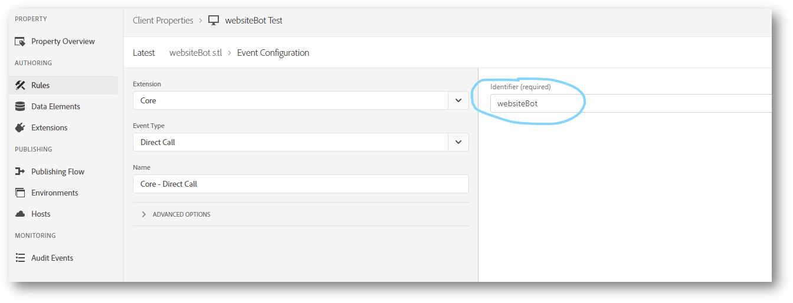
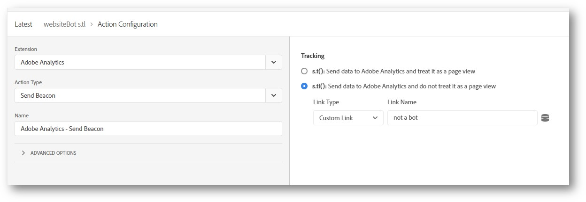

# Adobe plug-in: websiteBot

>[!IMPORTANT]
>
>This plug-in is provided by Adobe Consulting as a courtesy to help you get more value out of Adobe Analytics. Adobe Customer Care does not provide support with this plug-in, including installation or troubleshooting. If you require help with this plug-in, contact your organization's Account Manager. They can arrange a meeting with a consultant for assistance.

The `websiteBot` plug-in allows you to dynamically identify if desktop visitors are bots. You can use this data to drive greater accuracy in all types of reporting, which gives you a better way to measure legitimate site traffic.

This plug-in performs two checks:

* First, in case of a desktop device, it adds an event listener for mouse movement.
* Next, it determines whether the device is a desktop or mobile device using the `navigator.UserAgent` variable. Mobile devices are ignored.

If the user agent is on a desktop and no mouse movement is detected, the plug-in can 

* Either make a direct call rule call using the Web SDK or the Adobe Analytics extension, or 
* Make a link tracking call to indicate that the visitor is not a bot.

## Prerequisites

Adobe recommends the following before using this plug-in:

* **Configure eVar settings**: Set up an eVar under [Conversion variables](/help/admin/admin/c-manage-report-suites/c-edit-report-suites/conversion-var-admin/conversion-var-admin.md) in Report suite settings. Set the expiration to **Never** or **Visit** and allocation to **"Original Value (First)"**. This eVar should be set in both of these circumstances: when either the [!UICONTROL Direct Call] rule or the `s.tl` call is fired.
* **Collect user agent in a separate variable**: Collect the user agent string in a separate variable to monitor the efficacy of this plug-in. Set an eVar to `navigator.UserAgent` on every hit to collect this data.

## Install the plug-in using custom code editor

1. Add a new `websiteBot` rule.
1. Add a **Mouse Move Listener** event to the `websiteBot` rule, with this custom code:

   ```js
   trigger(document.addEventListener('mousemove', function detectMouseMove() {   
    document.removeEventListener('mousemove', detectMouseMove, false);   
    if (!
      /(android|bb\d+|meego).+mobile|avantgo|bada\/|blackberry|blazer|compal|elaine|fennec|hiptop|iemobile|
      ip(hone|od)|ipad|iris|kindle|Android|Silk|lge |maemo|midp|mmp|netfront|opera m(ob|in)i|palm( os)?|
      phone|p(ixi|re)\/|plucker|pocket|psp|series(4|6)0|symbian|treo|up\.(browser|link)|vodafone|wap|
      windows (ce|phone)|xda|xiino/i
         .test(navigator.userAgent) ||
      /1207|6310|6590|3gso|4thp|50[1-6]i|770s|802s|a wa|abac|ac(er|oo|s\-)|ai(ko|rn)|al(av|ca|co)|
      amoi|an(ex|ny|yw)|aptu|ar(ch|go)|as(te|us)|attw|au(di|\-m|r |s )|avan|be(ck|ll|nq)|bi(lb|rd)|
      bl(ac|az)|br(e|v)w|bumb|bw\-(n|u)|c55\/|capi|ccwa|cdm\-|cell|chtm|cldc|cmd\-|co(mp|nd)|craw|
      da(it|ll|ng)|dbte|dc\-s|devi|dica|dmob|do(c|p)o|ds(12|\-d)|el(49|ai)|em(l2|ul)|er(ic|k0)|esl8|
      ez([4-7]0|os|wa|ze)|fetc|fly(\-|_)|g1 u|g560|gene|gf\-5|g\-mo|go(\.w|od)|gr(ad|un)|haie|hcit|
      hd\-(m|p|t)|hei\-|hi(pt|ta)|hp( i|ip)|hs\-c|ht(c(\-| |_|a|g|p|s|t)|tp)|hu(aw|tc)|i\-(20|go|ma)|
      i230|iac( |\-|\/)|ibro|idea|ig01|ikom|im1k|inno|ipaq|iris|ja(t|v)a|jbro|jemu|jigs|kddi|keji|
      kgt( |\/)|klon|kpt |kwc\-|kyo(c|k)|le(no|xi)|lg( g|\/(k|l|u)|50|54|\-[a-w])|libw|lynx|m1\-w|
      m3ga|m50\/|ma(te|ui|xo)|mc(01|21|ca)|m\-cr|me(rc|ri)|mi(o8|oa|ts)|mmef|mo(01|02|bi|de|do|t(\-| 
      |o|v)|zz)|mt(50|p1|v )|mwbp|mywa|n10[0-2]|n20[2-3]|n30(0|2)|n50(0|2|5)|n7(0(0|1)|10)|ne((c|m)\-|
      on|tf|wf|wg|wt)|nok(6|i)|nzph|o2im|op(ti|wv)|oran|owg1|p800|pan(a|d|t)|pdxg|pg(13|\-([1-8]|c))|
      phil|pire|pl(ay|uc)|pn\-2|po(ck|rt|se)|prox|psio|pt\-g|qa\-a|qc(07|12|21|32|60|\-[2-7]|i\-)|
      qtek|r380|r600|raks|rim9|ro(ve|zo)|s55\/|sa(ge|ma|mm|ms|ny|va)|sc(01|h\-|oo|p\-)|sdk\/|
      se(c(\-|0|1)|47|mc|nd|ri)|sgh\-|shar|sie(\-|m)|sk\-0|sl(45|id)|sm(al|ar|b3|it|t5)|so(ft|ny)|
      sp(01|h\-|v\-|v )|sy(01|mb)|t2(18|50)|t6(00|10|18)|ta(gt|lk)|tcl\-|tdg\-|tel(i|m)|tim\-|t\-mo|
      to(pl|sh)|ts(70|m\-|m3|m5)|tx\-9|up(\.b|g1|si)|utst|v400|v750|veri|vi(rg|te)|vk(40|5[0-3]|\-v)|
      vm40|voda|vulc|vx(52|53|60|61|70|80|81|83|85|98)|w3c(\-| )|webc|whit|wi(g |nc|nw)|wmlb|wonu|
      x700|yas\-|your|zeto|zte\-/i
      .test(navigator.userAgent.substr(0, 4))) {       
      _satellite.track('websiteBot')
         }
      }))
   ```

1. Add a [!UICONTROL Direct Call] rule that fires an Analytics beacon using `websiteBot` as the identifier. In this example it uses a `s.tl` call:

   

1. Fire the Adobe Analytics – Set Variables & Adobe Analytics – Send Beacon actions in the [!UICONTROL Direct Call] rule.  One way to do this is shown in the following example:

   


## Install the plug-in using AppMeasurement

Copy and paste the following code anywhere in the AppMeasurement file after the Analytics tracking object is instantiated (using [`s_gi`](../functions/s-gi.md)). Preserving comments and version numbers of the code in your implementation helps Adobe with troubleshooting any potential issues.

```js
/******************************************* BEGIN CODE TO DEPLOY *******************************************/
/* Adobe Consulting Plugin: websiteBot BETA v0.12 */
/(android|bb\d+|meego).+mobile|avantgo|bada\/|blackberry|blazer|compal|elaine|fennec|hiptop|iemobile|ip(hone|od)|ipad|iris|kindle|Android|Silk|lge |maemo|midp|mmp|netfront|opera m(ob|in)i|palm( os)?|phone|p(ixi|re)\/|plucker|pocket|psp|series(4|6)0|symbian|treo|up\.(browser|link)|vodafone|wap|windows (ce|phone)|xda|xiino/i.test(navigator.userAgent)&&!/1207|6310|6590|3gso|4thp|50[1-6]i|770s|802s|a wa|abac|ac(er|oo|s\-)|ai(ko|rn)|al(av|ca|co)|amoi|an(ex|ny|yw)|aptu|ar(ch|go)|as(te|us)|attw|au(di|\-m|r |s )|avan|be(ck|ll|nq)|bi(lb|rd)|bl(ac|az)|br(e|v)w|bumb|bw\-(n|u)|c55\/|capi|ccwa|cdm\-|cell|chtm|cldc|cmd\-|co(mp|nd)|craw|da(it|ll|ng)|dbte|dc\-s|devi|dica|dmob|do(c|p)o|ds(12|\-d)|el(49|ai)|em(l2|ul)|er(ic|k0)|esl8|ez([4-7]0|os|wa|ze)|fetc|fly(\-|_)|g1 u|g560|gene|gf\-5|g\-mo|go(\.w|od)|gr(ad|un)|haie|hcit|hd\-(m|p|t)|hei\-|hi(pt|ta)|hp( i|ip)|hs\-c|ht(c(\-| |_|a|g|p|s|t)|tp)|hu(aw|tc)|i\-(20|go|ma)|i230|iac( |\-|\/)|ibro|idea|ig01|ikom|im1k|inno|ipaq|iris|ja(t|v)a|jbro|jemu|jigs|kddi|keji|kgt( |\/)|klon|kpt |kwc\-|kyo(c|k)|le(no|xi)|lg( g|\/(k|l|u)|50|54|\-[a-w])|libw|lynx|m1\-w|m3ga|m50\/|ma(te|ui|xo)|mc(01|21|ca)|m\-cr|me(rc|ri)|mi(o8|oa|ts)|mmef|mo(01|02|bi|de|do|t(\-| |o|v)|zz)|mt(50|p1|v )|mwbp|mywa|n10[0-2]|n20[2-3]|n30(0|2)|n50(0|2|5)|n7(0(0|1)|10)|ne((c|m)\-|on|tf|wf|wg|wt)|nok(6|i)|nzph|o2im|op(ti|wv)|oran|owg1|p800|pan(a|d|t)|pdxg|pg(13|\-([1-8]|c))|phil|pire|pl(ay|uc)|pn\-2|po(ck|rt|se)|prox|psio|pt\-g|qa\-a|qc(07|12|21|32|60|\-[2-7]|i\-)|qtek|r380|r600|raks|rim9|ro(ve|zo)|s55\/|sa(ge|ma|mm|ms|ny|va)|sc(01|h\-|oo|p\-)|sdk\/|se(c(\-|0|1)|47|mc|nd|ri)|sgh\-|shar|sie(\-|m)|sk\-0|sl(45|id)|sm(al|ar|b3|it|t5)|so(ft|ny)|sp(01|h\-|v\-|v )|sy(01|mb)|t2(18|50)|t6(00|10|18)|ta(gt|lk)|tcl\-|tdg\-|tel(i|m)|tim\-|t\-mo|to(pl|sh)|ts(70|m\-|m3|m5)|tx\-9|up(\.b|g1|si)|utst|v400|v750|veri|vi(rg|te)|vk(40|5[0-3]|\-v)|vm40|voda|vulc|vx(52|53|60|61|70|80|81|83|85|98)|w3c(\-| )|webc|whit|wi(g |nc|nw)|wmlb|wonu|x700|yas\-|your|zeto|zte\-/i.test(navigator.userAgent.substr(0,4))||document.addEventListener("mousemove",function e(){document.removeEventListener("mousemove",e,!1),s.tl(!0,"o","Not a bot")});
/******************************************** END CODE TO DEPLOY ********************************************/
```

## Use the plug-in

The `websiteBot` plugin fires a `s.tl` call if non-bot traffic is detected.

## Examples

```js
// Set eVar1 to detect bots. Dimension items in reporting are "true" or "false"
s.eVar1 = websiteBot;

// Use a ternary operator to set eVar values
s.eVar1 = websiteBot ? "Bot detected" : "Not a bot";
```

## Version History

### 0.1 (January 19, 2021)

* Beta release

### 0.11 (June 3, 2021)

* Updated AppMeasurement plug-in code
* Updated custom code editor section with expanded instructions.
* Updated "Use the plug-in" section.
