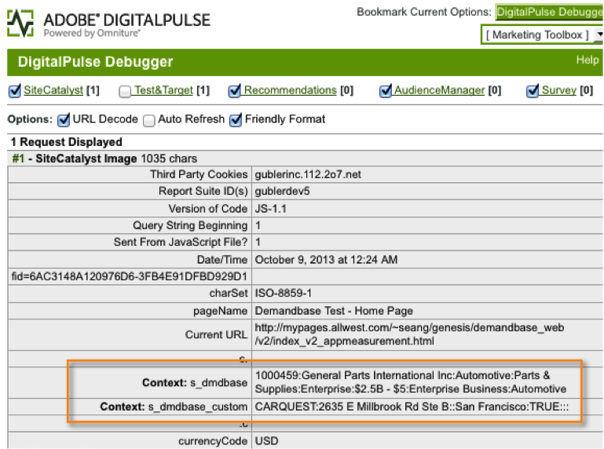
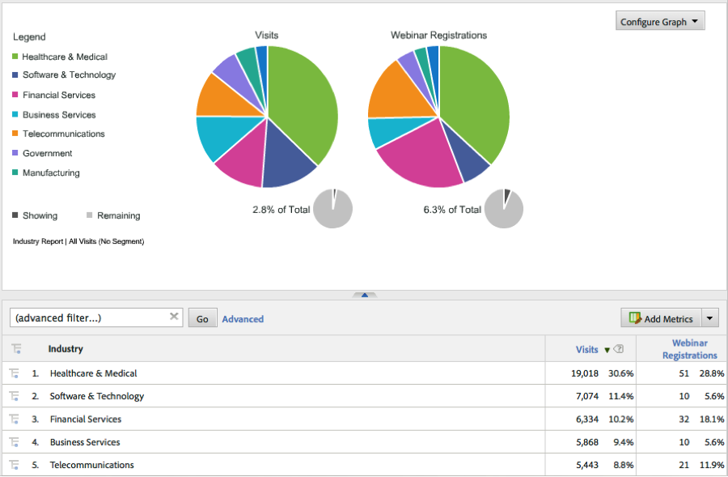

# Deploying the Integration{#deploying-the-integration}

Deploying this integration is a simple process that requires the following actions.

## Completing the Adobe Integration Wizard{#completing-the-adobe-integration-wizard}

To activate the integration, you must complete the configuration wizard within the Data Connectors interface.

1. Navigate to the Data Connectors (formerly Genesis) area within the Adobe Experience Cloud. 
1. Launch the Demandbase 2.0 integration wizard. 
1. Choose the desired Report Suite and provide a name for the integration. 
1. Configure the following items: 

<table id="table_8D60DC7C48C144DC9934749E7F9F65FF"> 
 <thead> 
  <tr> 
   <th colname="col1" class="entry"> Item </th> 
   <th colname="col2" class="entry"> Description </th> 
  </tr>
 </thead>
 <tbody> 
  <tr> 
   <td colname="col1"> Email address </td> 
   <td colname="col2"> The primary contact's email address. </td> 
  </tr> 
  <tr> 
   <td colname="col1"> Description </td> 
   <td colname="col2"> (Optional) Description for this integration setup. </td> 
  </tr> 
  <tr> 
   <td colname="col1"> Demandbase API key </td> 
   <td colname="col2"> You can obtain this from your Demandbase representative. </td> 
  </tr> 
  <tr> 
   <td colname="col1"> Custom Demandbase Dimension #N </td> 
   <td colname="col2"> These are the IDs for the 8 optional dimensions. For more information, see Demandbase Custom Dimensions. </td> 
  </tr> 
  <tr> 
   <td colname="col1"> Send to Adobe Target </td> 
   <td colname="col2">If “true”, the Demandbase dimensions will also be sent to Adobe Target using a hidden mbox. <p>Note:  A configured mbox.js file must be implemented on the webpage for dimensions to be collected. </p> </td> 
  </tr> 
 </tbody> 
</table>

1. Configure the following Variable Mappings items: 

   |  Item  | Description  |
   |---|---|
   |  Demandbase Dimensions  | Choose an available eVar variable from your report suite.  |
   |  Demandbase Custom Dimensions (optional)  | Choose an available eVar variable from your report suite.  |

1. Configure the names for the Custom Dimension (if applicable).

    1. If you chose to include Custom Dimensions in step 4 and mapped the optional eVar in step 5, then you have to provide friendly names for those dimensions. For example, if you chose to enter “stock_ticker” as Custom Dimension 1, then you should change the box containing “Dimension 1” to “Stock Ticker”. 
    1. Do **NOT** modify the names of the standard 8 dimensions (i.e. Demandbase SID, Company Name, Industry, etc.).

1. Check the box to have the Demandbase Integration dashboard automatically created for you (recommended). 
1. Review all configuration items and click **[!UICONTROL Activate Now]**.

## Deploying the Integration Code{#deploying-the-integration-code}

After completing the integration wizard, you must deploy the integration code to your Adobe Analytics deployment code (s_code).

>[!NOTE]
>
>If you used Adobe TagManager or Dynamic Tag Management to deploy Adobe Analytics, you can easily add the integration code using one of those tools.

1. Go to the **[!UICONTROL Support]** tab and download and save the `integration code v2_0_1` resource from the Resources area of the integration. 

1. If applicable, make any necessary modifications to the code. For more information, see Modifying the Integration Code (on this page). 
1. Include the Integrate Module if it is not already present in your Adobe Analytics deployment code.  
1. Deploy the code using one of the following methods:

    * Use Adobe TagManager or Dynamic Tag Management to add the code. 
    * Or, deliver the code to the organizational resource that is responsible for updating your Adobe Analytics deployment code.

>[!IMPORTANT]
>
>Make sure you test deployment for this integration in a development/staging environment before deploying it to a production environment.

## Modifying the Integration Code{#modifying-the-integration-code}

In most cases, you will not need to make any modifications to the integration code that is produced by the Data Connector wizard.

However, if you do need to make adjustments, some of the code settings are described below. 

<table id="table_5405A73CEFD44466B3C39559F4A037C9"> 
 <thead> 
  <tr> 
   <th colname="col1" class="entry"> Code Setting </th> 
   <th colname="col2" class="entry"> Description </th> 
  </tr>
 </thead>
 <tbody> 
  <tr> 
   <td colname="col1"> s.maxDelay </td> 
   <td colname="col2">The maximum number of milliseconds that the Adobe Analytics image request will wait for the Demandbase data before firing off to the Analytics collection server. <p>Note:  This setting applies across all integrations that might be running through the Integrate Module. </p> </td> 
  </tr> 
  <tr> 
   <td colname="col1"> _db._key </td> 
   <td colname="col2"> Your Demandbase API key. </td> 
  </tr> 
  <tr> 
   <td colname="col1"> _db._apiURL </td> 
   <td colname="col2"> The URL template for the Demandbase API. </td> 
  </tr> 
  <tr> 
   <td colname="col1"> _db._delim </td> 
   <td colname="col2"> The delimiter used to separate the Demandbase dimension values when they are sent to Adobe Analytics. Changing this setting may cause the default Classification Rules to not function correctly. </td> 
  </tr> 
  <tr> 
   <td colname="col1"> _db._setTnt </td> 
   <td colname="col2">If true, then the integration code will attempt to use a hidden mbox to send the Demandbase dimensions to Adobe Target as Profile Parameters. <p>Note:  This requires that the mbox.js code exists on the page. </p> </td> 
  </tr> 
  <tr> 
   <td colname="col1"> _db._tntVarPrefix </td> 
   <td colname="col2"> This string is prepended to each Demandbase dimension name before sending to Adobe Target. Example, if this setting has the value “db_” then the dimension “industry” will be sent to Adobe Target as “db_industry”. </td> 
  </tr> 
  <tr> 
   <td colname="col1"> _db._dimensionsArray </td> 
   <td colname="col2"> The standard Demandbase dimensions that are sent to Adobe Analytics. It is recommended that you do not modify this setting. The “max_size” property is the number of allowed characters for the dimension before truncation occurs. </td> 
  </tr> 
  <tr> 
   <td colname="col1"> _db._dimensionsArrayCustom </td> 
   <td colname="col2"> The custom Demandbase dimensions that are sent to Adobe Analytics. The “max_size” property is the number of allowed characters for the dimension before truncation occurs. </td> 
  </tr> 
  <tr> 
   <td colname="col1"> _db._cName </td> 
   <td colname="col2"> The name of the session cookie used to keep the state for the Demandbase API communication. </td> 
  </tr> 
  <tr> 
   <td colname="col1"> _db._contextName </td> 
   <td colname="col2"> The name of the contextData variable that is used to sent the standard dimensions to Adobe Analytics. It is recommended that you do not modify this setting. </td> 
  </tr> 
  <tr> 
   <td colname="col1"> _db._contextNameCustom </td> 
   <td colname="col2"> The name of the contextData variable that is used to sent the custom dimensions to Adobe Analytics. It is recommended that you do not modify this setting. </td> 
  </tr> 
 </tbody> 
</table>

## Including the Integrate Module{#including-the-integrate-module}

The integration code requires that the Integrate Module exists within your Adobe Analytics deployment.

If you do not already have the Integrate Module as part of your deployment, please complete the following steps depending on the type of implementation you have.

### For AppMeasurement v1.0+ {#section-f28d090bf2404cabaae34cd9c66fc575}

1. Unzip the AppMeasurement zip file that you downloaded from **[!UICONTROL Analytics]** > **[!UICONTROL Admin]** > **[!UICONTROL CodeManager]**. 

1. Open the file named [!DNL AppMeasurement_Module_Integrate.js]. 
1. Copy and paste the contents of this file into your primary [!DNL AppMeasurement.js] file. 

   >[!NOTE]
   >
   >Paste it just before the DO NOT ALTER ANYTHING BELOW THIS LINE comment within the file.

### For Legacy Code (H-code) {#section-bba8ad8c715e4f97883e7de3269f681a}

1. Download the Integrate Module from the “Resources” area within the Data Connectors UI (under the Support tab).

   

1. Copy and paste the contents of that file into your [!DNL s_code] file. 

   >[!NOTE]
   >
   >Paste it just before the DO NOT ALTER ANYTHING BELOW THIS LINE comment within the file.

## Verifying the Integration{#verifying-the-integration}

Validate that the integration is successfully capturing data by checking live tracking and reporting.

### Live Tracking {#section-9c20e8ff6b404ae09387ee07d675c9e2}

Use the DigitalPulse debugger tool to verify that Demandbase dimension data is being sent through to Adobe Analytics. After deleting your cookies, reload a page on your website where the integration code has been deployed. Assuming that your current IP maps to an organization recognized by Demandbase, you should see results similar to the following.

**Reports & Analytics (formerly SiteCatalyst) includes the two Demandbase context data variables:**



**Target Mbox includes the Demandbase Profile parameters:**
You will see this only if you have Target implemented on the page AND you have this integration configured for Adobe Target - see Step 4 in the Adobe integration wizard.


### Reporting {#section-1792fe75dc3249d0ad063dfd87a89162}

Review your Demandbase reports within Adobe Analytics using the Dashboard that was automatically created for you using the Adobe Integration wizard (Step 7).

Alternatively, you can navigate to the Demandbase reporting within the Adobe Analytics menu structure - see screenshots below.

>[!NOTE]
>
>This data should appear within 24-48 hours of successful deployment.




### Frequently Asked Question {#section-d926b160a2ef4f07b43ea1bc67ac2a0a}

**What does "[n/a]" mean?**

The Demandbase Data Connector indicates when an attribute is “Not Available” by setting this default value. There are two common scenarios where the default is set:

* Demandbase detects that the visitor is coming from an IP address that does not belong to a company. 
* An Account Watch attribute (beginning with “watch_list”) is used, but the company is not in your Account Watch list.

**Why does “`[n/a]`” appear more often for certain attributes?**

Demandbase classifies all IP addresses and provides the audience and audience_segment attributes even when the visitor is not coming from a company IP. When audience returns values such as “Residential”, “Wireless”, and “Hospitality”, the rest of the attributes are likely not available.

At times, a visitor’s audience will be “SMB”, but other attributes will show “`[n/a]`”. This means Demandbase is able to classify the visitor as a small business, but the full company profile is not available. This typically happens for the smallest companies, when more than one small business is using the same service provider or block of IP addresses.

### Developer Considerations {#section-d33fff55bc4b4db99f82dee418ef1bc2}

If you need to adjust the default value in your implementation, update the line:

```
_db._nonOrgMatchLabel = "[n/a]";
```
