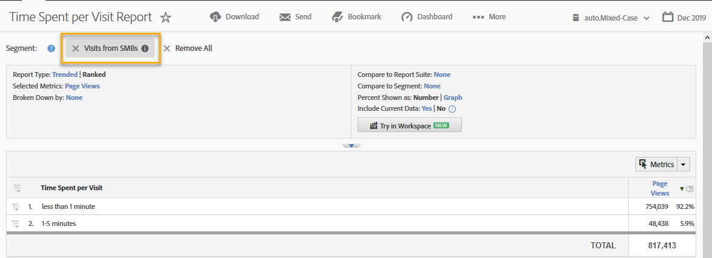

# Using the Integration{#using-the-integration}

Once the integration is deployed, you can begin using the additional capabilities that it provides.

> [!NOTE] It can take 24-48 hours to begin seeing some of the Demandbase data within Adobe Analytics reporting.

Here are some actions you can take to get value from this integration from within Adobe Analytics: 

## Viewing Traffic and Conversion Metrics by Demandbase Dimension{#viewing-traffic-and-conversion-metrics-by-demandbase-dimension}

This integration provides new dimensions that become available as Adobe Analytics reports.

The report below is an example of analyzing both Visits and a conversion metric (Webinar Registrations) that have been broken down by both the Audience type and then by Industry.

## Segmenting by Demandbase Dimensions{#segmenting-by-demandbase-dimensions}

A primary feature of this integration is the ability to create Adobe Analytics segments based on the Demandbase dimensions.

For example, you can build a segment that will include only Visits from SMB organizations. You might call this Visits from SMBs. Its definition would be:

Audience equals SMB.

For more information on how to build segments, consult the [Analytics Segmentation Guide](https://marketing.adobe.com/resources/help/en_US/analytics/segment/).

This segment can then be applied to practically any report - one example is the Time Spent per Visit Report seen here: 
