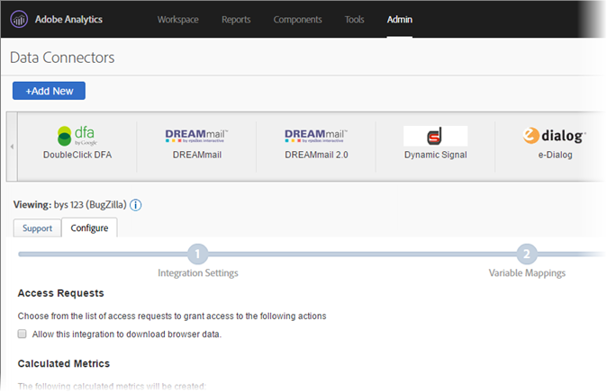
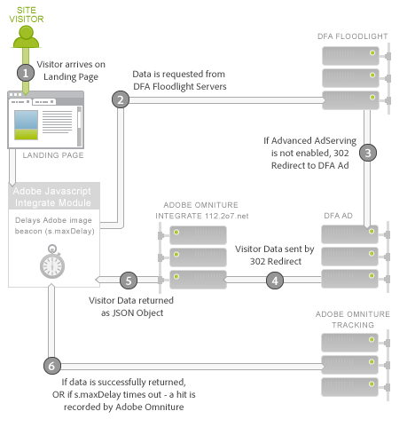

# DFA Data Connector for Adobe Analytics{#dfa-data-connector-for-adobe-analytics}

>[!IMPORTANT]
>
>We will be end-of-lifing the Adobe Data Connector technology on August 1, 2021. [Learn more...](/help/import/data-connectors/data-connectors-eol.md)

In today's increasingly complex and competitive online marketplace, online advertisers and agencies must continually improve their understanding of the online marketing environment, and their return on advertising spend. Although advertisers, agencies, and publishers all possess individual tools to help accomplish these objectives, manually aggregating data from disparate data systems and processes can severely hamper the effectiveness of on-line marketing campaigns, resulting in less-than-optimal campaign performance, data discrepancies and confusion.

The DoubleClick for Advertisers (DFA) integration solves this problem by using Adobe® Data Connectors™ to allow DoubleClick DFA to automatically pass data to Reports & Analytics.

**[!UICONTROL Analytics]** > **[!UICONTROL Admin]** > **[!UICONTROL All admin]** > **[!UICONTROL Data connectors]**

## Key Benefits{#key-benefits}

Key Benefits of the Data Connector - DFA integration include:

* **Increased conversion**: Gain directional insight to optimize ad campaign placement and on-site conversion based on post-click visitor behavior and preferences.
* **Shared location for data**: Combine DoubleClick DFA click-through and view -through data with Reports & Analytics to improve cross-organizational collaboration and abilities to make objective decisions.
* **Value-added analysis**: Automated integration between DFA and Adobe Reports & Analytics allows advertisers and agencies to spend less time crunching data and more time analyzing reports and taking action.
* **Deeper customer insight**: Gain greater insight into where visitors are coming from and what they are doing on your site.
* **Lifetime success metrics**: Measure the effectiveness of your acquisition campaigns across the entire visitor life cycle.
* **Integrated Reporting**: Automatically synchronize data between DFA and Reports & Analytics for streamlined business processes and reporting.
* **Lifetime Visitor Analysis**: Measure campaign effectiveness by multiple user-defined success events and lifetime value.
* **Cost Metrics**: Optimize return on investment by comparing DFA cost figures and revenue generated from those costs in a single system.

## Ad Serving Integration Overview{#ad-serving-integration-overview}

There are several ways in which this integration captures data about the ad-driven visitor. The first way is via clicking on an ad and arriving on a tagged landing page, called a click through:

 

The visitor arrives upon a publisher's site, which hosts the Ad. This Ad has a unique identifier, called the Ad ID. Ads comprise a Placement plus a Creative, which describe where the Ad is on the Publisher's site and what content was shown to the visitor. When the visitor fetches this Ad, placement, or creative from the DFA content servers, it tracks an Impression to the DFA Floodlight Servers for this visitor (1).

If the visitor clicks on the ad (2), the Floodlight Server is queried, which counts a click, then 302 redirects (3) the visitor to the Landing Page. When the visitor has arrived upon the Landing page, this is termed a click-through. This page contains Adobe tracking code which queries data from the DFA Floodlight Server.

If the visitor does not actually arrive on the Landing Page after the Floodlight Server has tracked a click, this is not termed a click-through. Some ads and implementations may not actually cause the visitor's browser to obey the 302 redirect. For further discussion on this topic, see [Reconciling Metric Discrepancies](../dfa-data-connector-analytics/dfa-reconciling-metric-discrepancies.md).

The next metric captured by this integration occurs when the visitor receives the Ad impression, does not click, yet sometime in the near future arrives upon the Landing page by another means.

This scenario is termed a view-through. The difference in this scenario with the click-through scenario is that the visitor does not click on the Ad, but instead continues to other activities before coming to the Landing page (2). In the simplest case, the visitor types in the landing page's URL in the browser. In other cases, the visitor continues browsing but later uses a search engine, which drives the visitor to the landing page. In any case, the user arrives upon the landing page.

## Adobe Integration: Real-Time Data Collection{#adobe-integration-real-time-data-collection}

The following figure shows how data collection works.

 

The data collection portion of the Adobe integration begins when the visitor arrives to the landing page (1). The Adobe data collection code running on the landing page has no knowledge of the history the visitor has had with served ads. The Google DFA team has coordinated a service running on the DFA Floodlight Server to allow the Adobe code to query ad information about the visitor currently on the site (2). To obtain this data, it temporarily delays the Adobe image beacon, and requests the data from the Floodlight Server.

Once the data arrives, or takes too long, it fires the hit to the Adobe tracking servers (3).

The Integrate module is a special core Adobe JavaScript module which causes the Adobe image beacon to delay, waiting on a 3rd party request for a specific amount of time (`s.maxDelay`). `s.maxDelay` defines how long the Integrate module will wait for data from the DFA Floodlight Server before firing the image tag to the visitor's browser. This behavior is important so that basic visitor data is still collected, even when the DFA Floodlight Servers are down or heavily loaded. If the Floodlight data arrives before `s.maxDelay` has expired, the Adobe tracking data will be fired immediately, and will contain the additional DFA data.

When a timeout occurs, the page code can specify an Adobe Reports & Analytics Event to be used as a Timeout Event. This event is useful when diagnosing problems with the integration, or when adjusting `s.maxDelay`. In cases where there are excessive timeouts, increase `s.maxDelay`. `s.maxDelay` can be set too high, however, in which cases visitors could have the potential of leaving the site prior to the `s.maxDelay` timer expiring. .

Sometimes the Floodlight Server responds with errors about the visitor. This usually occurs when the Floodlight Server does not know anything about the visitor, because the visitor has not yet seen any ads, or does not have a DFA visitor cookie. The page code can specify a Custom Conversion variable (eVar) which will collect these errors, and can aide in troubleshooting implementation problems or point out issues with the Google transaction. The most common errors are No History, No Cookie, Query Error, and Opted Out, as described in the following table: 

|  Error  | Name  | Description  |
|---|---|---|
|  nh  | No History  | The visitor has not viewed or clicked any ads.  |
|  nc  | No Cookie  | The visitor does not have a DFA visitor cookie.  |
|  qe  | Query Error  | There was an error querying data for the Floodlight Server.  |
|  oo  | Opted Out  | The visitor opted-out of Google impression/click tracking.  |

## Adobe Integration: Nightly Data Import{#adobe-integration-nightly-data-import}

The data collection portion of the integration collects click-through and view-through data about site visitors. To obtain DFA click, impression, and cost metrics, there is a nightly process coordinated by Google and Adobe to import this additional data to the integrated report suite. These metrics are imported through Data Sources, meaning they are available in aggregate only, and are not at the visit level.

## Version Differences{#version-differences}

There are currently three versions of the DFA integration, versions 1.0, 1.5, and 2.0.

The following table summarizes the features in each version of the integration.

|  Feature  | Version 1.0  | Version 1.5  | Version 2.0  |
|---|---|---|---|
|  DFA Click and Impression Nightly Metrics  | Yes  | Yes  | Yes  |
|  Click-through and View-through Tracking  | Yes  | Yes  | Yes  |
|  Integration receives data on an Advertiser level  | No  | Yes  | Yes  |
|  Integration receives data on a Floodlight Configuration level  | No  | No  | Yes  |
|  Cost Metrics  | No  | No  | Yes  |
|  Creative Metrics  | No  | No  | Yes  |
|  Query strings beyond 2k bytes  | No  | Yes  | Yes  |
|  Uses Integrate module for optimal 3rd party data collection  | No  | Yes  | Yes  |
|  Timeout and Error tracking  | No  | Yes  | Yes  |
|  No need for negotiated Client Side ID  | No  | No  | Yes  |

### About Version 1.5 {#section-b5a3e967cfa141ea8f740612336181be}

Version 1.5 of the integration introduces the Integrate module to the landing page Java Script. The Integrate module allows for fixed sized requests to the DFA ad server (ad.doubleclick.net) which overcomes the 2K request limits of the previous integration. It also introduces a configurable timeout, *`s.maxDelay`*, to continue collecting Adobe visitor data when network outages occur. Errors and timeouts can also be captured into Analytics variables.

The following illustration shows network interactions on the landing page in version 1.5.

In version 1.5, the Integrate module (2) requests data from the Floodlight Server (3). The Floodlight Server will redirect to the DFA ad server, which will return data about the visitor in the same way as version 1.0. It will 302 redirect (4) to a special translator service on integrate.112.2o7.net, which will turn the response structure into a JSON object. The Integrate module consumes this JSON object and passes the information along to the Adobe Tracking (5).

Moving from Version 1.0 of the integration to 1.5 involves a JavaScript change. To obtain this JavaScript, log into your Adobe Online Marketing Suite account, choose the Genesis product, click Edit on your DFA integration, and proceed through the wizard. Provided a Client Site ID has previously been assigned, once you have saved the Integration you will immediately receive the new JavaScript code via email. Once you have this code, you will also new version of the core s_code will be needed which has the Integrate module. This code can be requested from your Account Manager or Implementation Consultant.

An important feature of the new JavaScript code is that there is no implementation change necessary between version 1.5 and version 2.0.

### About Version 2.0 {#section-afd56de0c56c4489bb5ddc5798d6709a}

The latest version of the DFA integration brings data for an entire Floodlight Configuration into the integration. Previous to version 2.0, individual integrations were tied to a single DFA Advertiser. With this change, Clicks, Impression, and Cost metrics for the entire Floodlight Configuration will be included in the integrated report suite. It is also possible to track cross-site view throughs, when those two sites are inside the same Floodlight Configuration.

Media Cost metrics are also available as of version 2.0 of the integration. To enable media cost metrics for an integration, you must choose a Reports & Analytics event for Media Cost in the Genesis wizard, as well as specify what currency the metric figures are in the DFA interface.

Timeouts are expected to decrease with the 2.0 integration, since the 302 redirects have been eliminated. Eliminating these hops should decrease timeouts, and increase the amount of DFA data you can integrate.

If a Floodlight Configuration is a shared configuration in DFA, the upgrade from version 1. 5 to 2.0 causes conversion data for all shared advertisers within the Floodlight Configuration to be included in the report suite.

### Upgrading to Version 2.0 {#section-f0bf90b9a7a1434ab1540b6c0999f4c7}

The following table outlines the owners for migration to newer versions of the integration:

|  Migration  | Owner  | Tasks  |
|---|---|---|
|  Version 1.0 to 1.5  | Client  | Implement Version 1.5 JavaScript with Integrate Module  |
|  Version 1.5 to 2.0  | Client  | Client begins discussion with Google about time frames for upgrading. After approval, Google enables Advanced Ad Serving.  |
