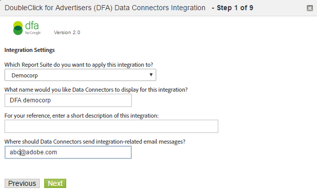

# DFA Integration{#dfa-integration}

Configuring the DFA integration involves the following tasks:

## Configure the DFA integration{#configure-the-dfa-integration}

Step through the DFA Data Connectors Integration.

The configuration pages provide an overview of the integration, along with helpful links for more information. There are both Adobe and DoubleClick fees associated with this integration. Contact your appropriate Sales Representatives for both organizations and make sure you understand the fee structure.

1. Log in to [!DNL Adobe Analytics].
1. Click **[!UICONTROL Admin]** > **[!UICONTROL All admin]** > **[!UICONTROL Data connectors]**.

   

1. Locate **[!UICONTROL DoubleClick DFA]**, then click **[!UICONTROL Add New]**.

   

   On each page of the Integration Wizard, provide the required information, then click **[!UICONTROL Next]**. The following table explains the information you need to complete the integration through the wizard.

<table id="table_8F6F7F304C36431DA5FD6E5D54F60FC0"> 
 <thead> 
  <tr> 
   <th colname="col1" class="entry"> Wizard Page # </th> 
   <th colname="col2" class="entry"> Field </th> 
   <th colname="col3" class="entry"> Description </th> 
  </tr> 
 </thead>
 <tbody> 
  <tr> 
   <td colname="col1"> 1 </td> 
   <td colname="col2"> Integration Name </td> 
   <td colname="col3"> The integration name that Genesis displays in the report suite's Active Integration List. </td> 
  </tr> 
  <tr> 
   <td colname="col1"> 1 </td> 
   <td colname="col2"> Integration Email Address </td> 
   <td colname="col3"> The email address that receives all notifications related to this integration. </td> 
  </tr> 
  <tr> 
   <td colname="col1"> 2 </td> 
   <td colname="col2"> User name </td> 
   <td colname="col3"> The DFA API username to use with this integration. To enable a user for API login, check the API attribute in the DFA interface. After you enable API login, a password field appears to provide a password for the user. This password is entered along with the username into the wizard to authenticate. </td> 
  </tr> 
  <tr> 
   <td colname="col1"> 2 </td> 
   <td colname="col2"> Password </td> 
   <td colname="col3"> The DFA API password. </td> 
  </tr> 
  <tr> 
   <td colname="col1"> 2 </td> 
   <td colname="col2"> Advertiser ID </td> 
   <td colname="col3"> <p>The DFA advertiser ID or the parent Floodlight Configuration ID. Data Connectors uses this ID to identify the DFA Advertiser to track (version 1.5 of the integration). This Advertiser ID is not used in version 2.0 of the integration - the parent Floodlight Configuration ID will be looked up and used. See the instructions on the screen </p> </td> 
  </tr> 
  <tr> 
   <td colname="col1"> 3 </td> 
   <td colname="col2"> DFA Ad Variable </td> 
   <td colname="col3"> The Analytics eVar that receives DFA campaign attribute, impressions, and clicks data. Typically, this is the Tracking Code eVar ( <span class="varname"> s.campaign </span>), but you can choose any available eVar. Data Connectors also adds the following DFA-related classifications to the selected eVar: <p><b>Campaigns</b>: A collection of ads served to multiple sites that carry common messaging. </p> <p><b>Site Name</b>: The site where the ad was served. </p> <p><b>Ad Name</b>: The Ad name, as defined in your DFA account. </p> <p><b>Site Placement Name</b>: The Web site and page where the Ad was served. </p> <p><b>Delivery Tool</b>: DoubleClick for Advertisers. </p> <p><b>Channel</b>: Banner Ad. </p> <p><b>Cost Structure</b>: CPM, CPC, or Fixed, based on the cost structure of the ad. </p> <p><b>Creative Name</b>: The name of the creative associated with an ad/placement/creative ID. </p> <p><b>DFA &gt; SearchCenter Deduplication</b>: Specifies that DFA should place values in Searchcenter variables when DFA Click-throughs or View-throughs occur. </a> . </p> </td> 
  </tr> 
  <tr> 
   <td colname="col1"> 4 </td> 
   <td colname="col2"> Impressions </td> 
   <td colname="col3"> The Custom Event that receives DFA Impressions metric data. Impressions indicates the number of times the ad was served. </td> 
  </tr> 
  <tr> 
   <td colname="col1"> 4 </td> 
   <td colname="col2"> Clicks </td> 
   <td colname="col3"> Select the custom Event that receives DFA Clicks metric data. Clicks indicates the number of times visitors clicked on the ad as measured by DFA's redirect. The Clicks metric correlates with the Analytics Click-throughs metric. <p>Note:  DFA Clicks and Analytics Click-throughs might not match exactly due to differences in the way data is collected.  </a>. </p> </td> 
  </tr> 
  <tr> 
   <td colname="col1"> 5 </td> 
   <td colname="col2"> View-Through Variable </td> 
   <td colname="col3"> <p>The Analytics eVar that receives DFA View-Through data. The View-Through variable helps you see how view-throughs affect conversion rates on your site. </p> <p>Data Connectors adds the same DFA-related classifications to this eVar as it does to the DFA Ad Variable (see above). </p> </td> 
  </tr> 
  <tr> 
   <td colname="col1"> 5 </td> 
   <td colname="col2"> Time Since Last View (view-through time bucket variable) </td> 
   <td colname="col3"> The Analytics eVar that receives DFA Time Since Last View data. The Time Since Last View indicates the amount of time that has lapsed since the last ad view-through. </td> 
  </tr> 
  <tr> 
   <td colname="col1"> 5 </td> 
   <td colname="col2"> View-Throughs </td> 
   <td colname="col3"> The Custom Event that receives DFA View-Throughs metric data. Use the View-Throughs event with the View-Through Variable to see which campaigns didn't influence a direct click-through, but may have played a role in driving traffic to the site at some subsequent time. <p>Data Connectors renames the selected Custom Event to "View Throughs". </p> </td> 
  </tr> 
  <tr> 
   <td colname="col1"> 6 </td> 
   <td colname="col2"> DFA Query Failure </td> 
   <td colname="col3"> (Optional) The Analytics eVar that receives any reported DFA query failure message codes. Possible DFA message codes include: 
    <ul id="ul_85FC7FB19F7F4ADF83ABCA6DDB44CE19"> 
     <li id="li_0A3181DED5A149588A0D3F1584E2FE8B"><b>nc</b>: No DoubleClick cookie. </li> 
     <li id="li_D397AA73AD5E4086A18B87F271E4EC14"><b>oo</b>: User has opted out. </li> 
     <li id="li_5AC1D0C8049340B4AD857D88E275CBD6"><b>nh</b>: No campaign history. </li> 
     <li id="li_73A8C5E905C54E2BB531A1FCDBC6AA1A"><b>qe</b>: Query error (time out, server down, etc.) </li> 
    </ul> </td> 
  </tr> 
  <tr> 
   <td colname="col1"> 6 </td> 
   <td colname="col2"> Timeout Event </td> 
   <td colname="col3"> <p>The Analytics Counter Event that increments each time the <span class="varname"> s.maxDelay </span> timer expires, and no response was received from the DFA servers. Use this event to configure the <span class="varname"> s.maxDelay </span> variable Tuning s.maxDelay </a>.) </p> </td> 
  </tr> 
 </tbody> 
</table>

## Web Site Updates for the DFA Integration{#web-site-updates-for-the-dfa-integration}

Once Genesis has configured your Analytics report suite for the DFA integration, you must do the following to configure your Web site and DFA environment to support the integration:

### Verify Cookie Space on the Domain{#verify-cookie-space-on-the-domain}

The Data Connectors integration for DFA requires you to set a cookie on the domain of the page.

Although it is rare, some domains have reached the maximum cookie capacity for some Web browsers. To avoid affecting a visitor's browsing experience on your Web site, consult with your network operations, development team, or engineering group to verify that adding another cookie to the domain of the pages used for the DFA integration will not affect the user experience. You will also need to select a name for the cookie.

### Update your DFA Query-String Parameter{#update-your-dfa-query-string-parameter}

If you have already been tracking Ad campaigns with Adobe Analytics prior to the DFA integration, it is possible that all campaigns (email, search, or banner) use the same query string parameter to identify the referring campaign ID on the landing page.

To understand when to request view-through and click-through data from DFA data for your DFA Ad campaigns, Data Connectors needs to identify when a visitor has clicked on a DFA campaign banner ad. To make this possible, you must add a differentiated query-string parameter to the DFA Ad campaign's landing page URL so Data Connectors can distinguish between DFA Ad campaign pages and other ad campaign pages that you might have on your Web site. The `dfa_overrideParam` in the JavaScript plug-in used for DFA.

>[!CAUTION]
>
>Although the Campaign variable can be used for other campaigns, do not use it for DFA campaigns. If you set the Campaign variable to a DFA campaign landing page, Adobe cannot tie impressions and clicks to DFA campaign click-throughs. Once per visit, Adobe collection servers check DFA servers for a previous click- or view-through. Because of this, include the DFA plug-in code only on common landing pages to avoid unnecessary redirects that can slow page-load times, particularly for users with slower Internet connections.

## Update Your Web Site's Data Collection Code{#update-your-web-site-s-data-collection-code}

The Genesis integration for DFA leverages the DFA Floodlight Configuration ID (dfa_SPOTID), which improves report consistency between DFA and Adobe data collection system.

>[!NOTE]
>
>The term Spotlight was changed to Floodlight in a recent release of Google DFA. The JavaScript parameter `dfa_SPOTID` was named based on the Spotlight terminology but is used for both versions.

To enable the DFA integration on your Web site, you must update your JavaScript data collection code by adding the following:

* Integrate Module for DFA 
* Addition to your Collection Code

### Integrate Module for DFA {#section-fa00e42a732a4e27a4ab3dfcfeae1a5b}

The DFA integration leverages the Adobe Experience Cloud Integrate Module, which adds functionality to your core JavaScript data collection code ( `s_code.js`). The Integrate Module comes as part of the .zip file when you download the AppMeasurement for Javascript code from the Code Manager. Contact your Adobe Consultant only if you need additional help finding it.

Insert the Integrate Module code in the `Modules` section of your website's `s_code.js` file.

### Addition to Your Collection Code {#section-8f98c727f1ba414fb8b4f02d696b8791}

Based on your selections when activating the DFA integration in the Integration Wizard, Data Connectors generates and emails you a customized addition to your JavaScript data collection code. Insert this code in the main section of the `s_code.js` file (not in the `doPlugins` function or any other function).

The sample code shown below is for illustration only; use the code that was emailed to you after you completed the Data Connectors Integration Wizard.

The collection code consists of the following components:

* DFA Integrate Settings 
* Integration-Required Plug-ins

**DFA Integrate Settings**

```
/************************** DFA VARIABLES **************************/ 
var dfaConfig = { 
   CSID:              "1234567", 
   SPOTID:            "29876543", 
   tEvar:             "eVar17", 
   errorEvar:         "eVar59", 
   timeoutEvent:      "event76", 
   requestURL:         "https://fls.doubleclick.net/ 
json?spot=[SPOTID]&src=[CSID]&var=[VAR]&host=integrate.112.2o7.net%2 
Fdfa_echo%3Fvar%3D[VAR]%26AQE%3D1%26A2S%3D1&ord=[RAND]", 
 
   maxDelay:          "1500", 
   visitCookie:       "s_dfa", 
   clickThroughParam: "CID", 
   searchCenterParam: "s_kwcid", 
   newRsidsProp:      undefined 
}; 
/************************ END DFA Variables ************************/ 
```

The DFA Integrate Settings Block sets variables required by the DFA integration. The values for each of these variables come from the following sources:

**CSID**: Client Side ID. Generated by DFA once you complete the Integration Wizard. Data Connectors pre-populates this variable with your DFA CS ID, and also sends you this value in the setup email after you complete the Integration Wizard. This variable is not required if Advanced Ad Serving is enabled on your account.

**SPOTID**: Floodlight Configuration (previously called Spotlight ID). Data Connectors pre-populates this variable with your DFA Floodlight Configuration ID, based on the DFA account information you specified in the Integration Wizard.

**tEvar**: Transfer Variable. Data Connectors pre-populates this variable with the Analytics variable name you specified for the View-Through variable in the Integration Wizard. Do not change this value without careful coordination with Adobe Engineering or Engineering Services.

**errorEvar**: Error Variable. Data Connectors pre-populates this variable with the Analytics variable name you specified for DFA Query Failure variable in the Integration Wizard.

**timeoutEvent**: Timeout Event. Data Connectors pre-populates this variable with the Analytics variable name you specified for the Timeout Event variable in the Integration Wizard.

**requestURL**: The remote DFA host to query for ad information. Do not change this value unless so instructed by Adobe.

**maxDelay**: Specifies the amount of time the JavaScript data collection code waits for a response from the DFA Floodlight server, in milliseconds. Adobe recommends experimenting with this value to find the optimum value based on your site's traffic. For example, increasing this value generally collects more DFA data, but increases the risk of losing the base visitor data if the visitor leaves the site during the delay period. Reducing this value lowers the risk of losing hit data, but can reduce the amount of DFA data sent with the Adobe hit data.

**visitCookie**: The name of the cookie used to restrict DFA calls to once per visit.

**clickThroughParam**: A query string, typically included on all ads, that notifies the Integrate module that a click has just occurred. The presence of this parameter in the query string causes the request to happen to DFA Floodlight servers no matter if the visitor had already been queried in the last 30 minutes.

**newRsidsProp**: (Optional) Mapped to an unused Traffic property variable. The DFA integration collects and stores this value in the visit cookie to identify the report suites that collected data for a particular visitor. This property is only needed with custom implementations with Adobe Engineering services.

**Integration-Required Plug-Ins**

The Collection Code addition incorporates additional plug-ins that improve the operation of the DFA integration:

* Limits DFA queries to once per visit 
* Provides cookie name flexibility. Although most organizations use s_dfa, you can use any valid cookie name for the DFA integration.
* Eliminates unnecessary redirects. Because view-through data is collected in real-time, Adobe collection servers and DFA could potentially exchange data on every page view. The plug-in blocks these data exchanges when the information is not necessary.

>[!CAUTION]
>
>One of the mechanisms the plug-in uses to eliminate unnecessary DFA queries is a domain-based visit cookie. An integration report suite that spans multiple domains inflates click-through and view-through data when visitors cross domains after a DFA-influenced view-through or click-through.

## Confirming a Successful DFA Integration{#confirming-a-successful-dfa-integration}

After you have made all the necessary Web site updates, you can use a network traffic viewer, such as Charles*, Chrome Developer Tools, or Firebug*, to confirm DFA is communicating with Adobe collection servers.

After you have deployed the DFA-enabled `s_code.js` file, use the network traffic viewer to view the requests between DFA and Adobe data collection servers, looking for the following:

* A request to DFA's `fls.doubleclick.net/json` service. This service can respond differently depending on the version of DFA you are using. With the DFA Integration version 1.5:

    * An HTTP 302 redirect to [!DNL ad.doubleclick.net]. This will send a Location: tag in the response which contains information about the ad visitor.
    * This Location tag causes a redirect to [!DNL integrate.112.2o7.net/dfa_echo]. This service translates the information about the ad visitor into JSON (JavaScript Object Notati on) encoded string. This data is returned with a 200 OK HTTP response.

* With DFA Integration version 2.0 (Advanced Ad Serving enabled):

    * [!DNL fls.doubleclick.net] will directly respond with a 200 OK.

In either case, a successful request will result in a request to the Adobe data collection servers that contains the parameter vX, where X is your View-Through eVar number. This parameter value takes the form: DFA-XXXX-XXXX- XXXX-XXXX-XXXX-XXXX-XXXX-XXXX-XXXX. This string contains data about the last click and the last impression for the current visitor.

## Tuning s.maxDelay{#tuning-s-maxdelay}

Achieving a successful DFA implementation involves optimizing s.maxDelay for your particular site.

In general, the decision to raise or lower *`s.maxDelay`* involves a tradeoff between obtaining more DFA visitor data and endangering collecting Adobe visitor data. Increasing *`s.maxDelay`* obtains more DFA visitor data, but (placed excessively high) could endanger the collection of Adobe visitor data. Decreasing s.maxDelay ensures the collection of Adobe visitor data, but could lose DFA visitor data.

*`s.maxDelay`* encapsulates more than just the time in network communication to contact DFA; it also represents browser delays to fire and evaluate the JavaScript from which these communications are based. This is because the Integrate module begins the *`s.maxDelay`* timer after it has inserted the HTML element in to the DOM which pulls the data from the DFA Floodlight server. The amount of time it takes for the browser to actually initiate the HTTP request based on this new HTML element varies based upon other images or JavaScript files that are loading simultaneously, speed of the visitors computer, and specific browser implementations. Furthermore, when the JSON data is retrieved from the DFA Floodlight server, the JavaScript must be evaluated by the browser. This again is controlled completely by the browser and can be delayed if there are large amounts of JavaScript code running simultaneously or many asynchronous JavaScript requests.

With this in mind, *`s.maxDelay`* needs to be set dependent up on the complexity of the landing page plus the amount of network delay with DFA. On some sites, one possible way to decrease complexity is to fire the Adobe collection code early in page loading, so that there is less going on in the browser at the time the Floodlight server is being requested.

The Timeout variable is absolutely required when tuning *`s.maxDelay`*, because it is incremented every time the s.maxDelay timeout is reached. When deciding whether to increase or decrease *`s.maxDelay`* we recommend following this process:

1. Collect several days of data with *`s.maxDelay`* set to a particular value.
1. Run a [!DNL Daily Unique Visitors Report] for the time range.
1. Run the [!DNL Timeout Event Report] to check the number of timeouts that are coming through. Remember that a timeout is only collected once per visitor.

Now having the figures in hand, compute

```
Timeout Percentage = [Step 3] / [Step 2] * 100
```

Note that the Timeout Percentage is actually considering all visitors to the site. Some of those visitors would not have been tied to DFA at all, and so the timeout is misleading. To improve this computation, another analysis could consider only unique visitors to pages with the `clickThroughParam` set (for example, `?CID=1`). This will show more accuracy.

If the Timeout Percentage is very low, consider decreasing *`s.maxDelay`*. If it is very high, increase *`s.maxDelay`*. When decreasing *`s.maxDelay`*, you will want to rerun the [!DNL Timeout Report] to ensure that timeouts have not dramatically increased. When increasing *`s.maxDelay`*, you will want to run a [!DNL Page Views Report] to make sure page views aren't falling out due to lost data. Each time *`s.maxDelay`* is changed observe the data for several days in order to ensure that the data represents a trend, and not just a day-to-day fluctuation.

The optimal setting for *`s.maxDelay`* is the point at which the timeout percentage is minimized while Page Views do not drop off.

Timeouts are expected to decrease when you move to version 2.0 of the integration, because of the eliminations of 302 redirects. Initial findings with beta clients have shown consistent reduction in timeouts, and thus more DFA data being collected
