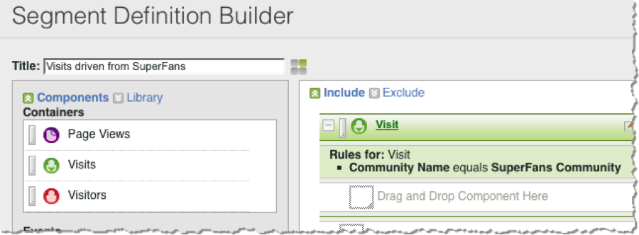

# Using the Integration{#using-the-integration}

Once deployed, you can begin using the additional capabilities that this integration provides.

**Note**: It can take 24-48 hours to begin seeing some of the Dynamic Signal data within your Adobe Analytics reporting.

The following actions result in added value from this integration within Adobe Analytics.

## Viewing Traffic and Conversion Metrics by Dynamic Signal Dimensions{#viewing-traffic-and-conversion-metrics-by-dynamic-signal-dimensions}

Example of a report in Adobe Analytics.

This integration provides new dimensions that become available as Adobe Analytics reports. The report below is an example of analyzing both Visits and a conversion metric (Registrations) that have been broken down by Article Title.

## Segmenting by Dynamic Signal Dimensions{#segmenting-by-dynamic-signal-dimensions}

Examples of segments based on Dynamic Signal dimensions.

A primary feature of this integration is the ability to create Adobe Analytics segments based on the integrated reporting dimensions. For example, you can build a segment that includes only Visits originating from a specific VoiceStorm Community. You might call this "Visits driven from SuperFans". This segment definition might look like the following.

## Integrated Reporting Dimensions{#integrated-reporting-dimensions}

Lists the Dynamic Signal reporting dimensions that are included with this integration.

|  Dimension  | Description  |
|---|---|
|  Channel Type  | The social network (or blogging platform) where the user shared a community post. Users may share a post on multiple channels. Clicks and other activity are segmented per channel. This field displays Facebook, Twitter, etc. so that you can see which Channel Type is driving activity.  |
|  Article ID  | The Article ID uniquely identifies each piece of content in the Dynamic Signal community.  |
|  Source Type  | This field indicates whether the post was created by a "Member" or the "Brand". Note that in either case content may be created manually in the application or imported from an external feed.  |
|  User Name  | The user who shared a post on his or her social network(s), generating click-throughs to your site.  |
|  Source ID  | The Source ID uniquely identifies the creator (or author) of the shared post. This is most often either a particular member or an external feed.  |
|  User ID  | The User Id uniquely identifies a user (i.e., a member) in the Dynamic Signal community. In this case, the user is the sharer who shared the post on his or her social network(s).  |
|  Source Name  | The source is the creator (or author) of the shared post. In most cases, this is a member of the community or an external feed.  |
|  Article Title  | The title of the shared post that generated clicks back to your site.  |
|  Community Name  | The name of your Dynamic Signal community.  |
