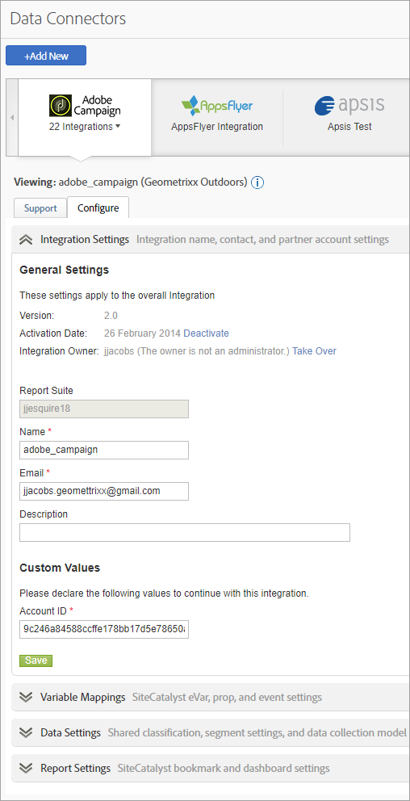

# Overview of data connectors

Adobe provides organizations with actionable, real-time intelligence regarding their digital strategies and marketing initiatives. Data connectors let you import tracking data from third-party applications into Analytics, so you can gather and use data from one central location. If you use one of the partner products, you can create an integration that imports the application data into marketing reports. Once integrated, you can generate reports that include data from your application.

For example, an e-mail integration might want to use an e-mail partner to distribute an e-mail campaign. When visitors come to your Web site you want to know which ones came in response to your e-mail campaign. Data connectors integrate data from your e-mail partner into marketing reports so that you can determine this information to gauge the effectiveness of your e-mail campaign.

>[!IMPORTANT]
>
>We will end-of-life the Adobe Data Connector technology on August 1, 2021. [Learn more...](/help/import/data-connectors/data-connectors-eol.md)

**System requirements**

Data connectors should integrate appropriately with most popular browsers. However, reports look and function best on systems that meet the following recommendations:

* Browser: Microsoft Internet Explorer version 6 and above
* Cookies: Required
* JavaScript: Enabled
* Operating System: Windows-based
* Macromedia Flash Player: version 6 or above
* Monitor Resolution: 1024x768 (800x600 will work)
* Color Depth: 16-bit or higher

Additionally, data collection improves when users' web browsers have JavaScript enabled.

**Prerequisites**

Before configuring a data connectors integration for your product, do the following:

* Have the necessary access credentials for the partner product account, with rights to access all data you want to integrate with marketing reports. You might want to create a special e-mail account for report distributors and for notification concerning the integrated operations.
* Identify the custom variables that hold your campaign information. This is commonly referred to as the campaign tracking code, but your organization might use some other terminology.
* Determine the events that you want to receive impressions and click data. You might want to rename the events accordingly.
* Place the appropriate code on your landing page so that Analytics can do appropriate modeling with the data that comes from the partner product. Specific instructions for each partner product are found in the in the Data Connectors Showcase on the Resources tab.

## Add an integration

You must have a current account to access the [!UICONTROL Data Connectors] landing page (console). It is also recommended that you are familiar with Adobe Analytics.

1. Log into the Adobe Experience Cloud.
1. Click **[!UICONTROL Analytics]** > **[!UICONTROL Admin]** > **[!UICONTROL All admin]** > **[!UICONTROL Data connectors]**.
1. Click **[!UICONTROL Add New]**.
1. Step through the **[!UICONTROL Add Integration]** interface.

    Depending on the individual product integration, you might need to provide specific configuration information as part of the integration process.

    When the integration completes, the partner product icon displays on the Data Connectors Network page and is available in menus.

## Data Connectors Console

After you activate an integration, it displays on the [!UICONTROL Data Connectors] page. You can view details and make configuration changes on the console. You can view active integrations and integrations across all report suites in your company. You can also view an activity log, set an integration as a dashboard, configure an integration, and find help.



## Remarketing segments in data connectors

Remarketing segments are data files that are created based on the variables used in a data connectors integration.

Adobe Analytics sends these in separate daily files via data warehouse to an FTP created by Adobe for the third party. The third party then distributes these files to the client. Companies commonly use these to remarket to those that may have visited the site and looked at a product, but did not buy. (For example, you reach out to a client offering a discount to a product they viewed but did not end up purchasing it).

**Segments**

* [!UICONTROL Cart Abandonment]: The percentage of visitors added an item to their cart but did not purchase it. It technically is a calculated metric comprised of Orders divided by Cart Adds.
* [!UICONTROL Purchases]: The recipient IDs (or visitor IDs) that made purchases based on the message ID in a specific product.
* [!UICONTROL Product Views]: Similar to [!UICONTROL Cart Abandonment], this is also a calculated metric. It reports [!UICONTROL Product Views] divided by Orders, because customers' viewing the product shows some interest.

**Implementation Examples**

In order to successfully implement remarketing segments, the following conditions must be met:

* A data connectors contract has been established and your organization has completed the implementation phase with an Adobe consultant.
* The corresponding event is fired at the same time the products variable:
    * Cart Abandonment: `scAdd` event
    * Purchases: `purchase` event
    * Product Views: `prodView` event

>[!NOTE]
>
>If the product is defined without an associated event, the `prodView` event automatically fires.
>
>If the above requirements are not met, the corresponding remarketing segments are not reported correctly.

[!UICONTROL Cart Abandonment]: fires after the user adds a product to the shopping cart:

```
s.products=";cat";
s.events="scAdd";
```

[!UICONTROL Purchases]: fires on the purchase confirmation page:

```
s.products=";
cat;1;50";
s.events="purchase";
//Note: Though optional, adding the purchaseID variable increases accuracy by preventing duplicate purchases
```

**Common Issues**

| Issue    | Description  |
| -----------| ---------- |  
| No product ID information is showing in Remarketing Segment file. | Occurs when the correct event fires, but no product variable is present on the same image request. In order to correct this, make sure the products variable and corresponding event fires on the same page, as seen in the implementation examples above. |  
| Remarketing segment files are not received. | If you are not receiving your files, have one of your organization's supported users contact ClientCare to investigate the cause of reports not successfully being received. |


>[!IMPORTANT]
>
>It is common for consultants to also set up a data warehouse request as a daily scheduled report in addition to your standard data connectors integration remarketing segment file. This data warehouse request would include data connectors variables as well as non-data connectors variables, and the request can be scheduled based only on your organization's specific request. To prevent confusion when troubleshooting, specify whether the file in question is the actual remarketing segment file, or a data warehouse request containing non-genesis variables.
