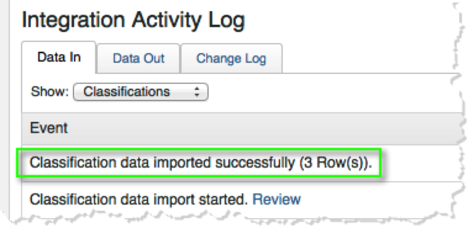
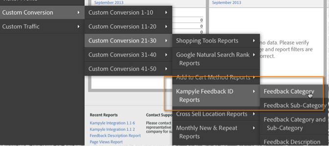

# Deploying the Integration{#deploying-the-integration}

Deploying this integration is a simple process consists of completing the Adobe Integration Wizard, deploying the plugin code (javascript), and verifying the integration.

## Complete the Adobe Integration Wizard{#complete-the-adobe-integration-wizard}

To activate the integration, you must complete the configuration wizard within the Data Connectors interface.

1. Log in to the Adobe Experience Cloud.
1. Navigate to **[!UICONTROL Data Connectors]** (formerly Genesis).
1. Launch the Kampyle integration wizard.
1. Select the desired report suite and provide a name for the integration.
1. Configure the following items:
   1. **[!UICONTROL Email address]** - the primary contact's email address.
   1. **[!UICONTROL Description]** - (optional) description for this integration setup.
   1. **[!UICONTROL Kampyle Key]** - Find this key in the Kampyle application under **[!UICONTROL Feedback Form]** > **[!UICONTROL Feedback Form Customization]**.
   1. **[!UICONTROL Tracking Server]** - the tracking server (domain) setting that you use to track Adobe Analytics data.
   1. **[!UICONTROL Tracking Server Secure]** - if your tracking server is different for secure/https traffic, then provide that setting here.
1. Configure the following **[!UICONTROL Variable Mappings]** items:
   1. **[!UICONTROL Kampyle Feedback ID]** -Select an available eVar variable from your report suite
   1. **[!UICONTROL Feedback Grade]** - Select an available success event (type "counter") from your report suite.
   1. **[!UICONTROL Feedback Items]** - Select an available success event (type "counter") from your report suite.
   1. **[!UICONTROL Feedback with Grade]** - Select an available success event (type "counter") from your report suite.
1. Check the box to have the Kampyle Integration dashboard automatically created for you (recommended).
1. Review all configuration items and click **[!UICONTROL Activate Now]**.

## Deploy the Integration Configuration Object{#deploy-the-integration-configuration-object}

After completing the integration wizard, you must deploy the integration configuration object to your web property.

In many cases, the easiest way to deploy the integration configuration object is to include it with your Adobe Analytics deployment code.

> [!NOTE] If you use Adobe TagManager or Dynamic Tag Management to deploy Adobe Analytics, you can easily add the integration configuration object through that tool.

1. Navigate to the **[!UICONTROL Resources]** > **[!UICONTROL Support]** tab of the integration.
1. Download and save the **[!UICONTROL Kampyle Integration Code (JS)]** resource. The code looks similar to this:

   ```
   /* Kampyle:  Integration configuration settings */
     window.k_sc_param = { "version":1.1 }
   ```

1. Deploy the code using one of the following methods:
   | **You use Adobe TagManager or Dynamic Tag Management.** | Use the tag management interface to add the code. |
   |---|---|
   | **In all other cases** | Deliver the code to the organizational resource that is responsible for updating your Adobe Analytics deployment code.  |

## Verify the Integration{#verify-the-integration}

Validate that the integration is successfully transferring data by completing a couple of checks.

### Integration Activity Log {#section-0472df9180db4f218db5f6040cab07af}

View your Kampyle integration setup within the Adobe Experience Cloud by navigating to **[!UICONTROL Support]** > **[!UICONTROL Integration Activity Log]**. Under the **[!UICONTROL Data In]** tab, you should see entries stating that classification data was successfully imported.

> [!NOTE] Log entries should appear within 24 hours of successful deployment.



### Adobe Reporting Data {#section-1ae9f0a5e6bc40988478ff55aefd56ac}

View your Kampyle feedback reports with Adobe Analytics by navigating to the Kampyle reporting within the appropriate menu structure.

> [!NOTE] Reporting data should appear within 24-48 hours of successful deployment, assuming that the integrated feedback form(s) is actively receiving submissions.



