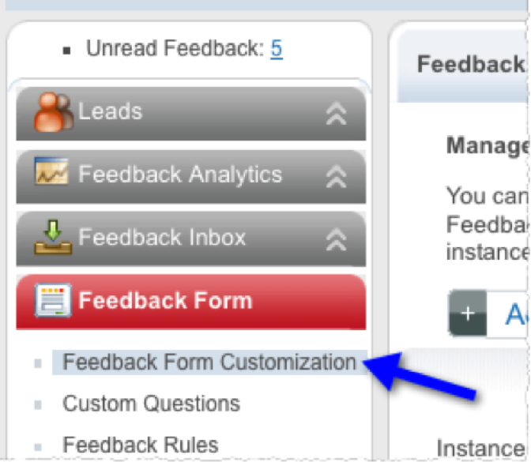
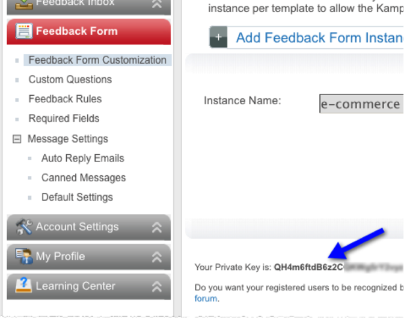

# Kampyle Data Connector for Adobe Analytics{#kampyle-data-connector-for-adobe-analytics}

>[!IMPORTANT]
>
>We will be end-of-lifing the Adobe Data Connector technology on August 1, 2021. [Learn more...](/help/import/data-connectors/data-connectors-eol.md)

The Kampyle Data Connector for Adobe Analytics combines Kampyle's integrated feedback system and the behavioral reporting of Adobe Analytics® to create powerful analytics and optimization opportunities for your organization.

Online marketers are increasingly realizing the relevance of customer feedback in brand building and driving business results. The Kampyle Data Connector for Adobe Analytics® adds visitor feedback metrics and dimensions to Adobe Analytics. It lets you analyze visitor behavior in the context of their attitudes and opinions. This helps you optimize based on feedback and improves conversion rates.

## Integration Prerequisites{#integration-prerequisites}

Prerequisites to consider before you can activate the data connector.

### Prerequisites for Adobe customers: {#section-d9c2e266931249e596de5f4406b5b6f0}

* You must be a current Adobe Analytics customer.
* You must be an Admin User.
* You must have 1 available and enabled eVar variable within your report suite.
* You must have 3 available and enabled custom events within your report suite (type: counter).

### Prerequisites for Kampyle customers: {#section-4bbbca50e74d4f218414ae0cc535b8e9}

* You must be a current customer of Kampyle for Websites.
* You must be an Adobe Experience Cloud admin user with permissions to enable data connectors.
* You must be able to retrieve the Kampyle Private Key from the Kampyle Feedback Form management UI.

## Retrieve the Kampyle Private Key{#retrieve-the-kampyle-private-key}

Steps to retrieve the key within the Kampyle interface.

1. Log in to your Kampyle account at [https://www.kampyle.com/login](https://www.kampyle.com/login).
1. In the left navigation, go to **[!UICONTROL Feedback Form]** > **[!UICONTROL Feedback Form Customization]**.

   

1. Find the Private Key listed on the lower portion of the main content pane.

   
