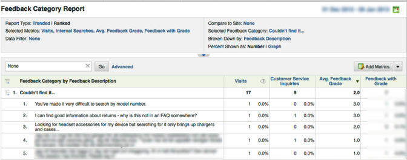
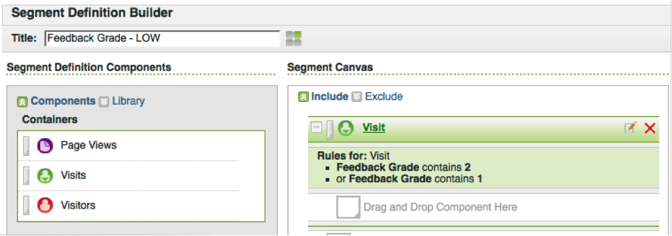
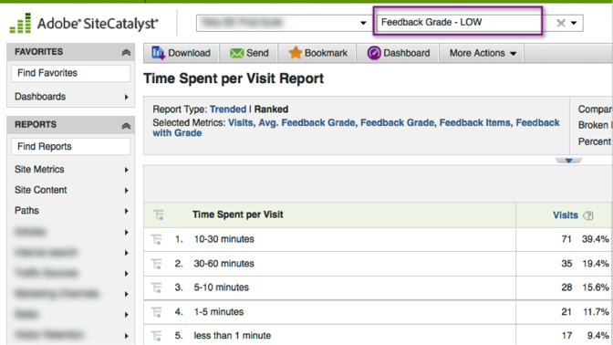

# Using the Integration{#using-the-integration}

Once deployed, you can begin using the additional capabilities that this integration provides. The following are actions to take to get value from this integration from within Adobe Analytics.

> [!NOTE] It can take 24-48 hours to begin seeing Kampyle response data within your Adobe Analytics reporting.

## Mix Feedback and Onsite Behavior Data{#mix-feedback-and-onsite-behavior-data}

You can break down Reports & Analytics reports by feedback dimensions.

Using Adobe Reports & Analytics, you can drill into numerous feedback dimensions that are available in reports. The report below is an example of drilling to a specific Category of feedback and then breaking it down by the feedback Description. Metrics from both Reports & Analytics (Visits & Customer Service Inquiries) and Kampyle (Avg Feedback Grade) are presented side-by-side for easy analysis.

## Segment by Feedback Dimension{#segment-by-feedback-dimension}

You can create segments based on feedback dimensions.

A primary feature of this integration is the ability to create Adobe Analytics segments based on the Kampyle feedback dimensions. For example, you can build a segment that will include only Visits where a Grade of 1 or 2 was given. You might call this "Feedback Grade - LOW". This segment definition would look like this:

This segment can then be applied to practically any report - one example is the Time Spent per Visit Report seen here.

