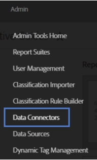
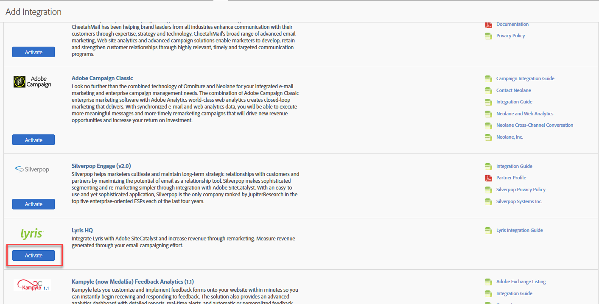
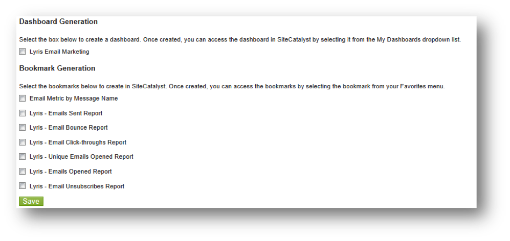

# Deploying the Integration{#deploying-the-integration}

Describes the three-step deployment process.

Deploying this integration is a simple process that requires the following actions: 

## Completing the Integration Wizard{#completing-the-integration-wizard}

Steps to use the integration wizard.

To activate the integration, you must complete the Lyris integration wizard within the Data Connectors interface.

1. Navigate to the Data Connectors (formerly Genesis) area within the Adobe Experience Cloud.

   

1. Under **[!UICONTROL Add Integration]**, under Lyris HQ, click **[!UICONTROL Activate]**.

   

1. Under **[!UICONTROL General Settings]**, choose the desired Report Suite and provide a name for the integration.
1. Fill in all your Lyris account-related information under **[!UICONTROL Custom Values]**.

   

1. Choose the appropriate reserved eVars and events from the drop-down menus.

   

1. You may choose your own segments under **[!UICONTROL Your Segments]** - apart from the 3 automated Partner segments.
1. This integration may require downloading a few data point to your Lyris account. You may choose to give access for this under **[!UICONTROL Access Request]**.
1. Under **[!UICONTROL Data Collection]**, you can choose to have an automated or a manual solution (JavaScript Plug-in) to collect query string parameters from the landing page URL. If you choose to have an automated solution, enter your query string parameter for Message ID and Recipient ID. For a JavaScript Plug-in, contact your Adobe Consultant.

   

1. You may choose to have the Lyris Dashboard and bookmarks automatically generated for you.

   

1. Review the integration summary and click **[!UICONTROL Activate]**.

## Configuration within the Lyris EmailLabs{#configuration-within-the-lyris-emaillabs}

Steps describing what to configure within Lyris following the completion of the wizard.

1. After completing the integration wizard, you must work with the Lyris Professional team to complete the integration to your Lyris HQ account and facilitate testing.
1. Add URL Query String Parameters: Verify that the URL append string is properly input into the Organization settings areas of the user interface. This should contain the campaign level ID (hq_m) and recipient level ID (hq_v).

   An example of a string ID is: 

   ```
   hq_lid=149&hq_m=96843&hq_l=23&hq_v=7703a51905
   ```

   >[!NOTE]
   >
   >If you are applying Lyris's native analytics tool, *Click Tracks* tags all of the required variables that are added.

## Verifying the Integration{#verifying-the-integration}

Steps to verify that the Lyris/Adobe Analytics integration was successful.

Once all deployment steps have been completed, you can validate that the integration is successfully transferring data.

>[!NOTE] It takes a few days for the data exchange to begin. Please make sure you contact Lyris after you activate the integration.

1. Navigate to your Lyris Integration within Data Connectors. Under the **[!UICONTROL Support]** tab > **[!UICONTROL Integration Activity Log]**, you should see events like **[!UICONTROL Metric data imported successfully]** and/or **[!UICONTROL Classification data imported successfully]**:

   

1. Now view your Lyris message reports with the appropriate metrics. In the Adobe Experience Cloud, select **[!UICONTROL Reports & Analytics]**.
1. Select the appropriate Report Suite.
1. Under **[!UICONTROL Custom Conversions]**, select the **[!UICONTROL Message ID Reports]** and choose **[!UICONTROL Message ID/Message Name]**.

## Query String Param Plug-In Code{#query-string-param-plug-in-code}

Shows the Lyris plug-in code to use with Adobe Analytics.

>[!NOTE] Please make sure that you reserved the necessary eVars in the Admin Tool of Adobe Analytics before you work with the code below. Once you know which eVars you have reserved, replace eVarN with the relevant eVar. E.g. eVar10.

```
/* 
  * Plugin: getQueryParam 2.3 
  */ 
s.getQueryParam=new Function("p","d","u","" 
+"var s=this,v='',i,t;d=d?d:'';u=u?u:(s.pageURL?s.pageURL:s.wd.locati" 
+"on);if(u=='f')u=s.gtfs().location;while(p){i=p.indexOf(',');i=i<0?p" 
+".length:i;t=s.p_gpv(p.substring(0,i),u+'');if(t){t=t.indexOf('#')>-" 
+"1?t.substring(0,t.indexOf('#')):t;}if(t)v+=v?d+t:t;p=p.substring(i=" 
+"=p.length?i:i+1)}return v"); 
s.p_gpv=new Function("k","u","" 
+"var s=this,v='',i=u.indexOf('?'),q;if(k&&i>-1){q=u.substring(i+1);v" 
+"=s.pt(q,'&','p_gvf',k)}return v"); 
s.p_gvf=new Function("t","k","" 
+"if(t){var s=this,i=t.indexOf('='),p=i<0?t:t.substring(0,i),v=i<0?'T" 
+"rue':t.substring(i+1);if(p.toLowerCase()==k.toLowerCase())return s." 
+"epa(v)}return ''"); 
 
/*in the s_doPlugins function - Replace N with actual eVar number*/ 
s.eVarN=s.getQueryParam("<insert Lyris QS Param>");  
//places query param value from Message ID in eVarN variable s.eVarN=s.getQueryParam("<insert Lyris QS Param>");  
//places query param value from Recepient ID in eVarN variable 

```
